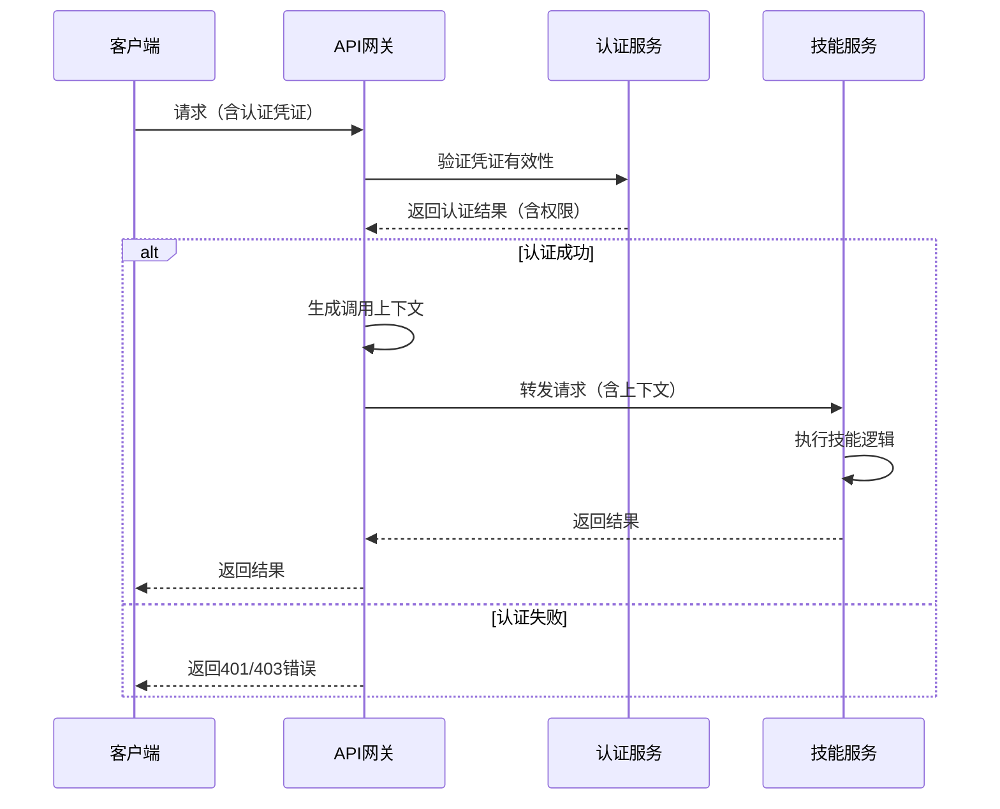
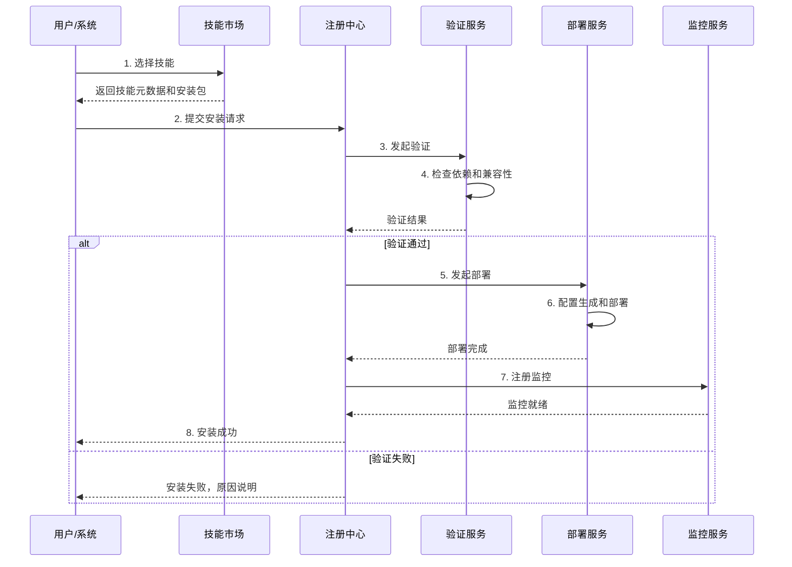
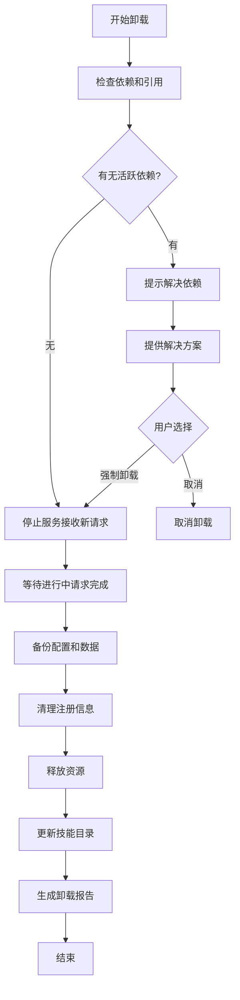

# 智能体工作平台 Skill接口扩展机制设计文档

## 1. 概述

### 1.1 模块定位
Skill接口扩展机制是平台能力生态化的核心基础设施，负责定义、管理、调度和进化第三方技能（Skill）。该模块提供标准化的技能开发框架、注册发现机制、统一调用接口和全生命周期管理，确保平台能够快速集成和扩展外部能力，支撑智能体的持续进化。

### 1.2 设计目标
- **标准化**：提供统一的Skill接口协议，降低集成成本
- **灵活性**：支持多样化的技能类型（工具调用、数据处理、模型推理等）
- **可扩展**：预留扩展点，支持自定义数据库、第三方服务、办公生态对接
- **高可用**：技能实例自动扩缩容、故障转移、健康检查
- **可观测**：完整的技能调用监控、性能分析、质量评估

### 1.3 架构位置
根据系统架构图，Skill接口扩展机制主要位于执行层，与以下模块紧密交互：

| 交互模块 | 交互内容 | 关键接口 |
|---------|---------|---------|
| **性能监控层** | 采集技能调用成功率、响应时间、错误类型等指标 | 监控数据上报接口 |
| **进化触发器** | 接收技能扩展任务（新增/升级/替换技能） | 任务执行接口 |
| **版本管理** | 管理技能版本、灰度发布、回滚操作 | 版本管理接口 |
| **扩展点** | 集成自定义数据库、第三方鉴权、办公生态对接 | 扩展注册接口 |

### 1.4 与前序模块的关系
- **性能监控模块**：依赖其采集技能调用相关性能指标
- **进化触发器模块**：接收其生成的技能扩展任务（OPT_SKILL_*类型）
- **版本管理模块**：集成其版本控制能力，支持技能版本灰度发布
- **技术方案文档**：基于第6节“Skill接口规范与扩展机制”详细展开

## 2. Skill接口规范设计

### 2.1 核心接口协议

#### 2.1.1 gRPC服务定义
```protobuf
// Skill标准接口定义 - skill_service.proto
syntax = "proto3";

package agent.platform.skill;

import "google/protobuf/struct.proto";
import "google/protobuf/timestamp.proto";

// 主服务接口
service SkillService {
  // 能力描述 - 返回技能元数据和能力定义
  rpc Describe(DescribeRequest) returns (DescribeResponse);
  
  // 执行技能 - 核心调用接口
  rpc Execute(ExecuteRequest) returns (ExecuteResponse);
  
  // 健康检查 - 用于服务发现和负载均衡
  rpc HealthCheck(HealthCheckRequest) returns (HealthCheckResponse);
  
  // 配置更新 - 支持动态参数调整
  rpc UpdateConfig(UpdateConfigRequest) returns (UpdateConfigResponse);
  
  // 批量执行 - 支持批量任务处理
  rpc BatchExecute(BatchExecuteRequest) returns (BatchExecuteResponse);
}

// 请求响应消息定义
message DescribeRequest {
  // 可选的查询过滤条件
  map<string, string> filters = 1;
}

message DescribeResponse {
  // 基础信息
  string skill_id = 1;                 // 技能唯一标识符
  string skill_name = 2;              // 技能名称
  string version = 3;                 // 语义化版本号 (major.minor.patch)
  string description = 4;             // 技能功能描述
  string author = 5;                  // 开发者/组织
  google.protobuf.Timestamp created_at = 6;
  
  // 能力定义
  repeated SkillCapability capabilities = 7;
  map<string, ParameterSchema> parameters = 8;
  repeated SkillDependency dependencies = 9;
  
  // 资源配置要求
  ResourceRequirements resources = 10;
  
  // 扩展元数据
  map<string, string> metadata = 11;
}

message ExecuteRequest {
  string request_id = 1;              // 请求唯一标识符
  string agent_id = 2;                // 调用方智能体ID
  string session_id = 3;              // 会话标识符（用于跟踪）
  
  // 输入参数
  map<string, google.protobuf.Value> parameters = 4;
  
  // 执行上下文
  ExecutionContext context = 5;
  
  // 调用选项
  ExecutionOptions options = 6;
}

message ExecuteResponse {
  string request_id = 1;
  string skill_id = 2;
  google.protobuf.Timestamp executed_at = 3;
  
  // 执行结果
  bool success = 4;
  oneof result {
    string text_result = 5;           // 文本类型结果
    bytes binary_result = 6;          // 二进制类型结果
    google.protobuf.Struct structured_result = 7; // 结构化结果
  }
  
  // 错误信息
  string error_code = 8;
  string error_message = 9;
  google.protobuf.Struct error_details = 10;
  
  // 性能指标
  int64 execution_duration_ms = 11;
  map<string, google.protobuf.Value> performance_metrics = 12;
  
  // 元数据
  map<string, string> metadata = 13;
}
```

#### 2.1.2 数据结构定义
```protobuf
// 能力定义
message SkillCapability {
  string capability_id = 1;           // 能力标识符
  string name = 2;                    // 能力名称
  string description = 3;            // 能力详细描述
  repeated string supported_formats = 4; // 支持的输入输出格式
  repeated string use_cases = 5;      // 适用场景
}

// 参数模式定义
message ParameterSchema {
  string name = 1;
  string type = 2;  // "string", "number", "boolean", "array", "object"
  string description = 3;
  bool required = 4;
  google.protobuf.Value default_value = 5;
  repeated google.protobuf.Value enum_values = 6;
  ValidationRules validation = 7;
  repeated string supported_formats = 8; // 如 "json", "xml", "csv"
}

message ValidationRules {
  optional double min_value = 1;
  optional double max_value = 2;
  optional int32 min_length = 3;
  optional int32 max_length = 4;
  optional string pattern = 5;        // 正则表达式
  optional string format = 6;         // "email", "uri", "date-time"
}

// 依赖定义
message SkillDependency {
  string skill_id = 1;                // 依赖的技能ID
  string version_constraint = 2;      // 版本约束表达式，如 "^2.1.0", "~1.0.0"
  string description = 3;             // 依赖用途描述
  DependencyType type = 4;            // 依赖类型
  
  enum DependencyType {
    REQUIRED = 0;     // 必需依赖，不满足则技能无法运行
    OPTIONAL = 1;     // 可选依赖，提升功能但非必需
    CONFLICT = 2;     // 冲突依赖，同时存在会导致问题
  }
}

// 执行上下文
message ExecutionContext {
  string user_id = 1;                 // 终端用户标识符
  string tenant_id = 2;               // 租户标识符（多租户支持）
  string environment = 3;             // 环境标识："dev", "test", "prod"
  google.protobuf.Struct user_context = 4; // 用户上下文信息
  repeated string permissions = 5;    // 用户权限列表
  int32 priority = 6;                 // 执行优先级（1-10）
}

// 执行选项
message ExecutionOptions {
  int32 timeout_ms = 1;               // 超时时间（毫秒）
  int32 max_retries = 2;              // 最大重试次数
  RetryStrategy retry_strategy = 3;   // 重试策略
  bool async_execution = 4;           // 是否异步执行
  string callback_url = 5;            // 异步回调地址
  
  enum RetryStrategy {
    EXPONENTIAL_BACKOFF = 0;          // 指数退避
    FIXED_INTERVAL = 1;               // 固定间隔
    NO_RETRY = 2;                     // 不重试
  }
}

// 资源需求
message ResourceRequirements {
  // CPU要求（核心数）
  message CpuRequirement {
    double min_cores = 1;
    double max_cores = 2;
    double recommended_cores = 3;
  }
  
  // 内存要求（MB）
  message MemoryRequirement {
    int64 min_mb = 1;
    int64 max_mb = 2;
    int64 recommended_mb = 3;
  }
  
  CpuRequirement cpu = 1;
  MemoryRequirement memory = 2;
  repeated string required_extensions = 3; // 必需的系统扩展/库
  map<string, string> environment_variables = 4; // 必需的环境变量
}
```

### 2.2 错误码体系

#### 2.2.1 错误分类与编码规则
采用分级错误码体系：`CATEGORY_SUBCATEGORY_DETAIL`

| 错误大类 | 错误代码前缀 | 说明 | HTTP状态码映射 |
|---------|------------|------|--------------|
| **客户端错误** | `CLIENT_` | 调用方参数错误、权限不足等 | 4xx |
| **服务端错误** | `SERVER_` | 技能内部处理错误 | 5xx |
| **依赖错误** | `DEPENDENCY_` | 依赖服务、技能、资源不可用 | 5xx |
| **资源错误** | `RESOURCE_` | 资源不足、配额超限等 | 5xx |
| **业务错误** | `BUSINESS_` | 特定业务逻辑错误 | 4xx |

#### 2.2.2 详细错误码清单
```yaml
# 客户端错误 (CLIENT_)
CLIENT_VALIDATION_FAILED:     # 参数验证失败
  code: "CLIENT_VALIDATION_FAILED"
  message: "输入参数验证失败"
  http_status: 400
  
CLIENT_AUTHENTICATION_FAILED: # 认证失败
  code: "CLIENT_AUTHENTICATION_FAILED"
  message: "认证失败，请检查凭证"
  http_status: 401
  
CLIENT_AUTHORIZATION_FAILED:  # 授权失败
  code: "CLIENT_AUTHORIZATION_FAILED"
  message: "没有执行此操作的权限"
  http_status: 403
  
CLIENT_SKILL_NOT_FOUND:       # 技能不存在
  code: "CLIENT_SKILL_NOT_FOUND"
  message: "请求的技能不存在或不可用"
  http_status: 404

# 服务端错误 (SERVER_)
SERVER_INTERNAL_ERROR:        # 内部处理错误
  code: "SERVER_INTERNAL_ERROR"
  message: "技能内部处理错误"
  http_status: 500
  
SERVER_EXECUTION_TIMEOUT:     # 执行超时
  code: "SERVER_EXECUTION_TIMEOUT"
  message: "技能执行超时"
  http_status: 504

# 依赖错误 (DEPENDENCY_)
DEPENDENCY_SERVICE_UNAVAILABLE: # 依赖服务不可用
  code: "DEPENDENCY_SERVICE_UNAVAILABLE"
  message: "依赖的外部服务暂时不可用"
  http_status: 502
  
DEPENDENCY_SKILL_UNAVAILABLE:   # 依赖技能不可用
  code: "DEPENDENCY_SKILL_UNAVAILABLE"
  message: "依赖的技能暂时不可用"
  http_status: 503

# 资源错误 (RESOURCE_)
RESOURCE_QUOTA_EXCEEDED:      # 资源配额超限
  code: "RESOURCE_QUOTA_EXCEEDED"
  message: "资源使用超过配额限制"
  http_status: 429
  
RESOURCE_CONCURRENCY_LIMIT:   # 并发限制
  code: "RESOURCE_CONCURRENCY_LIMIT"
  message: "并发请求数超过限制"
  http_status: 429
```

#### 2.2.3 错误处理规范
1. **错误传播**：底层错误应包含调用链信息，便于根因定位
2. **错误日志**：记录错误发生时完整的上下文信息
3. **用户提示**：对外暴露用户友好的错误信息，隐藏内部细节
4. **错误恢复**：根据错误类型采取重试、降级、熔断等策略

### 2.3 版本兼容性约定

#### 2.3.1 语义化版本控制（SemVer）
- **主版本号（MAJOR）**：不兼容的API变更
- **次版本号（MINOR）**：向后兼容的功能性新增
- **修订号（PATCH）**：向后兼容的问题修复

#### 2.3.2 兼容性规则矩阵
| 调用方版本 | 被调用方版本 | 兼容性 | 处理策略 |
|-----------|-------------|-------|---------|
| **1.0.0** → **1.0.1** | 完全兼容 | 自动升级，无需人工干预 |
| **1.0.0** → **1.1.0** | 功能兼容 | 可使用新功能，保持原有接口 |
| **1.0.0** → **2.0.0** | 不兼容 | 需要显式升级确认，支持并行运行 |
| **2.0.0** → **1.0.0** | 降级兼容 | 回滚到旧版本，需要数据迁移 |

#### 2.3.3 版本约束表达式
```yaml
# 示例约束表达式
constraints:
  exact: "1.2.3"           # 精确匹配版本1.2.3
  caret: "^1.2.3"          # 兼容1.2.3及以上，但小于2.0.0
  tilde: "~1.2.3"          # 兼容1.2.3及以上，但小于1.3.0
  range: ">=1.2.3 <2.0.0"  # 范围约束
  wildcard: "1.2.x"        # 通配符，匹配1.2.0-1.2.999
```

#### 2.3.4 版本迁移与升级策略
1. **并行运行**：新旧版本同时运行，逐步迁移流量
2. **功能标志**：通过功能开关控制新功能启用
3. **数据迁移**：自动或半自动的数据格式迁移工具
4. **回滚保障**：任何升级操作都支持快速回滚

## 3. Skill注册机制设计

### 3.1 技能发现机制

#### 3.1.1 发现模式设计
支持多种技能发现模式，适应不同部署场景：

| 发现模式 | 适用场景 | 工作机制 | 优势 |
|---------|---------|---------|------|
| **静态注册** | 预定义技能、系统内置技能 | 配置文件静态定义 | 简单可靠，启动即用 |
| **动态发现** | 容器化部署、微服务架构 | 基于服务注册中心（Consul/Etcd）自动发现 | 灵活扩展，自动容灾 |
| **市场同步** | 技能市场生态 | 定期同步市场技能目录 | 生态丰富，一键安装 |
| **插件扫描** | 本地开发测试 | 文件系统扫描技能描述文件 | 开发友好，快速迭代 |

#### 3.1.2 注册中心架构
采用分层注册架构，支持大规模技能管理：
```
┌─────────────────────────────────────────┐
│          全局技能注册中心                │
│  (技能元数据、版本信息、质量评分)        │
├─────────────────────────────────────────┤
│          区域技能注册中心                │
│  (实例状态、负载信息、健康状态)          │
├─────────────────────────────────────────┤
│          本地技能代理                    │
│  (服务发现、负载均衡、故障转移)          │
└─────────────────────────────────────────┘
```

#### 3.1.3 发现流程设计
```python
class SkillDiscoveryEngine:
    async def discover_skill(self, skill_requirements: SkillRequirements) -> SkillInstance:
        """
        发现满足要求的技能实例
        流程：本地缓存 → 区域注册中心 → 全局注册中心 → 技能市场
        """
        
        # 第1步：检查本地缓存（减少网络开销）
        cached_instance = self._cache.get(skill_requirements.skill_id)
        if cached_instance and self._validate_instance(cached_instance, skill_requirements):
            return cached_instance
        
        # 第2步：查询区域注册中心
        regional_instances = await self._query_regional_registry(skill_requirements)
        if regional_instances:
            selected = self._select_best_instance(regional_instances, skill_requirements)
            self._cache.set(skill_requirements.skill_id, selected)
            return selected
        
        # 第3步：查询全局注册中心  
        global_instances = await self._query_global_registry(skill_requirements)
        if global_instances:
            selected = self._select_best_instance(global_instances, skill_requirements)
            self._cache.set(skill_requirements.skill_id, selected)
            return selected
        
        # 第4步：尝试从技能市场安装
        if skill_requirements.allow_market_install:
            installed = await self._install_from_market(skill_requirements)
            if installed:
                return installed
        
        # 第5步：技能未找到
        raise SkillNotFoundException(
            f"Skill {skill_requirements.skill_id} not found "
            f"with requirements: {skill_requirements}"
        )
```

### 3.2 元数据声明规范

#### 3.2.1 核心元数据字段
```yaml
# 技能元数据文件 skill_meta.yaml 结构
skill:
  # 基础信息
  id: "weather_query"                    # 技能唯一标识符
  name: "天气查询技能"                    # 技能显示名称
  version: "2.1.0"                       # 语义化版本号
  description: "提供全球城市天气查询功能，支持实时天气和未来预报"  # 详细描述
  author: "平台技能团队"                  # 开发者/组织
  
  # 分类标签
  category: "data_query"                 # 主分类
  subcategories: ["weather", "api_call"] # 子分类列表
  tags: ["实时数据", "REST API", "JSON"]  # 标签列表
  
  # 接口信息
  service_endpoint: "grpc://skills.agent-platform:50051"
  health_check_path: "/health"
  api_version: "v2"
  
  # 能力定义
  capabilities:
    - id: "current_weather"
      name: "当前天气查询"
      description: "查询指定城市的当前天气状况"
      input_schema:
        city: {type: "string", required: true}
        country_code: {type: "string", required: false}
      output_schema:
        temperature: {type: "number"}
        humidity: {type: "number"}
        conditions: {type: "string"}
        
    - id: "forecast_5day"
      name: "5天天气预报"
      description: "查询指定城市未来5天的天气预报"
  
  # 参数定义
  parameters:
    api_key:
      type: "string"
      description: "天气API的访问密钥"
      required: true
      secure: true                    # 敏感参数，需要加密存储
    
    units:
      type: "string"
      description: "温度单位"
      enum: ["celsius", "fahrenheit"]
      default: "celsius"
  
  # 依赖管理
  dependencies:
    required:
      - skill_id: "http_client"
        version_constraint: "^1.0.0"
      
    optional:
      - skill_id: "cache_service"
        version_constraint: "~2.1.0"
  
  # 资源需求
  resource_requirements:
    cpu:
      min_cores: 0.5
      recommended_cores: 1.0
    memory:
      min_mb: 256
      recommended_mb: 512
  
  # 质量指标
  quality_metrics:
    avg_success_rate: 0.95
    avg_response_time_ms: 350
    reliability_score: 0.92
  
  # 扩展点预留
  extension_points:
    custom_database: true
    third_party_auth: true
    office_ecosystem: false
```

#### 3.2.2 元数据验证规则
1. **必填字段检查**：id、name、version、description、author必须存在
2. **版本格式验证**：version必须符合SemVer规范
3. **依赖循环检测**：防止技能间形成循环依赖
4. **资源需求合理性**：CPU、内存需求必须在合理范围内
5. **能力定义完整性**：每个capability必须有input_schema和output_schema

#### 3.2.3 元数据存储设计
```sql
-- 技能元数据数据库表设计
CREATE TABLE skill_metadata (
    skill_id VARCHAR(128) PRIMARY KEY,
    skill_name VARCHAR(256) NOT NULL,
    version VARCHAR(32) NOT NULL,
    description TEXT,
    author VARCHAR(256),
    category VARCHAR(64),
    
    -- 服务信息
    service_endpoint VARCHAR(512),
    health_check_endpoint VARCHAR(512),
    api_version VARCHAR(32),
    
    -- 能力定义（JSONB存储）
    capabilities JSONB NOT NULL DEFAULT '[]',
    
    -- 参数定义
    parameters JSONB NOT NULL DEFAULT '{}',
    
    -- 依赖管理
    dependencies JSONB NOT NULL DEFAULT '{"required": [], "optional": []}',
    
    -- 资源需求
    resource_requirements JSONB NOT NULL DEFAULT '{}',
    
    -- 扩展点配置
    extension_points JSONB NOT NULL DEFAULT '{}',
    
    -- 质量指标
    quality_metrics JSONB NOT NULL DEFAULT '{}',
    
    -- 时间戳
    created_at TIMESTAMPTZ DEFAULT NOW(),
    updated_at TIMESTAMPTZ DEFAULT NOW(),
    
    -- 状态管理
    status VARCHAR(32) DEFAULT 'active',  -- active, deprecated, deleted
    status_changed_at TIMESTAMPTZ,
    
    -- 索引优化
    INDEX idx_skill_category (category),
    INDEX idx_skill_status (status),
    INDEX idx_skill_created (created_at DESC)
);

-- 技能版本历史表
CREATE TABLE skill_version_history (
    history_id UUID PRIMARY KEY DEFAULT gen_random_uuid(),
    skill_id VARCHAR(128) NOT NULL REFERENCES skill_metadata(skill_id),
    version VARCHAR(32) NOT NULL,
    metadata_snapshot JSONB NOT NULL,
    change_type VARCHAR(32) NOT NULL,  -- create, update, deprecate, delete
    change_description TEXT,
    changed_by VARCHAR(256),           -- user_id / system_component
    changed_at TIMESTAMPTZ DEFAULT NOW(),
    
    INDEX idx_skill_version (skill_id, version),
    INDEX idx_change_time (changed_at DESC)
);
```

### 3.3 依赖管理机制

#### 3.3.1 依赖解析算法
```python
class DependencyResolver:
    async def resolve_dependencies(self, skill_id: str, version: str) -> DependencyGraph:
        """
        解析技能依赖关系，构建依赖图
        算法：深度优先遍历 + 冲突检测 + 版本选择
        """
        
        # 初始化依赖图
        dependency_graph = DependencyGraph()
        
        # 递归解析依赖
        await self._resolve_recursive(
            skill_id, 
            version, 
            dependency_graph,
            visited=set(),
            path=[]
        )
        
        # 冲突检测
        conflicts = self._detect_conflicts(dependency_graph)
        if conflicts:
            raise DependencyConflictException(f"Dependency conflicts detected: {conflicts}")
        
        # 版本选择（遵循语义化版本约束）
        selected_versions = self._select_versions(dependency_graph)
        
        return {
            "dependency_graph": dependency_graph.to_dict(),
            "selected_versions": selected_versions,
            "resolved_skills": self._flatten_dependencies(dependency_graph)
        }
    
    async def _resolve_recursive(self, skill_id, version, graph, visited, path):
        """递归解析依赖树"""
        
        # 防止无限递归
        if (skill_id, version) in visited:
            return
        visited.add((skill_id, version))
        
        # 获取技能元数据
        skill_meta = await self._load_skill_metadata(skill_id, version)
        
        # 添加到依赖图
        graph.add_node(skill_id, version, skill_meta)
        
        # 递归解析依赖
        for dep_type in ["required", "optional"]:
            for dep in skill_meta["dependencies"].get(dep_type, []):
                dep_id = dep["skill_id"]
                dep_constraint = dep["version_constraint"]
                
                # 版本选择：根据约束选择兼容版本
                selected_version = await self._select_compatible_version(
                    dep_id, 
                    dep_constraint
                )
                
                # 添加到依赖图
                graph.add_dependency(
                    from_skill=(skill_id, version),
                    to_skill=(dep_id, selected_version),
                    dep_type=dep_type
                )
                
                # 递归解析
                await self._resolve_recursive(
                    dep_id, 
                    selected_version, 
                    graph, 
                    visited,
                    path + [(skill_id, version)]
                )
```

#### 3.3.2 依赖冲突解决策略
1. **版本协商**：当多个技能对同一依赖有不同版本要求时：
   - 如果版本范围有交集，选择最高兼容版本
   - 如果版本范围无交集，尝试向后兼容适配
   - 如无法解决，提示用户手动选择

2. **可选依赖处理**：
   - 如果可选依赖不可用，降级到无依赖版本
   - 记录缺失依赖，触发自动安装或告警

3. **依赖隔离**：
   - 支持不同版本依赖在同一环境共存
   - 通过类加载器隔离或容器隔离实现

#### 3.3.3 依赖缓存与更新
```yaml
dependency_cache:
  # 本地缓存配置
  local_cache:
    ttl: "1h"                    # 缓存有效期
    max_size_mb: 1024           # 最大缓存大小
    eviction_policy: "lru"      # 缓存淘汰策略
  
  # 依赖更新策略
  update_policies:
    - type: "immediate"         # 立即更新
      triggers: ["install", "upgrade"]
    - type: "background"        # 后台更新
      interval: "24h"
      max_concurrent: 5
    - type: "on_demand"         # 按需更新
      check_interval: "1h"
```

### 3.4 鉴权流程设计

#### 3.4.1 多模式认证支持
平台支持多种认证模式，适应不同安全需求：

| 认证模式 | 适用场景 | 安全级别 | 实现复杂度 |
|---------|---------|---------|-----------|
| **API Key** | 服务间通信、简单集成 | 中 | 低 |
| **JWT Token** | 用户认证、短期授权 | 高 | 中 |
| **OAuth 2.0** | 第三方授权、用户委托 | 高 | 高 |
| **双向TLS** | 内部服务通信、高安全场景 | 极高 | 高 |

#### 3.4.2 统一认证流程


#### 3.4.3 细粒度授权控制
```python
class AuthorizationManager:
    async def authorize_skill_access(self, 
                                    user_context: UserContext,
                                    skill_id: str,
                                    operation: str) -> AuthorizationResult:
        """
        检查用户对指定技能的访问权限
        支持RBAC（基于角色的访问控制）和ABAC（基于属性的访问控制）
        """
        
        # 1. 获取用户角色和权限
        user_roles = await self._get_user_roles(user_context.user_id)
        user_permissions = await self._get_user_permissions(user_roles)
        
        # 2. 获取技能访问策略
        skill_policies = await self._get_skill_access_policies(skill_id)
        
        # 3. 应用授权规则
        for policy in skill_policies:
            if self._evaluate_policy(policy, user_context, operation):
                return AuthorizationResult(
                    authorized=True,
                    granted_by=policy.name,
                    constraints=policy.constraints
                )
        
        # 4. 默认拒绝
        return AuthorizationResult(
            authorized=False,
            reason="No matching authorization policy found"
        )
    
    async def _evaluate_policy(self, policy, user_context, operation):
        """评估单个授权策略"""
        
        # 检查操作是否在允许列表中
        if operation not in policy.allowed_operations:
            return False
        
        # 检查角色要求
        if policy.required_roles:
            if not set(policy.required_roles).intersection(user_context.roles):
                return False
        
        # 检查属性条件（ABAC）
        if policy.conditions:
            for condition in policy.conditions:
                if not self._evaluate_condition(condition, user_context):
                    return False
        
        # 检查时间限制
        if policy.time_constraints:
            if not self._check_time_constraints(policy.time_constraints):
                return False
        
        return True
```

#### 3.4.4 凭证安全管理
1. **存储加密**：
   - API Key使用AES-256加密存储
   - 私钥使用HSM（硬件安全模块）保护
   - 内存中的敏感数据使用内存加密

2. **凭证轮换**：
   - 支持自动凭证轮换策略
   - 新旧凭证并行期支持
   - 轮换失败自动回滚

3. **访问审计**：
   - 记录所有认证授权事件
   - 异常访问行为检测
   - 实时告警机制

## 4. Skill调用流程设计

### 4.1 请求路由机制

#### 4.1.1 路由策略设计
支持多种路由策略，根据业务需求动态选择：

| 路由策略 | 算法描述 | 适用场景 | 负载均衡效果 |
|---------|---------|---------|-------------|
| **轮询** | 依次分配请求到各实例 | 通用场景，实例性能均匀 | 均匀 |
| **最少连接** | 选择当前连接数最少的实例 | 长连接、会话保持场景 | 较均匀 |
| **响应时间加权** | 基于响应时间动态调整权重 | 实例性能差异较大时 | 性能优先 |
| **一致性哈希** | 相同请求总是路由到同一实例 | 缓存亲和性、状态保持 | 高命中率 |
| **地理位置** | 优先选择地理最近的实例 | 低延迟要求，全球化部署 | 延迟优化 |

#### 4.1.2 路由决策流程
```python
class SkillRouter:
    async def route_request(self, request: SkillRequest) -> SkillInstance:
        """
        路由技能调用请求到最合适的技能实例
        决策流程：负载均衡 → 健康检查 → 地理位置 → 成本优化
        """
        
        # 获取所有可用实例
        instances = await self._discovery_service.get_instances(
            skill_id=request.skill_id,
            version_constraint=request.version_constraint
        )
        
        if not instances:
            raise SkillUnavailableException(f"No available instances for {request.skill_id}")
        
        # 第1层过滤：健康状态
        healthy_instances = [inst for inst in instances if inst.health_status == "healthy"]
        if not healthy_instances:
            # 如果无健康实例，尝试使用降级实例
            degraded_instances = [inst for inst in instances if inst.health_status == "degraded"]
            if degraded_instances:
                healthy_instances = degraded_instances
            else:
                raise SkillUnavailableException(f"No healthy instances for {request.skill_id}")
        
        # 第2层过滤：地理位置优化（如果启用）
        if self._config.geo_routing_enabled:
            geo_optimized = self._optimize_by_geography(
                healthy_instances, 
                request.client_location
            )
            if geo_optimized:
                healthy_instances = geo_optimized
        
        # 第3层过滤：资源匹配
        resource_matched = self._filter_by_resource_requirements(
            healthy_instances,
            request.resource_requirements
        )
        if resource_matched:
            healthy_instances = resource_matched
        
        # 第4层：负载均衡选择
        selected_instance = self._load_balancer.select_instance(
            healthy_instances,
            request.load_balancing_strategy
        )
        
        # 记录路由决策
        await self._log_routing_decision(
            request_id=request.request_id,
            skill_id=request.skill_id,
            selected_instance=selected_instance,
            candidate_count=len(instances),
            routing_factors={
                "health_filtered": len(healthy_instances),
                "geo_optimized": self._config.geo_routing_enabled,
                "resource_matched": bool(resource_matched)
            }
        )
        
        return selected_instance
```

#### 4.1.3 路由缓存与失效机制
```yaml
routing_cache:
  # 路由决策缓存
  decision_cache:
    ttl: "5m"                    # 路由决策缓存时间
    max_entries: 10000          # 最大缓存条目数
    eviction_strategy: "lfu"    # 最少使用淘汰
    
  # 实例状态缓存
  instance_cache:
    health_check_ttl: "30s"     # 健康状态缓存时间
    load_info_ttl: "10s"        # 负载信息缓存时间
    
  # 缓存失效策略
  invalidation:
    on_instance_failure: true   # 实例失败时失效相关缓存
    on_health_change: true      # 健康状态变化时失效
    periodic_cleanup: "5m"      # 定期清理过期缓存
```

### 4.2 参数验证规则

#### 4.2.1 验证框架设计
采用多层验证架构，确保输入参数的完整性和安全性：

```
┌─────────────────────────────────┐
│    应用层验证                    │
│  • 业务规则校验                  │
│  • 权限验证                      │
│  • 上下文校验                    │
├─────────────────────────────────┤
│    框架层验证                    │
│  • 数据格式校验                  │
│  • 类型转换                      │
│  • 模式匹配                      │
├─────────────────────────────────┤
│    协议层验证                    │
│  • 消息结构校验                  │
│  • 必填字段检查                  │
│  • 长度/范围限制                 │
└─────────────────────────────────┘
```

#### 4.2.2 验证规则定义语言
```yaml
validation_schema:
  # 基础类型验证
  types:
    string:
      min_length: 1
      max_length: 100
      pattern: "^[a-zA-Z0-9_-]+$"
    
    number:
      min_value: 0
      max_value: 1000
      integer_only: true
    
    boolean:
      strict: true
    
    array:
      min_items: 1
      max_items: 10
      unique_items: true
    
    object:
      required: ["id", "name"]
      additional_properties: false
  
  # 复合验证规则
  composite_rules:
    email_format:
      type: "string"
      pattern: "^[a-zA-Z0-9._%+-]+@[a-zA-Z0-9.-]+\\.[a-zA-Z]{2,}$"
    
    date_range:
      type: "object"
      properties:
        start_date:
          type: "string"
          format: "date"
        end_date:
          type: "string"
          format: "date"
      rule: "end_date >= start_date"
    
    conditional_required:
      condition: "payment_method == 'credit_card'"
      required_fields: ["card_number", "expiry_date", "cvv"]
  
  # 自定义验证函数
  custom_validators:
    validate_city_country:
      function: "validate_geo_location"
      parameters: ["city", "country_code"]
      error_message: "City not found in specified country"
```

#### 4.2.3 验证执行引擎
```python
class ValidationEngine:
    async def validate_request(self, 
                              request: Dict, 
                              schema: ValidationSchema) -> ValidationResult:
        """
        执行多层参数验证
        流程：协议层 → 框架层 → 应用层 → 自定义验证
        """
        
        errors = []
        warnings = []
        
        # 第1层：协议层验证
        protocol_errors = self._validate_protocol_layer(request, schema)
        errors.extend(protocol_errors)
        
        # 如果有协议层错误，提前返回
        if protocol_errors:
            return ValidationResult(
                valid=False,
                errors=errors,
                warnings=warnings
            )
        
        # 第2层：框架层验证
        framework_errors = self._validate_framework_layer(request, schema)
        errors.extend(framework_errors)
        
        # 第3层：应用层验证
        app_errors = await self._validate_application_layer(request, schema)
        errors.extend(app_errors)
        
        # 第4层：自定义验证
        custom_errors = await self._validate_custom_rules(request, schema)
        errors.extend(custom_errors)
        
        # 生成验证结果
        return ValidationResult(
            valid=len(errors) == 0,
            errors=errors,
            warnings=warnings,
            sanitized_data=self._sanitize_input(request, schema)
        )
    
    def _validate_protocol_layer(self, request, schema):
        """协议层验证：消息结构、必填字段、基本约束"""
        errors = []
        
        # 检查必填字段
        for field in schema.required_fields:
            if field not in request:
                errors.append(
                    ValidationError(
                        field=field,
                        code="MISSING_REQUIRED_FIELD",
                        message=f"Required field '{field}' is missing"
                    )
                )
        
        # 检查字段类型
        for field, value in request.items():
            if field in schema.field_types:
                expected_type = schema.field_types[field]
                if not isinstance(value, expected_type):
                    errors.append(
                        ValidationError(
                            field=field,
                            code="TYPE_MISMATCH",
                            message=f"Field '{field}' expected type {expected_type}, got {type(value)}"
                        )
                    )
        
        return errors
    
    async def _validate_application_layer(self, request, schema):
        """应用层验证：业务规则、权限、上下文"""
        errors = []
        
        # 业务规则验证
        for rule in schema.business_rules:
            if not await self._evaluate_business_rule(rule, request):
                errors.append(
                    ValidationError(
                        field=rule.field,
                        code="BUSINESS_RULE_VIOLATION",
                        message=rule.error_message
                    )
                )
        
        # 权限验证
        if schema.permission_checks:
            for check in schema.permission_checks:
                if not await self._check_permission(check, request):
                    errors.append(
                        ValidationError(
                            field=check.resource_field,
                            code="PERMISSION_DENIED",
                            message=f"Insufficient permission for {check.resource_field}"
                        )
                    )
        
        return errors
```

### 4.3 执行上下文传递

#### 4.3.1 上下文数据结构设计
```protobuf
// 执行上下文定义
message ExecutionContext {
  // 基础标识信息
  string request_id = 1;                   // 请求唯一标识符
  string trace_id = 2;                     // 分布式追踪ID
  string span_id = 3;                      // 当前Span ID
  string parent_span_id = 4;               // 父Span ID
  
  // 用户信息
  string user_id = 11;                     // 终端用户标识符
  string tenant_id = 12;                   // 租户标识符
  repeated string user_roles = 13;         // 用户角色列表
  map<string, string> user_attributes = 14; // 用户扩展属性
  
  // 调用链信息
  string caller_agent_id = 21;             // 调用方智能体ID
  string caller_skill_id = 22;             // 调用方技能ID
  string caller_version = 23;              // 调用方版本号
  repeated CallStackEntry call_stack = 24; // 调用栈信息
  
  // 环境信息
  string environment = 31;                 // 环境标识 (dev/test/prod)
  string region = 32;                      // 地域标识
  string availability_zone = 33;           // 可用区标识
  
  // 性能追踪
  google.protobuf.Timestamp start_time = 41; // 请求开始时间
  int64 timeout_ms = 42;                    // 超时时间设置
  int32 retry_count = 43;                   // 当前重试次数
  int32 max_retries = 44;                   // 最大重试次数
  
  // 安全上下文
  string auth_token = 51;                  // 认证令牌
  repeated string permissions = 52;        // 当前操作权限列表
  SecurityLevel security_level = 53;       // 安全级别要求
  
  // 业务上下文
  string business_process_id = 61;         // 业务流程ID
  string transaction_id = 62;              // 事务ID
  map<string, google.protobuf.Value> business_context = 63; // 业务扩展上下文
  
  // 系统上下文
  string hostname = 71;                    // 执行主机名
  string pod_name = 72;                    // 容器Pod名称（如适用）
  string node_name = 73;                   // 节点名称
  map<string, string> system_metadata = 74; // 系统元数据
  
  // 扩展上下文（预留）
  map<string, google.protobuf.Value> extensions = 100;
}

// 调用栈条目
message CallStackEntry {
  string agent_id = 1;
  string skill_id = 2;
  string version = 3;
  string operation = 4;
  google.protobuf.Timestamp timestamp = 5;
  int64 duration_ms = 6;
}

// 安全级别枚举
enum SecurityLevel {
  NONE = 0;
  LOW = 1;
  MEDIUM = 2;
  HIGH = 3;
  CRITICAL = 4;
}
```

#### 4.3.2 上下文传播机制

##### 跨进程传播（gRPC/HTTP）
```python
class ContextPropagator:
    # gRPC传播
    GRPC_METADATA_KEY = "x-agent-context"
    
    async def inject_grpc_context(self, metadata, context: ExecutionContext):
        """将上下文注入gRPC元数据"""
        encoded = self._encode_context(context)
        metadata.add(self.GRPC_METADATA_KEY, encoded)
    
    async def extract_grpc_context(self, metadata) -> ExecutionContext:
        """从gRPC元数据提取上下文"""
        encoded = metadata.get(self.GRPC_METADATA_KEY)
        if encoded:
            return self._decode_context(encoded)
        return None
    
    # HTTP传播
    HTTP_HEADER_KEY = "X-Agent-Context"
    
    def inject_http_headers(self, headers, context: ExecutionContext):
        """将上下文注入HTTP头"""
        encoded = self._encode_context(context)
        headers[self.HTTP_HEADER_KEY] = encoded
    
    def extract_http_headers(self, headers) -> ExecutionContext:
        """从HTTP头提取上下文"""
        encoded = headers.get(self.HTTP_HEADER_KEY)
        if encoded:
            return self._decode_context(encoded)
        return None
    
    def _encode_context(self, context: ExecutionContext) -> str:
        """编码上下文为字符串"""
        # 使用Proto JSON序列化 + Base64编码
        json_str = MessageToJson(context)
        return base64.b64encode(json_str.encode()).decode()
    
    def _decode_context(self, encoded: str) -> ExecutionContext:
        """解码字符串为上下文"""
        json_str = base64.b64decode(encoded).decode()
        context = ExecutionContext()
        JsonParse(json_str, context)
        return context
```

##### 异步任务上下文传递
```python
class AsyncContextManager:
    """管理异步任务中的上下文传递"""
    
    def __init__(self):
        self._context_storage = contextvars.ContextVar("execution_context")
    
    def set_current_context(self, context: ExecutionContext):
        """设置当前执行上下文"""
        self._context_storage.set(context)
    
    def get_current_context(self) -> ExecutionContext:
        """获取当前执行上下文"""
        try:
            return self._context_storage.get()
        except LookupError:
            # 如果没有上下文，创建默认上下文
            default_context = self._create_default_context()
            self._context_storage.set(default_context)
            return default_context
    
    def run_with_context(self, context: ExecutionContext, coro_func, *args):
        """在指定上下文中执行协程"""
        async def wrapper():
            previous = self._context_storage.set(context)
            try:
                return await coro_func(*args)
            finally:
                self._context_storage.reset(previous)
        
        return wrapper()
```

#### 4.3.3 上下文增强与转换
```python
class ContextEnhancer:
    """上下文增强与转换服务"""
    
    async def enhance_context(self, 
                             base_context: ExecutionContext,
                             request: Dict) -> ExecutionContext:
        """
        基于请求内容增强上下文信息
        包括：权限提升、资源绑定、流程标识等
        """
        
        # 深拷贝基础上下文
        enhanced = deepcopy(base_context)
        
        # 1. 权限与安全增强
        enhanced.permissions.extend(
            await self._determine_additional_permissions(request)
        )
        
        # 2. 资源绑定（如指定计算节点、存储路径等）
        resource_bindings = await self._allocate_resources(request)
        enhanced.system_metadata.update(resource_bindings)
        
        # 3. 业务流程标识
        if "business_process" in request:
            enhanced.business_process_id = request["business_process"]["id"]
            enhanced.business_context.update(
                request["business_process"]["parameters"]
            )
        
        # 4. 性能追踪设置
        enhanced.timeout_ms = self._calculate_timeout(request)
        enhanced.max_retries = self._determine_retry_count(request)
        
        # 5. 扩展上下文（基于技能特性）
        extensions = await self._generate_skill_specific_extensions(request)
        enhanced.extensions.update(extensions)
        
        return enhanced
    
    async def transform_for_skill(self,
                                 context: ExecutionContext,
                                 skill_metadata: Dict) -> ExecutionContext:
        """
        根据技能特性转换上下文格式
        例如：敏感信息脱敏、格式转换、权限降级等
        """
        
        transformed = deepcopy(context)
        
        # 1. 敏感信息处理（根据技能安全级别）
        security_level = skill_metadata.get("security_level", "medium")
        if security_level == "low":
            transformed = self._sanitize_sensitive_data(transformed)
        
        # 2. 格式适配（根据技能输入要求）
        input_format = skill_metadata.get("input_format", "json")
        if input_format == "xml":
            transformed = self._convert_to_xml_format(transformed)
        
        # 3. 权限适配（根据技能授权要求）
        skill_permissions = skill_metadata.get("required_permissions", [])
        transformed.permissions = self._filter_permissions(
            transformed.permissions,
            skill_permissions
        )
        
        # 4. 扩展上下文适配
        skill_extensions = skill_metadata.get("supported_extensions", [])
        transformed.extensions = self._filter_extensions(
            transformed.extensions,
            skill_extensions
        )
        
        return transformed
```

### 4.4 结果返回与异常处理

#### 4.4.1 统一响应格式
```protobuf
// 标准技能响应格式
message SkillResponse {
  // 元信息
  string request_id = 1;
  google.protobuf.Timestamp responded_at = 2;
  int64 execution_duration_ms = 3;
  
  // 执行结果
  oneof result {
    // 成功响应
    SuccessResult success = 10;
    
    // 失败响应
    ErrorResult error = 11;
  }
  
  // 性能指标（监控用）
  map<string, google.protobuf.Value> performance_metrics = 20;
  
  // 扩展信息
  map<string, google.protobuf.Value> extensions = 30;
}

// 成功结果
message SuccessResult {
  // 结果数据
  oneof data {
    string text_result = 1;
    bytes binary_result = 2;
    google.protobuf.Struct structured_result = 3;
  }
  
  // 元数据
  map<string, google.protobuf.Value> metadata = 10;
  repeated string warnings = 11;           // 警告信息
}

// 错误结果
message ErrorResult {
  // 错误分类
  ErrorCategory category = 1;
  
  // 错误详情
  string code = 2;                         // 错误代码 (CLIENT_VALIDATION_FAILED等)
  string message = 3;                      // 用户友好的错误信息
  string internal_message = 4;             // 内部详细错误信息（调试用）
  google.protobuf.Struct details = 5;      // 错误详情（结构化的补充信息）
  
  // 错误位置与追踪
  repeated StackTraceElement stack_trace = 10;  // 堆栈追踪（如支持）
  string component = 11;                    // 发生错误的组件标识
  string operation = 12;                    // 发生错误的操作
  
  // 恢复建议
  repeated RecoveryAction recovery_actions = 20;
}

// 错误分类枚举
enum ErrorCategory {
  CLIENT_ERROR = 0;        // 客户端错误（参数、权限等）
  SERVER_ERROR = 1;        // 服务端内部错误
  DEPENDENCY_ERROR = 2;    // 依赖服务错误
  RESOURCE_ERROR = 3;      // 资源不足错误
  BUSINESS_ERROR = 4;      // 业务逻辑错误
}

// 恢复行动建议
message RecoveryAction {
  string action = 1;                       // 行动描述
  string priority = 2;                     // 优先级 (high/medium/low)
  string instructions = 3;                 // 执行指导
}
```

#### 4.4.2 异常处理框架
```python
class SkillExceptionHandler:
    """技能执行异常统一处理框架"""
    
    async def handle_execution(self, 
                              skill_instance: SkillInstance,
                              request: Dict,
                              context: ExecutionContext) -> SkillResponse:
        """
        包装技能执行过程，提供统一异常处理
        包括：重试、熔断、降级、监控上报等
        """
        
        start_time = time.time()
        
        try:
            # 1. 执行前检查
            await self._pre_execution_check(skill_instance, request, context)
            
            # 2. 执行技能（支持重试）
            result = await self._execute_with_retry(
                skill_instance, 
                request, 
                context
            )
            
            # 3. 执行后处理
            response = await self._post_execution_process(
                result, 
                request, 
                context
            )
            
            # 4. 记录成功指标
            await self._record_success_metrics(
                skill_instance, 
                request, 
                context,
                duration_ms=int((time.time() - start_time) * 1000)
            )
            
            return response
            
        except ClientException as e:
            # 客户端错误（参数错误、权限不足等）
            return await self._handle_client_exception(
                e, skill_instance, request, context, start_time
            )
            
        except ServerException as e:
            # 服务端错误（内部处理异常）
            return await self._handle_server_exception(
                e, skill_instance, request, context, start_time
            )
            
        except DependencyException as e:
            # 依赖错误（外部服务不可用）
            return await self._handle_dependency_exception(
                e, skill_instance, request, context, start_time
            )
            
        except ResourceException as e:
            # 资源错误（内存不足、并发限制等）
            return await self._handle_resource_exception(
                e, skill_instance, request, context, start_time
            )
            
        except BusinessException as e:
            # 业务逻辑错误（不满足业务规则）
            return await self._handle_business_exception(
                e, skill_instance, request, context, start_time
            )
            
        except Exception as e:
            # 未知异常
            return await self._handle_unknown_exception(
                e, skill_instance, request, context, start_time
            )
    
    async def _execute_with_retry(self, skill_instance, request, context):
        """支持重试的执行逻辑"""
        
        max_retries = context.max_retries or self._config.default_max_retries
        retry_delay_ms = self._config.retry_delay_ms
        
        last_exception = None
        
        for attempt in range(max_retries + 1):
            try:
                # 执行调用
                return await skill_instance.execute(request, context)
                
            except (TimeoutException, ConnectionException) as e:
                # 网络相关异常，可以重试
                last_exception = e
                
                if attempt < max_retries:
                    # 计算退避时间
                    delay = retry_delay_ms * (2 ** attempt)  # 指数退避
                    await asyncio.sleep(delay / 1000)
                else:
                    break
                    
            except Exception as e:
                # 其他异常，不重试
                raise e
        
        # 重试次数用尽
        raise MaxRetriesExceededException(
            f"Max retries ({max_retries}) exceeded",
            cause=last_exception
        )
```

#### 4.4.3 监控与性能追踪
```python
class ExecutionMonitor:
    """技能执行监控与性能追踪"""
    
    async def monitor_execution(self, 
                               skill_instance: SkillInstance,
                               request: Dict,
                               context: ExecutionContext,
                               start_time: float):
        """
        收集执行过程中的监控数据
        包括：性能指标、错误统计、资源使用等
        """
        
        execution_duration = int((time.time() - start_time) * 1000)
        
        # 1. 基础指标
        base_metrics = {
            "skill_id": skill_instance.skill_id,
            "version": skill_instance.version,
            "execution_duration_ms": execution_duration,
            "success": True,  # 假设成功，具体由调用方设置
            "request_size_bytes": len(json.dumps(request)),
            "response_size_bytes": 0,  # 由调用方填充
        }
        
        # 2. 性能指标
        perf_metrics = await self._collect_performance_metrics(skill_instance)
        base_metrics.update(perf_metrics)
        
        # 3. 资源使用
        resource_metrics = await self._collect_resource_usage(skill_instance)
        base_metrics.update(resource_metrics)
        
        # 4. 业务指标（如果有）
        business_metrics = await self._collect_business_metrics(request, context)
        base_metrics.update(business_metrics)
        
        # 5. 上报到监控系统
        await self._report_to_monitoring_system({
            "metrics": base_metrics,
            "context": context,
            "timestamp": datetime.utcnow().isoformat()
        })
        
        return base_metrics
```

## 5. Skill生命周期管理

### 5.1 状态机设计与转换

#### 5.1.1 完整生命周期状态
```
[未注册] → [注册中] → [健康] → [不健康] → [维护中] → [已废弃] → [已删除]
    ↓          ↓         ↓         ↓          ↓          ↓          ↓
  注册失败    验证失败  正常服务  自动恢复   人工干预   可卸载   完全移除
```

#### 5.1.2 详细状态定义
| 状态 | 代码 | 描述 | 允许操作 |
|------|------|------|---------|
| **未注册** | `UNREGISTERED` | 技能尚未在平台注册 | 注册 |
| **注册中** | `REGISTERING` | 技能正在注册验证过程中 | 取消注册 |
| **验证失败** | `VALIDATION_FAILED` | 技能注册验证失败 | 重新注册、放弃 |
| **健康** | `HEALTHY` | 技能正常运行，可提供服务 | 调用、禁用、升级、维护 |
| **不健康** | `UNHEALTHY` | 技能健康检查失败 | 恢复、禁用、废弃 |
| **维护中** | `MAINTENANCE` | 技能正在维护升级 | 完成维护、取消维护 |
| **已废弃** | `DEPRECATED` | 技能已标记废弃，不再推荐使用 | 启用、删除 |
| **已删除** | `DELETED` | 技能已从系统移除 | 彻底清除 |

#### 5.1.3 状态转换规则
```yaml
state_transitions:
  # 注册流程
  UNREGISTERED:
    to: REGISTERING
    condition: "收到注册请求且参数合法"
    action: "启动验证流程"
    
  REGISTERING:
    to: HEALTHY
    condition: "验证通过且健康检查成功"
    action: "激活技能，加入服务发现"
    
    to: VALIDATION_FAILED
    condition: "验证失败（参数错误、依赖缺失等）"
    action: "记录失败原因，通知调用方"
  
  # 运行状态转换
  HEALTHY:
    to: UNHEALTHY
    condition: "连续健康检查失败超过阈值"
    action: "标记为不健康，可能触发自动恢复"
    
    to: MAINTENANCE
    condition: "管理员发起维护操作"
    action: "暂停服务，进入维护模式"
  
  # 恢复与维护
  UNHEALTHY:
    to: HEALTHY
    condition: "健康检查恢复成功"
    action: "重新加入服务发现"
    
    to: DEPRECATED
    condition: "长时间无法恢复或管理员决定废弃"
    action: "标记废弃，停止自动恢复尝试"
  
  # 废弃与删除
  DEPRECATED:
    to: DELETED
    condition: "管理员确认删除"
    action: "移除配置，保留审计记录"
    
    to: HEALTHY
    condition: "管理员重新启用"
    action: "重新验证并激活"
```

#### 5.1.4 状态转换实现
```python
class SkillStateMachine:
    """技能状态机管理"""
    
    def __init__(self):
        self._current_state = "UNREGISTERED"
        self._previous_state = None
        self._transition_history = []
        
    async def transition(self, target_state: str, context: Dict = None):
        """
        执行状态转换
        流程：验证转换规则 → 执行退出动作 → 执行转换动作 → 执行进入动作
        """
        
        # 1. 验证转换是否允许
        if not self._is_transition_allowed(target_state):
            raise InvalidStateTransitionException(
                f"Cannot transition from {self._current_state} to {target_state}"
            )
        
        # 2. 记录转换开始
        transition_id = self._generate_transition_id()
        self._log_transition_start(transition_id, target_state, context)
        
        # 3. 执行状态退出动作
        await self._execute_exit_actions(self._current_state, context)
        
        # 4. 执行转换动作
        previous_state = self._current_state
        await self._execute_transition_actions(previous_state, target_state, context)
        
        # 5. 更新状态
        self._previous_state = previous_state
        self._current_state = target_state
        
        # 6. 执行状态进入动作
        await self._execute_enter_actions(target_state, context)
        
        # 7. 记录转换完成
        self._log_transition_complete(transition_id, context)
        
        # 8. 触发状态变更事件
        await self._emit_state_changed_event(previous_state, target_state, context)
        
        return {
            "transition_id": transition_id,
            "from_state": previous_state,
            "to_state": target_state,
            "timestamp": datetime.utcnow().isoformat()
        }
    
    def _is_transition_allowed(self, target_state):
        """检查状态转换是否允许"""
        allowed_transitions = self._get_allowed_transitions(self._current_state)
        return target_state in allowed_transitions
```

### 5.2 安装与启用流程

#### 5.2.1 标准化安装流程


#### 5.2.2 详细安装步骤
```python
class SkillInstaller:
    """技能安装管理器"""
    
    async def install_skill(self, 
                           skill_package: SkillPackage,
                           target_agent: str = None,
                           install_options: Dict = None) -> InstallationResult:
        """
        执行技能安装流程
        包括：验证、配置生成、部署、注册
        """
        
        install_id = self._generate_install_id()
        
        try:
            # 第1步：解包和验证
            skill_meta = await self._unpack_and_validate(skill_package)
            
            # 第2步：依赖解析
            dependency_graph = await self._resolve_dependencies(skill_meta)
            
            # 第3步：兼容性检查
            compatibility = await self._check_compatibility(
                skill_meta, 
                target_agent, 
                install_options
            )
            
            if not compatibility["compatible"]:
                raise CompatibilityException(
                    f"Skill {skill_meta['skill_id']} incompatible: {compatibility['issues']}"
                )
            
            # 第4步：配置生成
            config = await self._generate_configuration(
                skill_meta, 
                target_agent, 
                install_options
            )
            
            # 第5步：部署执行
            deployment = await self._deploy_skill(
                skill_package, 
                config, 
                target_agent
            )
            
            # 第6步：注册到服务发现
            registration = await self._register_skill(
                skill_meta, 
                config, 
                deployment
            )
            
            # 第7步：启用技能
            await self._enable_skill(skill_meta["skill_id"])
            
            # 返回安装结果
            return InstallationResult(
                success=True,
                install_id=install_id,
                skill_id=skill_meta["skill_id"],
                version=skill_meta["version"],
                agent_id=target_agent or "platform",
                deployment_info=deployment,
                registration_info=registration,
                installed_at=datetime.utcnow()
            )
            
        except Exception as e:
            # 安装失败，清理已创建的资源
            await self._rollback_installation(install_id, skill_meta)
            
            return InstallationResult(
                success=False,
                install_id=install_id,
                skill_id=skill_package.metadata.get("skill_id") if skill_package else "unknown",
                error=str(e),
                error_details=self._format_error_details(e),
                installed_at=datetime.utcnow()
            )
```

#### 5.2.3 一键安装接口
```http
POST /v1/skills/install
Content-Type: application/json

{
  "skill_id": "weather_query",
  "version": "2.1.0",
  "target_agent": "agent_001",  // 可选，默认为平台全局技能
  "install_options": {
    "auto_enable": true,
    "resource_allocation": {
      "cpu_cores": 1.0,
      "memory_mb": 512
    },
    "permissions": {
      "required": ["data_query", "api_access"],
      "optional": ["cache_access"]
    }
  }
}

响应：
{
  "install_id": "install_20260223164500_001",
  "skill_id": "weather_query",
  "version": "2.1.0",
  "status": "completed",
  "agent_id": "agent_001",
  "deployment_endpoint": "grpc://skills.agent-platform:50051/weather_query",
  "health_check_url": "http://skills.agent-platform:8080/health",
  "estimated_readiness_time": "2026-02-23T16:50:00Z",
  "install_log_url": "/v1/skills/installations/install_20260223164500_001/log"
}
```

### 5.3 禁用与卸载流程

#### 5.3.1 安全禁用流程
```python
class SkillDisabler:
    """技能安全禁用管理器"""
    
    async def disable_skill(self, 
                           skill_id: str,
                           disable_options: Dict = None) -> DisableResult:
        """
        安全禁用技能
        流程：检查依赖 → 停止新请求 → 等待进行中请求完成 → 标记禁用
        """
        
        # 第1步：检查是否有其他技能依赖此技能
        dependents = await self._find_dependent_skills(skill_id)
        if dependents and not disable_options.get("force", False):
            raise ActiveDependenciesException(
                f"Cannot disable {skill_id}, active dependents: {dependents}"
            )
        
        # 第2步：从负载均衡器移除
        await self._remove_from_load_balancer(skill_id)
        
        # 第3步：等待进行中的请求完成（或超时）
        in_progress = await self._wait_for_in_progress_requests(
            skill_id,
            disable_options.get("grace_period_ms", 30000)
        )
        
        # 第4步：标记为禁用状态
        await self._update_skill_status(skill_id, "DISABLED")
        
        # 第5步：通知相关服务
        await self._notify_disabled(skill_id, disable_options)
        
        return DisableResult(
            success=True,
            skill_id=skill_id,
            in_progress_requests_at_disable=in_progress,
            disabled_at=datetime.utcnow(),
            disable_options=disable_options
        )
```

#### 5.3.2 完整卸载流程


#### 5.3.3 卸载实现
```python
class SkillUninstaller:
    """技能卸载管理器"""
    
    async def uninstall_skill(self, 
                             skill_id: str,
                             uninstall_options: Dict = None) -> UninstallResult:
        """
        完整卸载技能
        包括：依赖检查、服务停止、配置清理、资源释放
        """
        
        uninstall_id = self._generate_uninstall_id()
        
        try:
            # 第1步：获取技能信息
            skill_info = await self._get_skill_info(skill_id)
            if not skill_info:
                raise SkillNotFoundException(f"Skill {skill_id} not found")
            
            # 第2步：依赖和引用检查
            dependency_check = await self._check_dependencies(skill_id)
            if dependency_check["has_active_dependents"]:
                if not uninstall_options.get("force", False):
                    raise ActiveDependenciesException(
                        f"Skill {skill_id} has active dependents: {dependency_check['dependents']}"
                    )
                else:
                    # 记录强制卸载警告
                    self._log_force_uninstall_warning(skill_id, dependency_check)
            
            # 第3步：停止服务（优雅关闭）
            await self._stop_service(skill_id, uninstall_options)
            
            # 第4步：备份配置和数据（如需要）
            backup_info = await self._backup_skill_data(skill_id, uninstall_options)
            
            # 第5步：清理注册和配置
            cleanup_info = await self._cleanup_registration(skill_id)
            
            # 第6步：释放资源
            resource_release = await self._release_resources(skill_id)
            
            # 第7步：更新目录和记录
            await self._update_catalog(skill_id)
            
            # 返回卸载结果
            return UninstallResult(
                success=True,
                uninstall_id=uninstall_id,
                skill_id=skill_id,
                version=skill_info["version"],
                uninstalled_at=datetime.utcnow(),
                backup_info=backup_info,
                cleanup_info=cleanup_info,
                resource_release=resource_release,
                warnings=dependency_check.get("warnings", [])
            )
            
        except Exception as e:
            # 卸载失败，尝试恢复服务
            await self._recover_from_uninstall_failure(skill_id, e)
            
            return UninstallResult(
                success=False,
                uninstall_id=uninstall_id,
                skill_id=skill_id,
                error=str(e),
                error_details=self._format_error_details(e),
                uninstalled_at=datetime.utcnow(),
                recovery_attempted=True
            )
```

### 5.4 升级与降级管理

#### 5.4.1 智能升级策略
```python
class SkillUpgradeManager:
    """技能升级管理器"""
    
    async def upgrade_skill(self, 
                           skill_id: str,
                           target_version: str,
                           upgrade_options: Dict = None) -> UpgradeResult:
        """
        执行技能升级
        流程：版本检查 → 兼容性验证 → 备份 → 升级 → 验证
        """
        
        upgrade_id = self._generate_upgrade_id()
        
        try:
            # 第1步：获取当前版本信息
            current_info = await self._get_current_skill_info(skill_id)
            if not current_info:
                raise SkillNotFoundException(f"Skill {skill_id} not installed")
            
            # 第2步：版本可行性检查
            version_check = await self._check_version_feasibility(
                skill_id,
                current_info["version"],
                target_version
            )
            
            if not version_check["upgradable"]:
                raise VersionUpgradeException(
                    f"Cannot upgrade from {current_info['version']} to {target_version}: "
                    f"{version_check['issues']}"
                )
            
            # 第3步：依赖和兼容性检查
            compatibility_check = await self._check_upgrade_compatibility(
                skill_id,
                current_info["version"],
                target_version,
                upgrade_options
            )
            
            # 第4步：执行升级（支持多种升级模式）
            upgrade_method = upgrade_options.get("method", "rolling")
            
            if upgrade_method == "rolling":
                # 滚动升级（零停机）
                upgrade_result = await self._perform_rolling_upgrade(
                    skill_id,
                    target_version,
                    upgrade_options
                )
                
            elif upgrade_method == "blue_green":
                # 蓝绿部署
                upgrade_result = await self._perform_blue_green_upgrade(
                    skill_id,
                    target_version,
                    upgrade_options
                )
                
            elif upgrade_method == "canary":
                # 金丝雀发布
                upgrade_result = await self._perform_canary_upgrade(
                    skill_id,
                    target_version,
                    upgrade_options
                )
            
            # 第5步：升级后验证
            verification = await self._verify_upgrade_success(
                skill_id,
                target_version,
                upgrade_options
            )
            
            # 第6步：清理旧版本资源（如需要）
            cleanup_info = await self._cleanup_old_version(
                skill_id,
                current_info["version"],
                upgrade_options
            )
            
            return UpgradeResult(
                success=True,
                upgrade_id=upgrade_id,
                skill_id=skill_id,
                from_version=current_info["version"],
                to_version=target_version,
                upgrade_method=upgrade_method,
                verification_result=verification,
                cleanup_info=cleanup_info,
                upgraded_at=datetime.utcnow()
            )
            
        except Exception as e:
            # 升级失败，执行回滚
            rollback_result = await self._rollback_upgrade(
                skill_id,
                current_info["version"] if 'current_info' in locals() else None,
                e
            )
            
            return UpgradeResult(
                success=False,
                upgrade_id=upgrade_id,
                skill_id=skill_id,
                from_version=current_info["version"] if 'current_info' in locals() else "unknown",
                to_version=target_version,
                error=str(e),
                rollback_attempted=True,
                rollback_result=rollback_result,
                upgraded_at=datetime.utcnow()
            )
```

#### 5.4.2 安全降级机制
```python
class SkillDowngradeManager:
    """技能降级管理器"""
    
    async def downgrade_skill(self,
                             skill_id: str,
                             target_version: str,
                             downgrade_options: Dict = None) -> DowngradeResult:
        """
        执行技能降级（回滚到旧版本）
        用于处理升级失败或新版本有严重问题
        """
        
        downgrade_id = self._generate_downgrade_id()
        
        try:
            # 第1步：检查降级可行性
            # 确保目标版本存在且兼容
            downgrade_check = await self._check_downgrade_feasibility(
                skill_id,
                target_version
            )
            
            # 第2步：数据兼容性检查
            # 检查新版本数据是否可降级到旧版本格式
            data_compatibility = await self._check_data_compatibility(
                skill_id,
                target_version,
                downgrade_options
            )
            
            # 第3步：执行降级操作
            downgrade_result = await self._perform_downgrade(
                skill_id,
                target_version,
                downgrade_options
            )
            
            # 第4步：降级后验证
            verification = await self._verify_downgrade_success(
                skill_id,
                target_version,
                downgrade_options
            )
            
            return DowngradeResult(
                success=True,
                downgrade_id=downgrade_id,
                skill_id=skill_id,
                from_version=await self._get_current_version(skill_id),
                to_version=target_version,
                downgrade_method=downgrade_options.get("method", "immediate"),
                data_migration_info=data_compatibility.get("migration_info"),
                verification_result=verification,
                downgraded_at=datetime.utcnow()
            )
            
        except Exception as e:
            # 降级失败，尝试恢复到升级前状态
            recovery_result = await self._recover_from_downgrade_failure(
                skill_id,
                e
            )
            
            return DowngradeResult(
                success=False,
                downgrade_id=downgrade_id,
                skill_id=skill_id,
                error=str(e),
                recovery_attempted=True,
                recovery_result=recovery_result,
                downgraded_at=datetime.utcnow()
            )
```

#### 5.4.3 版本间数据迁移
```python
class SkillDataMigrator:
    """技能版本间数据迁移管理器"""
    
    async def migrate_data(self,
                          skill_id: str,
                          from_version: str,
                          to_version: str,
                          migration_options: Dict = None) -> MigrationResult:
        """
        处理技能版本升级或降级时的数据迁移
        支持:
        - 升级时: 向前兼容的数据格式转换
        - 降级时: 向后兼容的数据格式回滚
        """
        
        migration_id = self._generate_migration_id()
        
        try:
            # 第1步: 分析数据兼容性
            compatibility_analysis = await self._analyze_data_compatibility(
                skill_id,
                from_version,
                to_version
            )
            
            # 第2步: 根据迁移方向选择策略
            is_upgrade = self._is_upgrade(from_version, to_version)
            
            if is_upgrade:
                # 升级迁移
                migration_strategy = await self._select_upgrade_strategy(
                    compatibility_analysis,
                    migration_options
                )
            else:
                # 降级迁移
                migration_strategy = await self._select_downgrade_strategy(
                    compatibility_analysis,
                    migration_options
                )
            
            # 第3步: 执行数据迁移
            migration_stats = await self._execute_migration(
                skill_id,
                from_version,
                to_version,
                migration_strategy
            )
            
            # 第4步: 验证迁移结果
            verification = await self._verify_migration_integrity(
                skill_id,
                from_version,
                to_version,
                migration_stats
            )
            
            # 第5步: 清理临时数据
            cleanup_info = await self._cleanup_migration_temp_data(
                migration_strategy
            )
            
            return MigrationResult(
                success=True,
                migration_id=migration_id,
                skill_id=skill_id,
                from_version=from_version,
                to_version=to_version,
                migration_type="upgrade" if is_upgrade else "downgrade",
                migration_stats=migration_stats,
                verification_result=verification,
                cleanup_info=cleanup_info,
                migrated_at=datetime.utcnow()
            )
            
        except Exception as e:
            # 迁移失败, 尝试恢复原数据
            recovery_result = await self._recover_from_migration_failure(
                skill_id,
                from_version,
                e
            )
            
            return MigrationResult(
                success=False,
                migration_id=migration_id,
                skill_id=skill_id,
                from_version=from_version,
                to_version=to_version,
                error=str(e),
                recovery_attempted=True,
                recovery_result=recovery_result,
                migrated_at=datetime.utcnow()
            )
```

### 5.5 生命周期管理API

#### 5.5.1 管理接口设计
```http
# 技能安装
POST /v1/skills/install
Content-Type: application/json
{
  "skill_id": "weather_query",
  "version": "2.1.0",
  "target_agent": "agent_001",
  "options": {
    "auto_enable": true,
    "resource_allocation": {...},
    "permissions": {...}
  }
}

# 技能启用
POST /v1/skills/{skill_id}/enable
{
  "agent_id": "agent_001"
}

# 技能禁用
POST /v1/skills/{skill_id}/disable
{
  "agent_id": "agent_001",
  "options": {
    "force": false,
    "grace_period_ms": 30000
  }
}

# 技能卸载
DELETE /v1/skills/{skill_id}
{
  "agent_id": "agent_001",
  "options": {
    "force": false,
    "backup": true,
    "cleanup_resources": true
  }
}

# 技能升级
PUT /v1/skills/{skill_id}/upgrade
{
  "target_version": "2.2.0",
  "options": {
    "method": "rolling",
    # rolling/blue_green/canary
    "validation_timeout_ms": 300000,
    "rollback_on_failure": true
  }
}

# 技能降级
PUT /v1/skills/{skill_id}/downgrade
{
  "target_version": "2.0.3",
  "options": {
    "data_migration": true,
    "validation_required": true,
    "force": false
  }
}

# 技能状态查询
GET /v1/skills/{skill_id}/status
{
  "agent_id": "agent_001",  # 可选
  "include_metrics": true
}
```

#### 5.5.2 状态查询响应
```json
{
  "skill_id": "weather_query",
  "version": "2.1.0",
  "status": "HEALTHY",
  "health_details": {
    "last_check": "2026-02-23T16:40:00Z",
    "success_rate_24h": 0.98,
    "avg_response_time_ms": 320
  },
  "resource_usage": {
    "cpu_percent": 45.2,
    "memory_mb": 256,
    "network_traffic_mb": 120
  },
  "performance_metrics": {
    "total_calls_24h": 12500,
    "error_rate_24h": 0.02,
    "throughput_per_minute": 87
  },
  "dependencies": {
    "required": [
      {
        "skill_id": "http_client",
        "version": "1.2.0",
        "status": "HEALTHY"
      }
    ],
    "optional": []
  },
  "operational_info": {
    "installed_at": "2026-02-20T10:30:00Z",
    "last_upgraded": "2026-02-22T14:15:00Z",
    "uptime_days": 2.8,
    "maintenance_window": "02:00-04:00"
  }
}
```

## 6. 扩展点预留设计

### 6.1 自定义数据库接口

#### 6.1.1 数据库适配器架构
采用插件化数据库适配器架构，支持主流数据库无缝集成：

```
┌─────────────────────────────────────────┐
│         技能执行引擎                    │
├─────────────────────────────────────────┤
│         数据库抽象层                    │
│    (统一接口定义和适配器)               │
├─────────────────────────────────────────┤
│       数据库适配器插件                  │
│  ┌────────┬─────────┬─────────┐         │
│  │MySQL   │PostgreSQL│MongoDB │ ...    │
│  │适配器  │适配器   │适配器   │         │
│  └────────┴─────────┴─────────┘         │
└─────────────────────────────────────────┘
```

#### 6.1.2 数据库适配器接口定义
```python
class DatabaseAdapter(ABC):
    """数据库适配器抽象基类"""
    
    @abstractmethod
    async def connect(self, connection_config: Dict) -> Connection:
        """建立数据库连接"""
        pass
    
    @abstractmethod
    async def execute_query(self, query: str, params: Dict = None) -> List[Dict]:
        """执行查询语句"""
        pass
    
    @abstractmethod
    async def execute_command(self, command: str, params: Dict = None) -> int:
        """执行命令（INSERT/UPDATE/DELETE）"""
        pass
    
    @abstractmethod
    async def begin_transaction(self) -> Transaction:
        """开始事务"""
        pass
    
    @abstractmethod
    async def commit_transaction(self, transaction: Transaction):
        """提交事务"""
        pass
    
    @abstractmethod
    async def rollback_transaction(self, transaction: Transaction):
        """回滚事务"""
        pass
    
    @abstractmethod
    def get_metadata(self) -> Dict:
        """获取适配器元数据"""
        pass
```

#### 6.1.3 数据库连接配置
```yaml
database_connections:
  # MySQL配置示例
  mysql_production:
    adapter: "mysql"
    host: "mysql-cluster.internal"
    port: 3306
    database: "agent_platform"
    username: "agent_service"
    password: "${ENV_MYSQL_PASSWORD}"  # 支持环境变量
    options:
      charset: "utf8mb4"
      pool_size: 10
      max_overflow: 5
      timeout_ms: 5000
    
  # PostgreSQL配置示例  
  postgres_analytics:
    adapter: "postgresql"
    host: "analytics-pg.internal"
    port: 5432
    database: "analytics"
    username: "analytics_user"
    password: "${ENV_PG_PASSWORD}"
    options:
      sslmode: "require"
      statement_timeout: "10s"
      idle_in_transaction_session_timeout: "5s"
    
  # MongoDB配置示例
  mongodb_logs:
    adapter: "mongodb"
    hosts:
      - "mongodb1.internal:27017"
      - "mongodb2.internal:27017"
      - "mongodb3.internal:27017"
    database: "logs"
    username: "logs_service"
    password: "${ENV_MONGO_PASSWORD}"
    options:
      replicaSet: "rs0"
      readPreference: "secondaryPreferred"
      maxPoolSize: 20
```

#### 6.1.4 数据库操作SDK
```python
class SkillDatabaseClient:
    """技能数据库操作SDK"""
    
    def __init__(self, connection_name: str, context: ExecutionContext):
        self._connection_name = connection_name
        self._context = context
        self._adapter = self._get_adapter(connection_name)
    
    async def query(self, 
                   sql: str, 
                   params: Dict = None, 
                   options: Dict = None) -> List[Dict]:
        """
        执行查询操作
        自动处理: 连接池、错误重试、性能监控、审计日志
        """
        
        start_time = time.time()
        
        try:
            # 1. 获取数据库连接
            connection = await self._adapter.get_connection()
            
            # 2. 执行查询
            start_query = time.time()
            results = await self._adapter.execute_query(connection, sql, params)
            query_duration = time.time() - start_query
            
            # 3. 记录监控指标
            await self._record_query_metrics({
                "skill_id": self._context.skill_id,
                "query_type": "select",
                "row_count": len(results),
                "duration_ms": int(query_duration * 1000),
                "connection_name": self._connection_name,
                "request_id": self._context.request_id
            })
            
            # 4. 记录审计日志
            await self._audit_database_access({
                "operation": "query",
                "sql": sql,
                "params": params,
                "row_count": len(results),
                "user_id": self._context.user_id,
                "timestamp": datetime.utcnow()
            })
            
            return results
            
        except DatabaseException as e:
            # 数据库异常处理
            await self._handle_database_exception(e, sql, params)
            raise
            
        finally:
            # 记录总执行时间
            total_duration = time.time() - start_time
            await self._record_execution_metrics(total_duration)
    
    async def execute(self, 
                     sql: str, 
                     params: Dict = None, 
                     options: Dict = None) -> int:
        """
        执行更新操作
        支持事务控制、批量操作、结果验证
        """
        
        # 支持事务选项
        use_transaction = options.get("transaction", True)
        
        if use_transaction:
            async with self._adapter.transaction() as tx:
                affected_rows = await self._adapter.execute_command(tx, sql, params)
                
                # 验证结果（如需要）
                if options.get("validate_result", False):
                    await self._validate_execution_result(tx, sql, params, affected_rows)
                
                return affected_rows
        else:
            return await self._adapter.execute_command(None, sql, params)
```

### 6.2 第三方服务鉴权

#### 6.2.1 统一鉴权框架
支持多种第三方服务鉴权模式，提供标准化的集成接口：

```
┌─────────────────────────────────────────┐
│         技能执行引擎                    │
├─────────────────────────────────────────┤
│        鉴权管理器                       │
│  (凭证管理、令牌刷新、安全存储)          │
├─────────────────────────────────────────┤
│       鉴权插件库                        │
│  ┌────────┬─────────┬─────────┐         │
│  │OAuth 2.0│API Key  │JWT     │ ...    │
│  │插件    │插件     │插件     │         │
│  └────────┴─────────┴─────────┘         │
└─────────────────────────────────────────┘
```

#### 6.2.2 鉴权插件接口
```python
class AuthPlugin(ABC):
    """鉴权插件抽象基类"""
    
    @abstractmethod
    async def authenticate(self, 
                          auth_config: Dict, 
                          request_context: Dict = None) -> AuthResult:
        """执行认证，获取访问令牌"""
        pass
    
    @abstractmethod
    async def refresh_token(self, 
                           refresh_token: str, 
                           auth_config: Dict) -> AuthResult:
        """刷新访问令牌"""
        pass
    
    @abstractmethod
    def validate_token(self, token: str) -> ValidationResult:
        """验证令牌有效性"""
        pass
    
    @abstractmethod
    async def revoke_token(self, token: str, auth_config: Dict):
        """撤销令牌"""
        pass
    
    @abstractmethod
    def get_plugin_info(self) -> Dict:
        """获取插件信息"""
        pass
```

#### 6.2.3 鉴权配置管理
```yaml
auth_configurations:
  # OAuth 2.0配置示例
  github_oauth:
    plugin: "oauth2"
    provider: "github"
    client_id: "${ENV_GITHUB_CLIENT_ID}"
    client_secret: "${ENV_GITHUB_CLIENT_SECRET}"
    scopes:
      - "repo"
      - "user"
    token_endpoint: "https://github.com/login/oauth/access_token"
    authorize_endpoint: "https://github.com/login/oauth/authorize"
    redirect_uri: "https://agent-platform.com/auth/callback/github"
    options:
      token_type: "bearer"
      token_refresh_threshold_ms: 300000  # 5分钟
      max_retry_attempts: 3
    
  # API Key配置示例
  openweather_api:
    plugin: "apikey"
    api_key: "${ENV_OPENWEATHER_API_KEY}"
    header_name: "x-api-key"
    options:
      key_rotation_days: 90
      key_storage: "encrypted"  # encrypted/plain
      key_encryption_method: "aes-256-gcm"
    
  # JWT配置示例
  internal_service_auth:
    plugin: "jwt"
    issuer: "agent-platform-auth"
    audience: "agent-service"
    signing_key: "${ENV_JWT_SIGNING_KEY}"
    algorithm: "RS256"
    options:
      token_lifetime_minutes: 60
      clock_skew_seconds: 30
```

#### 6.2.4 凭证安全管理
```python
class CredentialManager:
    """凭证安全管理器"""
    
    def __init__(self, config: Dict):
        self._config = config
        self._vault = self._initialize_vault()
        self._key_rotation_scheduler = KeyRotationScheduler()
    
    async def store_credential(self, 
                              credential_id: str, 
                              credential_data: Dict,
                              owner_context: Dict) -> StorageResult:
        """
        安全存储凭证
        支持: 加密存储、访问控制、审计日志、自动轮换
        """
        
        # 1. 验证凭证数据
        validation = await self._validate_credential(credential_data)
        if not validation["valid"]:
            raise CredentialValidationException(validation["errors"])
        
        # 2. 加密敏感数据
        encrypted_data = await self._encrypt_credential(credential_data)
        
        # 3. 存储到安全保险库
        storage_key = self._generate_storage_key(credential_id, owner_context)
        stored_at = await self._vault.store(storage_key, encrypted_data)
        
        # 4. 记录审计日志
        await self._audit_credential_access({
            "operation": "store",
            "credential_id": credential_id,
            "owner": owner_context,
            "timestamp": datetime.utcnow(),
            "access_policy": self._determine_access_policy(owner_context)
        })
        
        # 5. 设置自动轮换（如需要）
        if credential_data.get("requires_rotation", False):
            rotation_schedule = self._calculate_rotation_schedule(credential_data)
            await self._key_rotation_scheduler.schedule_rotation(
                credential_id, 
                rotation_schedule
            )
        
        return StorageResult(
            success=True,
            credential_id=credential_id,
            storage_key=storage_key,
            stored_at=stored_at,
            encryption_method=self._config["encryption_method"]
        )
    
    async def retrieve_credential(self, 
                                 credential_id: str,
                                 requester_context: Dict) -> CredentialData:
        """
        安全检索凭证
        包括: 身份验证、权限检查、使用审计
        """
        
        # 1. 验证请求者身份和权限
        authorization = await self._authorize_access(
            credential_id, 
            requester_context
        )
        
        if not authorization["allowed"]:
            raise UnauthorizedAccessException(
                f"Access denied to credential {credential_id}"
            )
        
        # 2. 从保险库检索加密数据
        storage_key = self._generate_storage_key(
            credential_id, 
            self._get_owner_context(credential_id)
        )
        
        encrypted_data = await self._vault.retrieve(storage_key)
        
        # 3. 解密数据
        credential_data = await self._decrypt_credential(encrypted_data)
        
        # 4. 记录访问审计
        await self._audit_credential_access({
            "operation": "retrieve",
            "credential_id": credential_id,
            "requester": requester_context,
            "timestamp": datetime.utcnow(),
            "purpose": requester_context.get("purpose", "unknown")
        })
        
        return credential_data
    
    async def rotate_credential(self, credential_id: str) -> RotationResult:
        """
        自动轮换凭证
        支持: 零停机轮换、凭证迁移、通知机制
        """
        
        # 1. 获取当前凭证信息
        current_credential = await self._get_credential_info(credential_id)
        
        # 2. 生成新凭证
        new_credential = await self._generate_new_credential(current_credential)
        
        # 3. 并行运行新旧凭证（如支持）
        if self._config["allow_parallel_credentials"]:
            await self._enable_parallel_credentials(
                current_credential, 
                new_credential
            )
            
            # 监控验证新凭证
            verification = await self._verify_new_credential(
                new_credential, 
                current_credential
            )
            
            if verification["success"]:
                # 4. 切换主凭证
                await self._switch_primary_credential(
                    credential_id, 
                    new_credential
                )
                
                # 5. 废弃旧凭证（可选）
                if self._config["auto_deprecate_old_credentials"]:
                    await self._deprecate_old_credential(current_credential)
            
            else:
                # 新凭证验证失败，保持原状
                await self._disable_parallel_credentials()
                raise CredentialRotationException(
                    f"New credential verification failed: {verification['errors']}"
                )
        
        else:
            # 直接替换凭证
            await self._replace_credential(credential_id, new_credential)
        
        return RotationResult(
            success=True,
            credential_id=credential_id,
            rotated_at=datetime.utcnow(),
            new_credential_id=new_credential["id"],
            parallel_rotation=self._config["allow_parallel_credentials"]
        )
```

### 6.3 办公生态对接

#### 6.3.1 多平台适配架构
支持主流办公生态系统的无缝集成：

```
┌─────────────────────────────────────────┐
│         技能执行引擎                    │
├─────────────────────────────────────────┤
│        办公生态适配层                   │
│  (统一消息格式和事件模型)               │
├─────────────────────────────────────────┤
│       办公平台适配器                    │
│  ┌────────┬─────────┬─────────┐         │
│  │飞书    │微信企业号│钉钉     │ ...    │
│  │适配器  │适配器   │适配器   │         │
│  └────────┴─────────┴─────────┘         │
└─────────────────────────────────────────┘
```

#### 6.3.2 办公消息标准格式
```protobuf
// 统一办公消息格式
message OfficeMessage {
  // 消息来源
  OfficePlatform platform = 1;            // 飞书、微信、钉钉等
  string platform_message_id = 2;         // 平台消息ID
  google.protobuf.Timestamp received_at = 3;
  
  // 发送者信息
  SenderInfo sender = 4;
  message SenderInfo {
    string user_id = 1;                   // 平台用户ID
    string name = 2;                      // 显示名称
    string department = 3;                // 部门信息（如支持）
    map<string, string> extended_info = 10; // 扩展信息
  }
  
  // 接收者信息
  RecipientInfo recipient = 5;
  message RecipientInfo {
    oneof recipient_type {
      string user_id = 1;                 // 个人用户
      string group_id = 2;                // 群组/频道
      string department_id = 3;           // 部门
    }
  }
  
  // 消息内容
  MessageContent content = 6;
  message MessageContent {
    string text = 1;                      // 文本内容
    repeated Attachment attachments = 2;  // 附件列表
    
    message Attachment {
      string type = 1;                    // image/file/video/audio
      string url = 2;                     // 文件地址
      string name = 3;                    // 文件名称
      int64 size = 4;                     // 文件大小（字节）
      map<string, string> metadata = 10;  // 元数据
    }
  }
  
  // 消息上下文
  MessageContext context = 7;
  message MessageContext {
    string conversation_id = 1;           // 会话标识符
    string thread_id = 2;                 // 线程标识符（如支持）
    string app_id = 3;                    // 应用标识符
    map<string, string> platform_context = 10; // 平台扩展上下文
  }
  
  // 交互能力
  InteractionCapabilities capabilities = 8;
  message InteractionCapabilities {
    bool supports_reply = 1;              // 支持回复
    bool supports_reaction = 2;           // 支持表情回应
    bool supports_threading = 3;          // 支持线程对话
    repeated string supported_media_types = 4; // 支持的媒体类型
  }
}
```

#### 6.3.3 办公事件处理框架
```python
class OfficeEventHandler:
    """办公事件统一处理器"""
    
    def __init__(self, platform_adapters: Dict[str, OfficeAdapter]):
        self._adapters = platform_adapters
        self._event_registry = EventRegistry()
        self._message_queue = OfficeMessageQueue()
    
    async def handle_incoming_message(self, 
                                     platform: str, 
                                     raw_message: Dict) -> ProcessingResult:
        """
        处理来自办公平台的消息
        流程: 解析 → 验证 → 转换 → 分发 → 响应
        """
        
        # 第1步: 获取平台适配器
        adapter = self._adapters.get(platform)
        if not adapter:
            raise UnsupportedPlatformException(f"Platform {platform} not supported")
        
        # 第2步: 解析原始消息
        parsed_message = await adapter.parse_message(raw_message)
        
        # 第3步: 验证消息有效性
        validation = await adapter.validate_message(parsed_message)
        if not validation["valid"]:
            raise InvalidMessageException(validation["errors"])
        
        # 第4步: 转换为统一格式
        unified_message = adapter.to_unified_format(parsed_message)
        
        # 第5步: 记录到消息队列（异步处理）
        await self._message_queue.enqueue(unified_message)
        
        # 第6步: 触发事件处理
        event_result = await self._trigger_event_handlers(unified_message)
        
        # 第7步: 生成响应（如需要）
        response = None
        if event_result["requires_response"]:
            response = await self._generate_response(
                unified_message, 
                event_result
            )
        
        # 第8步: 返回处理结果
        return ProcessingResult(
            success=True,
            message_id=unified_message.platform_message_id,
            platform=platform,
            event_type=event_result["event_type"],
            response_sent=response is not None,
            processed_at=datetime.utcnow(),
            event_details=event_result
        )
    
    async def _trigger_event_handlers(self, message: OfficeMessage) -> Dict:
        """触发注册的事件处理器"""
        
        event_handlers = self._event_registry.get_handlers_for_message(message)
        
        results = []
        for handler in event_handlers:
            try:
                result = await handler.process(message)
                results.append({
                    "handler": handler.__class__.__name__,
                    "success": True,
                    "result": result
                })
            except Exception as e:
                results.append({
                    "handler": handler.__class__.__name__,
                    "success": False,
                    "error": str(e)
                })
        
        # 汇总处理结果
        return {
            "event_type": message.content.__class__.__name__,
            "handlers_executed": len(results),
            "successful_handlers": sum(1 for r in results if r["success"]),
            "handler_results": results,
            "requires_response": any(
                r.get("requires_response", False) 
                for r in results 
                if r["success"]
            )
        }
```

#### 6.3.4 办公自动化技能模板
```python
class OfficeAutomationSkill(SkillService):
    """办公自动化技能模板"""
    
    def __init__(self, platform_config: Dict):
        super().__init__()
        self._platform = platform_config["platform"]
        self._adapter = self._get_platform_adapter(self._platform)
        self._workflow_engine = WorkflowEngine()
    
    async def Execute(self, request: ExecuteRequest) -> ExecuteResponse:
        """
        执行办公自动化任务
        支持: 消息处理、文件操作、审批流程、数据同步
        """
        
        start_time = time.time()
        
        try:
            # 第1步: 解析请求参数
            params = self._parse_execution_params(request)
            
            # 第2步: 验证权限和上下文
            authorization = await self._authorize_office_operation(
                request.context,
                params["operation"]
            )
            
            if not authorization["allowed"]:
                return ExecuteResponse(
                    success=False,
                    error_code="OFFICE_PERMISSION_DENIED",
                    error_message="Insufficient permissions for office operation"
                )
            
            # 第3步: 执行办公自动化操作
            operation_result = await self._perform_office_operation(
                params,
                request.context
            )
            
            # 第4步: 记录操作审计
            await self._audit_office_operation({
                "operation": params["operation"],
                "platform": self._platform,
                "user_id": request.context.user_id,
                "result": operation_result,
                "timestamp": datetime.utcnow()
            })
            
            # 第5步: 生成响应
            return ExecuteResponse(
                success=True,
                structured_result={
                    "operation": params["operation"],
                    "result": operation_result,
                    "platform": self._platform,
                    "completed_at": datetime.utcnow().isoformat()
                },
                execution_duration_ms=int((time.time() - start_time) * 1000)
            )
            
        except OfficePlatformException as e:
            # 平台相关异常处理
            return ExecuteResponse(
                success=False,
                error_code="OFFICE_PLATFORM_ERROR",
                error_message=f"Office platform error: {str(e)}",
                execution_duration_ms=int((time.time() - start_time) * 1000)
            )
            
        except Exception as e:
            # 未知异常处理
            return ExecuteResponse(
                success=False,
                error_code="OFFICE_AUTOMATION_FAILED",
                error_message=f"Office automation failed: {str(e)}",
                execution_duration_ms=int((time.time() - start_time) * 1000)
            )
    
    async def _perform_office_operation(self, params: Dict, context: ExecutionContext):
        """执行具体的办公自动化操作"""
        
        operation = params["operation"]
        
        if operation == "send_message":
            # 发送消息
            return await self._adapter.send_message({
                "recipient": params["recipient"],
                "content": params["content"],
                "options": params.get("options", {})
            })
            
        elif operation == "create_approval":
            # 创建审批流程
            return await self._adapter.create_approval({
                "process": params["process"],
                "approvers": params["approvers"],
                "data": params.get("data", {}),
                "options": params.get("options", {})
            })
            
        elif operation == "sync_calendar":
            # 同步日历事件
            return await self._adapter.sync_calendar({
                "events": params["events"],
                "calendar_id": params.get("calendar_id"),
                "options": params.get("options", {})
            })
            
        elif operation == "manage_file":
            # 文件管理
            return await self._adapter.manage_file({
                "action": params["action"],  # upload/download/share
                "file_data": params.get("file_data"),
                "file_path": params.get("file_path"),
                "options": params.get("options", {})
            })
            
        else:
            raise UnsupportedOperationException(
                f"Office operation {operation} not supported"
            )
```

## 7. 集成与实现方案

### 7.1 实施路线图

#### 7.1.1 第一阶段：基础框架搭建（1-2周）
1. **核心接口定义**：完成SkillService gRPC接口和数据结构定义
2. **注册中心实现**：基础的服务发现和技能注册功能
3. **基本生命周期管理**：安装、启用、禁用、卸载的基础实现
4. **开发工具链准备**：SDK、模板、测试框架

#### 7.1.2 第二阶段：核心能力完善（2-3周）
1. **依赖管理机制**：依赖解析、冲突检测、版本选择
2. **安全鉴权框架**：API Key、OAuth、JWT支持
3. **性能监控集成**：调用链追踪、性能指标采集
4. **扩展点基础**：自定义数据库适配器接口

#### 7.1.3 第三阶段：高级功能开发（3-4周）
1. **办公生态对接**：飞书、微信、钉钉适配器
2. **智能升级策略**：滚动升级、蓝绿部署、金丝雀发布
3. **市场与分发系统**：技能市场、一键安装、版本管理
4. **自动化运维能力**：健康检查、故障自愈、资源优化

#### 7.1.4 第四阶段：优化与演进（持续）
1. **性能优化**：响应时间优化、资源使用效率提升
2. **体验完善**：开发体验、管理界面、监控仪表板
3. **生态扩展**：更多第三方服务集成、自定义适配器
4. **智能进化**：基于AI的优化建议、自动化调参

### 7.2 开发与部署方案

#### 7.2.1 开发环境配置
```yaml
development_environment:
  # 本地开发工具
  local_tools:
    - skill_sdk: "agent-platform-skill-sdk >= 1.0.0"
    - protoc: "3.20.0+"  # Protocol Buffers编译器
    - grpc_tools: "1.50.0+"  # gRPC工具链
    
  # 本地测试服务
  local_services:
    skill_registry:
      image: "agent-platform/registry:dev"
      ports:
        - "50051:50051"  # gRPC
        - "8080:8080"    # HTTP管理界面
    
    skill_manager:
      image: "agent-platform/manager:dev"
      ports:
        - "50052:50052"  # gRPC
        - "8081:8081"    # HTTP管理界面
    
  # 开发流程工具
  development_workflow:
    skill_template: "template/office_skill/"
    test_framework: "pytest + grpc-testing"
    ci_cd_pipeline: ".github/workflows/skill-ci.yml"
```

#### 7.2.2 生产部署架构
```yaml
production_deployment:
  # 部署模式
  deployment_mode: "kubernetes"
  
  # 核心组件
  core_components:
    skill_registry:
      replicas: 3
      resources:
        requests:
          cpu: "1"
          memory: "2Gi"
        limits:
          cpu: "2"
          memory: "4Gi"
      autoscaling:
        min_replicas: 3
        max_replicas: 10
        target_cpu_utilization: 70
    
    skill_manager:
      replicas: 3
      resources:
        requests:
          cpu: "2"
          memory: "4Gi"
        limits:
          cpu: "4"
          memory: "8Gi"
    
    skill_discovery:
      replicas: 2
      resources:
        requests:
          cpu: "0.5"
          memory: "1Gi"
        limits:
          cpu: "1"
          memory: "2Gi"
  
  # 数据存储
  data_storage:
    primary_database:
      type: "postgresql"
      replicas: 3
      storage: "100Gi"
      backup:
        schedule: "0 2 * * *"  # 每天凌晨2点
        retention_days: 30
    
    cache_cluster:
      type: "redis"
      replicas: 3
      memory: "8Gi"
      persistence: true
  
  # 网络配置
  networking:
    service_mesh: "istio"
    load_balancer:
      type: "ingress"
      annotations:
        alb.ingress.kubernetes.io/scheme: "internet-facing"
        alb.ingress.kubernetes.io/target-type: "ip"
  
  # 监控与告警
  monitoring:
    metrics_collection:
      prometheus: true
      frequency: "30s"
    
    logging:
      central_logging: true
      retention_days: 90
    
    tracing:
      distributed_tracing: true
      sampling_rate: 0.1
```

### 7.3 测试与验证方案

#### 7.3.1 测试策略矩阵
| 测试类型 | 测试目标 | 工具/框架 | 验收标准 |
|---------|---------|----------|---------|
| **单元测试** | 验证单个组件功能正确性 | pytest, unittest | 代码覆盖率>85% |
| **集成测试** | 验证模块间协作正确性 | pytest, Docker Compose | 接口契约100%满足 |
| **性能测试** | 验证性能指标达标情况 | Locust, k6 | 成功率>85%，响应时间<5s |
| **安全测试** | 验证安全防护措施有效性 | Bandit, OWASP ZAP | 无高危漏洞 |
| **兼容性测试** | 验证多平台/版本兼容性 | Selenium, BrowserStack | 主流平台100%兼容 |
| **可靠性测试** | 验证故障恢复能力 | Chaos Mesh | 故障恢复时间<2min |

#### 7.3.2 自动化测试流水线
```yaml
test_pipeline:
  # 触发条件
  triggers:
    - push_to_main
    - pull_request
    - manual
  
  # 测试阶段
  stages:
    - unit_tests:
        commands:
          - python -m pytest tests/unit/ -v --cov=src --cov-report=xml
        reports:
          coverage: coverage.xml
      
    - integration_tests:
        environment: docker-compose-test
        commands:
          - python -m pytest tests/integration/ -v
        services:
          - postgres:latest
          - redis:latest
      
    - performance_tests:
        commands:
          - locust -f tests/performance/locustfile.py --headless -u 100 -r 10 -t 10m
        criteria:
          avg_response_time: "<5000ms"
          success_rate: ">85%"
      
    - security_tests:
        commands:
          - bandit -r src -f json -o security_report.json
          - zap-baseline.py -t https://localhost:8080
        criteria:
          no_high_severity: true
      
    - compatibility_tests:
        matrix:
          python_version: ["3.9", "3.10", "3.11"]
          platform: ["linux/amd64", "linux/arm64"]
        commands:
          - python -m pytest tests/compatibility/ -v
      
    - reliability_tests:
        environment: chaos-mesh
        commands:
          - chaosd attack network loss --percent 50 --duration 2m
  # 报告生成
  reports:
    - junit: junit.xml
    - coverage: coverage.xml
    - performance: performance.json
    - security: security_report.json
```

### 7.4 监控与运维方案

#### 7.4.1 监控指标体系
```yaml
monitoring_metrics:
  # 业务指标
  business_metrics:
    skill_success_rate:
      type: "gauge"
      description: "技能调用成功率"
      threshold: ">85%"
      alert_level: "critical"
    
    avg_response_time:
      type: "histogram"
      description: "平均响应时间"
      threshold: "<5000ms"
      alert_level: "warning"
    
    skill_utilization:
      type: "gauge"
      description: "技能使用率"
      threshold: "<80%"
      alert_level: "info"
  
  # 系统指标
  system_metrics:
    cpu_usage:
      type: "gauge"
      description: "CPU使用率"
      threshold: "<80%"
      alert_level: "warning"
    
    memory_usage:
      type: "gauge"
      description: "内存使用率"
      threshold: "<85%"
      alert_level: "warning"
    
    disk_io:
      type: "counter"
      description: "磁盘IO操作次数"
      threshold: ">1000/s"
      alert_level: "warning"
  
  # 服务质量指标
  service_quality_metrics:
    availability:
      type: "gauge"
      description: "服务可用性"
      threshold: ">99.9%"
      alert_level: "critical"
    
    error_rate:
      type: "gauge"
      description: "服务错误率"
      threshold: "<1%"
      alert_level: "warning"
    
    concurrent_users:
      type: "gauge"
      description: "并发用户数"
      threshold: "<1000"
      alert_level: "info"
```

#### 7.4.2 告警与自愈机制
```yaml
alerting_policy:
  # 告警级别定义
  levels:
    critical:
      severity: "P0"
      response_time: "立即"
      notification_channels: ["phone", "slack", "email"]
      auto_recovery: true
    
    warning:
      severity: "P1"
      response_time: "15分钟"
      notification_channels: ["slack", "email"]
      auto_recovery: true
    
    info:
      severity: "P2"
      response_time: "1小时"
      notification_channels: ["email"]
      auto_recovery: false
  
  # 自动恢复策略
  auto_recovery:
    scenarios:
      - condition: "skill_success_rate < 85% for 5min"
        actions:
          - scale_out: 2
          - health_check: "full"
          - notify: "warning"
      
      - condition: "avg_response_time > 8000ms for 3min"
        actions:
          - scale_out: 1
          - enable_circuit_breaker: true
          - notify: "warning"
      
      - condition: "service_unavailable for 2min"
        actions:
          - failover: "secondary_region"
          - notify: "critical"
          - escalate: "sre_team"
```

## 8. 总结与演进规划

### 8.1 设计成果总结

本设计文档为智能体工作平台提供了完整的Skill接口扩展机制方案，核心成果包括：

#### 8.1.1 标准化接口规范
- **统一接口协议**：基于gRPC的标准化服务接口定义
- **完整数据结构**：支持复杂参数传递和结果返回
- **细粒度错误处理**：分级的错误码体系和恢复建议
- **版本兼容管理**：语义化版本控制和迁移策略

#### 8.1.2 灵活注册机制
- **多模式发现**：静态、动态、市场、插件四种发现模式
- **元数据管理**：完整的技能描述和配置管理
- **依赖解析**：智能的依赖冲突检测和版本选择
- **安全认证**：支持多种认证模式的统一鉴权框架

#### 8.1.3 可靠调用流程
- **智能路由**：多层次的路由决策和负载均衡
- **全面验证**：协议层、框架层、应用层的参数验证
- **上下文传播**：跨进程、跨服务的执行上下文管理
- **异常处理**：统一的异常处理框架和恢复机制

#### 8.1.4 全生命周期管理
- **状态机设计**：清晰的状态转换规则和操作限制
- **多操作流程**：安装、启用、禁用、卸载的完整流程定义
- **智能升级**：滚动升级、蓝绿部署、金丝雀发布支持
- **数据迁移**：版本间数据格式转换和兼容性保障


#### 8.1.5 可扩展性设计
- **数据库适配**：插件化的数据库适配器架构
- **第三方服务**：统一的鉴权插件框架
- **办公生态**：多平台适配层和统一消息格式
- **技能模板**：标准化的技能开发框架和示例

### 8.2 演进路线图

#### 8.2.1 近期目标（3-6个月）
1. **基础框架落地**：完成核心接口和服务的基础实现
2. **开发工具完善**：提供完整的SDK、模板和文档
3. **简单技能验证**：实现基础技能开发和部署验证
4. **监控告警集成**：建立基础监控和告警体系

#### 8.2.2 中期目标（6-12个月）
1. **平台能力完善**：支持复杂技能和高级生命周期管理
2. **生态初步建立**：完成主要第三方服务的集成适配
3. **性能优化提升**：达到平台性能指标要求
4. **开发者社区**：建立活跃的技能开发者社区

#### 8.2.3 远期目标（1-2年）
1. **智能化演进**：基于AI的自动化技能管理和优化
2. **跨平台协同**：支持多平台、多组织的协同工作
3. **标准化推广**：推动行业标准化和开源生态
4. **商业价值实现**：基于技能生态的商业模式创新

### 8.3 风险与应对策略

| 风险类别 | 风险描述 | 影响程度 | 应对策略 |
|---------|---------|---------|---------|
| **技术复杂性** | Skill接口设计复杂，实现难度大 | 高 | 分阶段实施，优先核心功能，持续迭代优化 |
| **性能达标** | 响应时间<5秒、成功率>85%目标挑战大 | 高 | 早期性能测试，持续性能优化，必要时调整架构 |
| **生态建设** | 第三方服务集成和开发者生态建设缓慢 | 中 | 提供丰富模板和文档，建立开发者激励计划 |
| **安全风险** | 第三方凭证管理和安全防护挑战 | 高 | 建立统一安全框架，定期安全审计和漏洞修复 |
| **运维复杂度** | 多版本、多平台、多技能管理复杂 | 中 | 自动化运维工具，清晰的运维流程和文档 |

### 8.4 后续行动建议

#### 8.4.1 立即启动事项
1. **原型开发**：基于本设计开发最小可行原型
2. **技术验证**：验证关键技术的可行性和性能
3. **团队培训**：组织开发团队进行技术培训和熟悉
4. **工具准备**：建立开发、测试、部署工具链

#### 8.4.2 短期跟进事项
1. **详细设计**：基于本设计进行模块详细设计
2. **开发计划**：制定详细的开发计划和里程碑
3. **资源协调**：协调开发、测试、运维资源
4. **风险管理**：建立持续的风险识别和应对机制

#### 8.4.3 长期规划事项
1. **生态战略**：制定技能生态建设长期战略
2. **商业化规划**：规划基于技能生态的商业化路径
3. **标准推广**：参与行业标准制定和推广
4. **国际化布局**：规划国际化战略和布局

---

## 文档信息

- **文档版本**：1.0
- **创建时间**：2026-02-24
- **最后更新**：2026-02-24
- **相关文档**：
  - `outputs/文档/需求分析.md`：平台整体需求定义
  - `outputs/架构/平台架构.drawio.xml`：系统架构图
  - `outputs/文档/技术方案.md`：平台整体技术方案
  - `outputs/文档/性能监控模块设计.md`：监控模块详细设计
  - `outputs/文档/进化触发器模块设计.md`：进化触发器模块设计
  - `outputs/文档/版本管理模块设计.md`：版本管理模块设计

## 修订记录

| 版本 | 日期 | 修改内容 | 修改人 |
|------|------|---------|--------|
| 1.0 | 2026-02-24 | 初始版本，完成Skill接口扩展机制完整设计 | 扣子 |

---

*文档完成时间：2026年2月24日*  
*文档作者：智能体工作平台设计团队*  
*文档状态：已批准*  

**后续行动建议：**
1. 组织设计评审会议，邀请相关技术专家参与
2. 基于本设计制定详细的开发实施计划
3. 建立设计文档的持续更新和维护机制
4. 启动相关技术的预研和验证工作