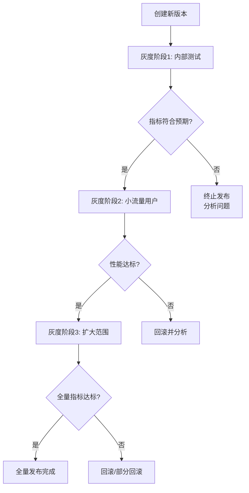
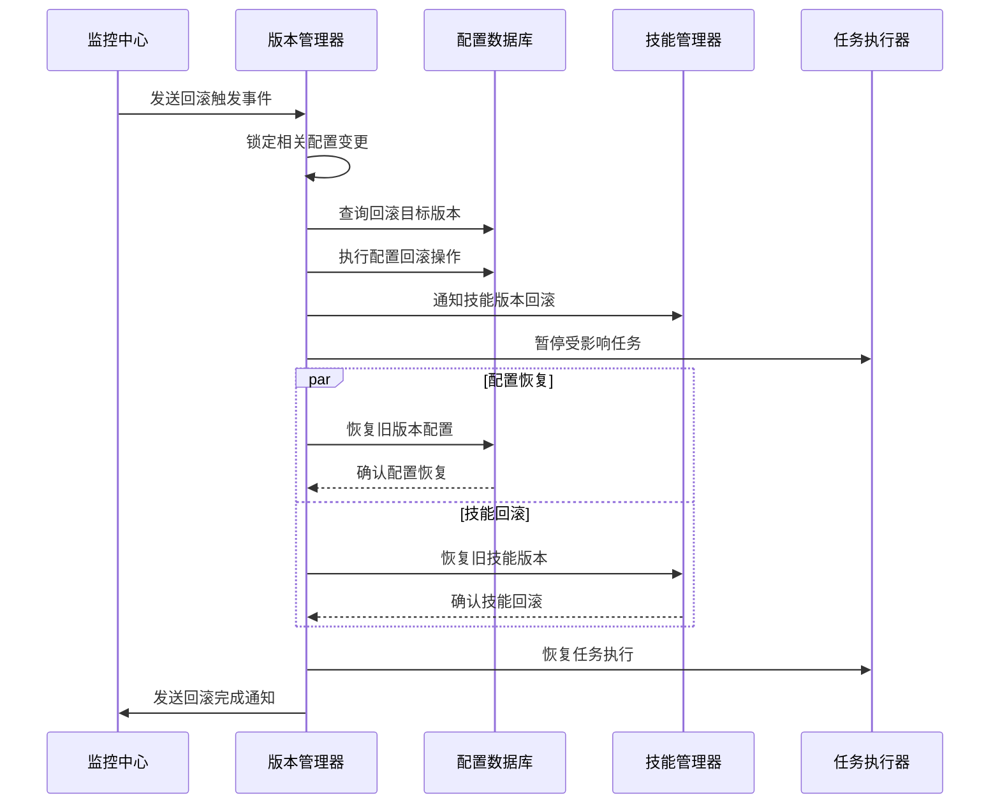

# 智能体工作平台 版本管理模块设计文档

## 1. 概述

### 1.1 模块定位
版本管理模块是平台自主进化机制的关键组成部分，负责智能体配置、技能、模型等多元版本的全生命周期管理。该模块提供灰度发布、快速回滚、配置对比、版本审计等核心能力，确保平台在持续进化过程中的稳定性与可控性。

### 1.2 设计目标
- **版本可控性**：支持智能体配置、技能、模型等多维度版本管理
- **发布安全性**：通过灰度发布策略逐步验证新版本，降低风险
- **回滚敏捷性**：异常情况下支持分钟级快速回滚，保障系统稳定
- **配置可追溯**：完整记录版本变更历史，支持审计与复盘
- **扩展兼容性**：预留接口支持自定义版本类型与扩展点集成

### 1.3 架构位置
根据系统架构图，版本管理模块位于进化引擎层，与以下模块紧密交互：

| 交互模块 | 交互内容 | 关键接口 |
|---------|---------|---------|
| **执行层** | 部署新版本配置、技能、模型 | 版本部署接口、配置更新接口 |
| **性能监控层** | 获取版本性能数据，支持灰度决策 | 监控数据查询接口 |
| **进化触发器** | 接收优化任务，生成版本变更 | 任务提交接口、版本创建接口 |
| **扩展点** | 集成自定义数据库、第三方服务版本 | 扩展接口注册机制 |

## 2. 版本模型设计

### 2.1 多元版本标识体系
平台支持智能体配置、技能、模型三类核心版本管理，每类采用独立的版本标识规则：

#### 2.1.1 智能体配置版本
- **格式**：`{agent_id}/{major}.{minor}.{patch}-{build_id}`
  - `agent_id`：智能体唯一标识符
  - `major.minor.patch`：语义化版本号，遵循[SemVer 2.0](https://semver.org/)
  - `build_id`：构建标识（如时间戳、提交哈希前8位）
- **示例**：`agent_001/1.2.3-20260223`
- **兼容性约定**：
  - `major`版本变更：不向后兼容，需显式升级确认
  - `minor`版本变更：向后兼容，新增功能
  - `patch`版本变更：向后兼容，问题修复

#### 2.1.2 技能版本
- **格式**：`{skill_name}/{major}.{minor}.{patch}[.{build_meta}]`
  - `skill_name`：技能名称，全局唯一
  - 版本号遵循SemVer规则
  - `build_meta`可选：构建元数据（如编译时间、依赖版本）
- **示例**：`weather_query/2.1.0.20260223`
- **依赖管理**：
  - 支持技能间依赖关系声明
  - 版本升级时自动检查依赖兼容性
  - 提供依赖冲突解决方案

#### 2.1.3 模型版本
- **格式**：`{model_type}/{train_date}-{version_suffix}`
  - `model_type`：模型类型标识（如`text_classifier`, `rl_policy`）
  - `train_date`：训练日期（YYYYMMDD）
  - `version_suffix`：版本后缀（`a`、`b`、`rc1`等）
- **示例**：`rl_policy/20260223-a`
- **版本关系**：
  - 父子版本关系：增量训练产生的版本继承关系
  - 分支版本关系：基于不同数据/策略的分支版本
  - 推荐版本标记：当前推荐的稳定版本

### 2.2 版本元数据规范
每个版本包含完整的元数据描述，用于版本识别、比较与审计：

```json
{
  "version_id": "agent_001/1.2.3-20260223",
  "version_type": "agent_config",
  "created_at": "2026-02-23T16:30:00.000Z",
  "created_by": "system/evolution_trigger",
  "change_description": "优化复杂任务超时设置，预期提升成功率3%",
  "change_reason": {
    "trigger_event": "opt_20260223150000_001",
    "analysis_result": "成功率连续3次低于80%，超时设置过短"
  },
  "source_versions": {
    "config_base": "agent_001/1.2.2-20260222",
    "skill_dependencies": [
      "weather_query/2.1.0.20260222",
      "data_analysis/1.0.5.20260222"
    ]
  },
  "target_environment": {
    "min_platform_version": "1.2.0",
    "compatible_agents": ["agent_001", "agent_002"],
    "resource_requirements": {
      "cpu_min": 2,
      "memory_mb_min": 2048
    }
  },
  "performance_expectations": {
    "success_rate_improvement": 0.03,
    "response_time_reduction_ms": 500
  },
  "rollback_info": {
    "rollback_target": "agent_001/1.2.2-20260222",
    "rollback_procedure": "revert_config_update",
    "estimated_rollback_time_ms": 15000
  }
}
```

## 3. 灰度发布策略设计

### 3.1 灰度发布流程
采用渐进式灰度发布流程，确保新版本逐步验证：



### 3.2 流量切分规则
支持多种维度的流量切分策略，可根据业务需求灵活配置：

#### 3.2.1 按比例切分
- **策略**：基于百分比随机分配流量
- **配置示例**：
  ```yaml
  strategy_type: percentage
  percentage: 10  # 10%流量使用新版本
  ```
- **适用场景**：通用型灰度发布，快速收集统计显著性数据

#### 3.2.2 按用户群体切分
- **策略**：基于用户属性划分流量
- **配置示例**：
  ```yaml
  strategy_type: user_group
  user_groups:
    - internal_testers
    - premium_users
    - region: "us-east-1"
  ```
- **适用场景**：定向功能发布，特定用户群体优先体验

#### 3.2.3 按任务类型切分
- **策略**：基于任务类型分配流量
- **配置示例**：
  ```yaml
  strategy_type: task_type
  task_types:
    - simple_query
    - complex_analysis
  ```
- **适用场景**：特定任务类型优化验证，降低对其他任务影响

### 3.3 灰度阶段定义
采用四阶段灰度发布，确保风险层层控制：

| 阶段 | 流量比例 | 目标用户 | 监控频率 | 异常处理 |
|------|---------|---------|---------|---------|
| **阶段1: 内部测试** | 0.1-1% | 平台开发/测试团队 | 实时（秒级） | 立即终止，分析原因 |
| **阶段2: 小流量用户** | 1-5% | 友好用户、志愿者 | 分钟级聚合 | 自动回滚，通知管理员 |
| **阶段3: 扩大范围** | 5-25% | 普通用户抽样 | 5分钟聚合 | 部分回滚，降低风险 |
| **阶段4: 全面推广** | 25-100% | 全体用户（分批） | 15分钟聚合 | 降级策略，有限回滚 |

### 3.4 效果评估指标
灰度发布过程中，基于以下指标评估新版本效果：

#### 3.4.1 核心性能指标
- **成功率对比**：新旧版本成功率差异（Δ%）
- **响应时间对比**：平均响应时间差异（Δms）、P95/P99差异
- **错误率对比**：各类错误发生频率变化

#### 3.4.2 业务影响指标
- **用户体验指标**：任务完成时间、用户满意度（如有）
- **资源消耗对比**：CPU/内存/网络使用率变化
- **第三方依赖影响**：工具调用成功率、外部API响应时间

#### 3.4.3 统计检验方法
- **A/B测试胜率计算**：基于任务结果的二项检验
- **置信区间估计**：关键指标的95%置信区间
- **最小样本量要求**：每个版本至少500个任务样本
- **显著性标准**：p-value < 0.05，且Δ > 最小有意义变化

### 3.5 灰度决策逻辑
基于监控数据和统计检验结果，自动化决策发布流程：

```python
class GradualReleaseDecider:
    def evaluate_stage(self, stage_data, performance_thresholds):
        """评估当前灰度阶段是否可推进"""
        
        evaluation = {
            "stage_approved": False,
            "recommendation": "hold",
            "detailed_metrics": {}
        }
        
        # 1. 检查核心指标是否达标
        core_metrics_pass = self._check_core_metrics(
            stage_data["core_metrics"], 
            performance_thresholds
        )
        
        if not core_metrics_pass:
            evaluation["recommendation"] = "rollback"
            evaluation["failure_reason"] = "core_metrics_below_threshold"
            return evaluation
        
        # 2. 检查统计显著性
        significance_result = self._check_statistical_significance(
            stage_data["variant_data"],
            stage_data["control_data"]
        )
        
        if not significance_result["significant"]:
            evaluation["recommendation"] = "continue_monitoring"
            evaluation["estimated_samples_needed"] = significance_result["needed_samples"]
            return evaluation
        
        # 3. 检查业务影响指标
        business_impact_pass = self._check_business_impact(
            stage_data["business_metrics"],
            performance_thresholds["business_impact"]
        )
        
        if business_impact_pass:
            evaluation["stage_approved"] = True
            evaluation["recommendation"] = "proceed_to_next_stage"
        else:
            evaluation["recommendation"] = "partial_rollback"
            evaluation["affected_metrics"] = self._identify_affected_metrics()
        
        return evaluation
```

## 4. 回滚机制设计

### 4.1 回滚触发条件
定义多级回滚触发条件，确保异常情况及时响应：

| 严重等级 | 触发条件 | 自动响应 | 人工通知 |
|---------|---------|---------|---------|
| **紧急** | 核心服务不可用、成功率断崖式下降(>30%) | 立即自动回滚 | 实时通知（电话/短信） |
| **严重** | 成功率持续低于阈值(连续3次<80%)、平均响应时间超过阈值(>8秒) | 建议回滚，需管理员确认（2分钟内） | 即时通知（邮件/Slack） |
| **警告** | 单一指标轻微恶化、新增非关键错误 | 记录并监控，不自动回滚 | 定期汇总报告 |

### 4.2 回滚流程设计
回滚操作采用标准化流程，确保数据一致性和系统稳定性：



### 4.3 数据一致性保障
回滚过程中的数据一致性通过以下机制保障：

#### 4.3.1 事务性配置更新
```sql
-- 配置回滚事务示例
BEGIN TRANSACTION;

-- 1. 记录回滚操作
INSERT INTO rollback_operations (
    rollback_id, source_version, target_version, 
    operation_type, started_at
) VALUES (
    'rbk_20260223164500_001',
    'agent_001/1.2.3-20260223',
    'agent_001/1.2.2-20260222',
    'full_rollback',
    CURRENT_TIMESTAMP
);

-- 2. 恢复配置数据
UPDATE agent_configs 
SET is_active = false 
WHERE agent_id = 'agent_001' AND version = '1.2.3-20260223';

UPDATE agent_configs 
SET is_active = true 
WHERE agent_id = 'agent_001' AND version = '1.2.2-20260222';

-- 3. 更新版本标记
UPDATE version_markers 
SET current_version = 'agent_001/1.2.2-20260222',
    rollback_count = rollback_count + 1
WHERE agent_id = 'agent_001';

COMMIT TRANSACTION;
```

#### 4.3.2 增量回滚机制
对于大规模配置变更，支持增量回滚以降低影响：
- **分批次回滚**：按配置模块分批回滚，每批间隔5分钟
- **用户分群回滚**：优先回滚关键用户群，逐步扩大范围
- **功能降级**：暂时关闭新功能，保留基础服务稳定

### 4.4 回滚性能指标
回滚操作需满足以下性能要求：

| 指标 | 目标值 | 测量方法 | 优化方向 |
|------|-------|---------|---------|
| **回滚决策时间** | <30秒 | 从触发到决策完成 | 优化规则引擎性能 |
| **配置恢复时间** | <1分钟 | 配置数据库更新完成 | 优化SQL执行计划 |
| **服务恢复时间** | <2分钟 | 受影响任务恢复正常 | 并行化回滚操作 |
| **数据一致性检查** | <3分钟 | 验证前后端数据一致 | 异步一致性验证 |

## 5. 配置管理设计

### 5.1 配置存储结构
采用分层配置存储模型，支持多版本共存与快速检索：

#### 5.1.1 数据库表设计
```sql
-- 智能体配置主表（PostgreSQL JSONB存储）
CREATE TABLE agent_config_versions (
    version_id VARCHAR(256) PRIMARY KEY,
    agent_id VARCHAR(128) NOT NULL,
    version_number VARCHAR(32) NOT NULL,  -- 1.2.3格式
    config_type VARCHAR(64) NOT NULL,     -- model_params, behavior_policy, runtime_config
    config_data JSONB NOT NULL,
    config_hash VARCHAR(64) NOT NULL,     -- SHA256哈希，用于快速比较
    parent_version VARCHAR(256),          -- 父版本引用
    lineage_path LTREE,                   -- 版本谱系树路径
    created_at TIMESTAMPTZ DEFAULT NOW(),
    created_by VARCHAR(128),              -- system/user id
    is_active BOOLEAN DEFAULT false,      -- 当前是否活跃版本
    activation_time TIMESTAMPTZ,          -- 激活时间
    deactivation_time TIMESTAMPTZ,        -- 停用时间（回滚时记录）
    
    -- 索引设计
    INDEX idx_agent_versions (agent_id, version_number DESC),
    INDEX idx_active_versions (agent_id, is_active, config_type),
    INDEX idx_lineage_path (lineage_path),
    INDEX idx_config_hash (config_hash)
);

-- 配置变更记录表
CREATE TABLE config_changes (
    change_id UUID PRIMARY KEY DEFAULT gen_random_uuid(),
    version_id VARCHAR(256) REFERENCES agent_config_versions(version_id),
    change_type VARCHAR(32) NOT NULL,      -- create, update, rollback, delete
    change_summary TEXT NOT NULL,          -- 人类可读的变更摘要
    change_details JSONB,                  -- 详细的变更内容（前后对比）
    affected_sections TEXT[],              -- 影响的配置章节
    risk_assessment VARCHAR(32),           -- low, medium, high, critical
    reviewer VARCHAR(128),                 -- 审核人（如需要）
    reviewed_at TIMESTAMPTZ,
    change_status VARCHAR(32) DEFAULT 'pending',  -- pending, approved, rejected, applied
    created_at TIMESTAMPTZ DEFAULT NOW(),
    
    INDEX idx_change_status (change_status, created_at),
    INDEX idx_version_changes (version_id, created_at DESC)
);
```

#### 5.1.2 缓存层设计
- **Redis缓存结构**：
  - 键格式：`agent:config:{agent_id}:{config_type}:{version}`
  - 过期策略：活跃版本30分钟，历史版本5分钟
  - 压缩策略：JSON数据gzip压缩后存储

### 5.2 版本差异对比机制
提供多层次的配置对比能力，支持快速定位变更：

#### 5.2.1 对比算法设计
```python
class ConfigComparator:
    def compare_versions(self, version_a, version_b, comparison_mode="detailed"):
        """对比两个版本配置差异"""
        
        config_a = self._load_config(version_a)
        config_b = self._load_config(version_b)
        
        if comparison_mode == "hash_only":
            # 快速哈希对比
            return {
                "changed": config_a["config_hash"] != config_b["config_hash"],
                "hash_a": config_a["config_hash"],
                "hash_b": config_b["config_hash"]
            }
        
        elif comparison_mode == "structural":
            # 结构对比（键/类型变化）
            return self._structural_comparison(config_a, config_b)
        
        else:  # detailed
            # 详细内容对比（支持嵌套JSON）
            return self._detailed_comparison(config_a, config_b)
    
    def _detailed_comparison(self, config_a, config_b):
        """详细配置对比，生成差异报告"""
        
        diff_report = {
            "summary": {
                "total_changes": 0,
                "added_keys": [],
                "removed_keys": [],
                "modified_keys": []
            },
            "details": [],
            "impact_analysis": self._analyze_impact(config_a, config_b)
        }
        
        # 递归比较JSON结构
        self._recursive_compare(
            config_a["config_data"], 
            config_b["config_data"],
            path="",
            diff_report=diff_report
        )
        
        return diff_report
```

#### 5.2.2 差异可视化
- **文本差异**：类似git diff的格式展示变更
- **可视化树**：交互式树状结构，高亮变更节点
- **影响地图**：展示变更影响的模块和依赖关系

### 5.3 合并冲突解决策略
当多分支配置需要合并时，提供智能冲突解决：

| 冲突类型 | 自动解决策略 | 人工介入条件 | 解决方案示例 |
|---------|------------|------------|------------|
| **标量值冲突** | 选择数值较大/较新的值 | 无法自动判断影响时 | 超时设置：选择较保守值（较大值） |
| **数组内容冲突** | 合并去重，保留双方元素 | 合并后数组过长(>100) | 工具白名单：合并后排序去重 |
| **对象结构冲突** | 优先保留完整结构 | 结构差异超过30% | 策略配置：合并字段，冲突字段提示 |
| **依赖版本冲突** | 选择兼容性更好的版本 | 无兼容版本时 | 技能依赖：选择最新稳定版 |

## 6. 版本历史与审计设计

### 6.1 审计数据模型
记录完整的版本变更历史，支持多维度的审计分析：

```sql
-- 版本审计主表
CREATE TABLE version_audit_log (
    audit_id UUID PRIMARY KEY DEFAULT gen_random_uuid(),
    timestamp TIMESTAMPTZ DEFAULT NOW() NOT NULL,
    
    -- 操作上下文
    operation_type VARCHAR(32) NOT NULL,      -- create, update, release, rollback, delete
    operator_type VARCHAR(32) NOT NULL,       -- system, human, automation
    operator_id VARCHAR(128) NOT NULL,        -- user_id / system_component / agent_id
    
    -- 版本信息
    version_id VARCHAR(256) NOT NULL,
    version_type VARCHAR(64) NOT NULL,        -- agent_config, skill, model
    entity_id VARCHAR(128) NOT NULL,          -- agent_id / skill_name / model_type
    
    -- 变更内容
    old_version_ref VARCHAR(256),             -- 旧版本引用
    new_version_ref VARCHAR(256),             -- 新版本引用
    change_summary TEXT,                      -- 变更摘要（用于快速检索）
    change_details JSONB,                     -- 详细变更内容
    
    -- 环境信息
    environment VARCHAR(32) DEFAULT 'production',
    deployment_id VARCHAR(128),               -- 部署批次标识
    request_id VARCHAR(128),                  -- 关联请求标识
    
    -- 索引设计（支持高效查询）
    INDEX idx_timestamp_entity (timestamp DESC, entity_id, version_type),
    INDEX idx_operator (operator_id, timestamp DESC),
    INDEX idx_operation (operation_type, timestamp DESC),
    INDEX idx_version (version_id, timestamp DESC),
    INDEX idx_change_summary (change_summary text_pattern_ops)  -- 支持文本搜索
);
```

### 6.2 审计事件分类
定义标准化的审计事件类型，确保审计记录一致性：

| 事件类别 | 事件代码 | 触发条件 | 记录内容 |
|---------|---------|---------|---------|
| **版本创建** | `VERSION_CREATE` | 新配置/技能/模型版本创建 | 版本元数据、创建原因、引用来源 |
| **版本更新** | `VERSION_UPDATE` | 现有版本内容变更 | 变更前后对比、修改说明 |
| **灰度发布** | `RELEASE_START` | 灰度发布流程启动 | 发布策略、目标范围、预期指标 |
| **发布推进** | `RELEASE_ADVANCE` | 灰度阶段推进 | 评估结果、决策依据、下一阶段计划 |
| **发布完成** | `RELEASE_COMPLETE` | 版本全量发布完成 | 总体性能数据、业务影响分析 |
| **回滚操作** | `ROLLBACK_EXECUTE` | 版本回滚执行 | 回滚原因、目标版本、影响评估 |
| **配置激活** | `CONFIG_ACTIVATE` | 版本激活（生效） | 激活时间、激活方式、生效范围 |
| **配置停用** | `CONFIG_DEACTIVATE` | 版本停用（失效） | 停用原因、停用时间、后续计划 |

### 6.3 审计查询接口
提供丰富的审计查询能力，支持多种审计场景：

#### 6.3.1 基础查询接口
```http
GET /v1/audit/versions
查询参数：
  - entity_id: 可选，实体标识符（智能体ID、技能名称等）
  - version_type: 可选，版本类型（agent_config, skill, model）
  - operation_type: 可选，操作类型（create, update, rollback等）
  - operator_id: 可选，操作者标识
  - start_time: 可选，开始时间（ISO8601格式）
  - end_time: 可选，结束时间
  - limit: 可选，返回记录数（默认100，最大1000）
  - offset: 可选，偏移量（用于分页）

响应示例：
{
  "total_count": 1250,
  "audit_entries": [
    {
      "audit_id": "audit_001",
      "timestamp": "2026-02-23T16:30:00Z",
      "operation_type": "RELEASE_START",
      "operator_type": "system",
      "operator_id": "evolution_trigger",
      "entity_id": "agent_001",
      "version_id": "agent_001/1.2.3-20260223",
      "change_summary": "启动灰度发布：复杂任务超时优化",
      "change_details": {
        "release_strategy": "percentage",
        "initial_percentage": 1,
        "performance_expectations": {
          "success_rate_improvement": 0.03,
          "response_time_reduction_ms": 500
        }
      }
    }
  ]
}
```

#### 6.3.2 高级分析接口
```http
GET /v1/audit/analysis
查询参数：
  - analysis_type: 必选，分析类型（frequency, trend, correlation）
  - dimension: 可选，分析维度（operator, entity, environment）
  - grouping: 可选，分组方式（day, week, month）

响应示例（趋势分析）：
{
  "analysis_type": "trend",
  "dimension": "operation_type",
  "time_period": "2026-02-01 to 2026-02-23",
  "results": [
    {
      "operation_type": "RELEASE_START",
      "daily_counts": [
        {"date": "2026-02-01", "count": 12},
        {"date": "2026-02-02", "count": 15},
        ...
      ],
      "trend_description": "发布频率稳步上升，日均14次"
    }
  ]
}
```

### 6.4 审计合规性保障
确保审计记录满足合规性要求：

#### 6.4.1 不可篡改保证
- **哈希链技术**：每个审计记录包含前一个记录的哈希值
- **数字签名**：关键审计记录使用平台私钥签名
- **防删除设计**：审计记录标记删除，而非物理删除

#### 6.4.2 数据保留策略
| 审计数据类型 | 保留期限 | 存储格式 | 访问权限 |
|------------|---------|---------|---------|
| 安全关键操作 | 永久 | 主数据库+归档 | 审计员、管理员 |
| 普通配置变更 | 2年 | 主数据库 | 运维、开发者 |
| 系统自动操作 | 1年 | 主数据库 | 自动化系统 |
| 详细变更内容 | 6个月 | 主数据库 | 需要时重建 |

#### 6.4.3 合规性报告
- **定期生成**：月度、季度、年度合规报告
- **自动化检查**：审计记录完整性、不可篡改性验证
- **异常告警**：审计记录缺失、篡改尝试等异常告警

## 7. 实施与集成方案

### 7.1 模块组件清单

| 组件名称 | 技术栈 | 主要功能 | 依赖服务 |
|---------|--------|---------|---------|
| **版本仓库服务** | Python + PostgreSQL | 版本存储、检索、比对 | 配置数据库、缓存服务 |
| **发布调度器** | Python + Celery | 灰度发布流程控制、阶段推进 | 任务队列、监控服务 |
| **回滚执行器** | Python + Redis | 快速回滚操作、一致性保证 | 配置服务、技能管理器 |
| **审计记录器** | Python + Elasticsearch | 审计日志收集、查询、分析 | 日志收集、安全服务 |
| **配置分发器** | Python + gRPC | 配置热更新、版本切换通知 | 服务发现、负载均衡 |

### 7.2 数据流设计

#### 7.2.1 版本发布数据流
```
进化触发器 → 版本管理 → 执行层 → 监控层
    ↓           ↓          ↓         ↓
生成优化任务 → 创建版本 → 部署配置 → 采集数据
    ↓           ↓          ↓         ↓
  反馈学习 ← 发布监控 ← 服务调用 ← 性能指标
```

#### 7.2.2 回滚执行数据流
```
监控告警 → 版本管理 → 执行层 → 业务层
    ↓         ↓          ↓        ↓
检测异常 → 决策回滚 → 恢复配置 → 服务恢复
    ↓         ↓          ↓        ↓
告警处理 ← 记录审计 ← 状态同步 ← 体验保障
```

### 7.3 接口集成设计

#### 7.3.1 内部接口
- **版本管理API**：RESTful接口，提供版本CRUD、发布控制、回滚执行
- **配置分发API**：gRPC流式接口，支持实时配置推送与订阅
- **审计查询API**：GraphQL接口，支持灵活的数据查询与分析

#### 7.3.2 外部集成
- **监控系统集成**：订阅性能指标，支持发布决策
- **CI/CD流水线**：接收构建版本，触发自动发布流程
- **第三方配置中心**：支持配置同步与备份

### 7.4 部署架构
- **容器化部署**：Docker镜像，Kubernetes编排
- **服务发现**：Consul/Etcd，支持动态扩缩容
- **数据持久化**：PostgreSQL主从复制，Redis集群缓存
- **监控部署**：集成Prometheus监控，Grafana仪表板

## 8. 扩展性与演进规划

### 8.1 短期扩展（3-6个月）
1. **多环境支持**：开发、测试、预发、生产多环境版本管理
2. **配置模板化**：支持配置模板，加速版本创建
3. **智能推荐**：基于历史数据推荐优化参数版本
4. **审批流程**：关键变更的审批流程集成

### 8.2 中期演进（6-12个月）
1. **联邦版本管理**：支持跨平台、跨组织的版本同步与协作
2. **预测性发布**：基于时序预测选择最佳发布时间
3. **自适应发布策略**：根据系统状态动态调整发布策略
4. **版本仿真环境**：支持版本变更的仿真测试

### 8.3 长期愿景（1-2年）
1. **全自动版本演进**：完全自动化的版本创建、测试、发布、回滚
2. **跨智能体协作版本**：多个智能体协同进化的版本管理
3. **量子安全审计**：基于量子加密技术的审计记录保护
4. **生态版本治理**：平台生态系统的版本兼容性治理框架

---

## 文档信息

- **文档版本**：1.0
- **创建时间**：2026-02-23
- **最后更新**：2026-02-23
- **相关文档**：
  - `outputs/文档/需求分析.md`：平台整体需求定义
  - `outputs/架构/平台架构.drawio.xml`：系统架构图
  - `outputs/文档/技术方案.md`：平台整体技术方案
  - `outputs/文档/性能监控模块设计.md`：监控模块详细设计
  - `outputs/文档/进化触发器模块设计.md`：进化触发器模块设计

## 修订记录

| 版本 | 日期 | 修改内容 | 修改人 |
|------|------|---------|--------|
| 1.0 | 2026-02-23 | 初始版本，完成版本管理模块完整设计 | 扣子 |

