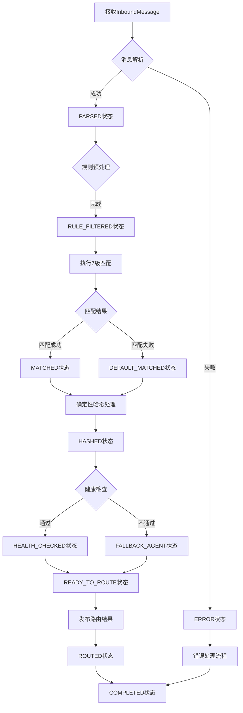

# 路由（Routing）层技术方案文档

## 1. 概述

### 1.1 定位与职责

路由层是六元组架构中的多维度智能分发引擎，负责基于7级匹配规则决定每条消息由哪个Agent处理。基于HexaCore框架的auto-reply模块实现，路由层的核心职责包括：

- **智能调度分发**：基于peer、content、channel、time等多维度匹配规则，将消息精准分发到最合适的Agent
- **确定性路由保证**：确保同一会话的消息总是路由到同一个Agent，维持上下文连续性
- **企业级规则配置**：支持复杂的条件组合（AND/OR逻辑）、正则表达式匹配和语义相似度匹配
- **性能与容错**：通过规则索引、结果缓存和健康检查机制，确保高并发下的稳定性和可靠性
- **热重载支持**：支持HexaCore.json配置文件热重载，新增规则无需重启服务

### 1.2 在六元组架构中的位置

路由层作为六元组架构的核心调度中枢，承担着"智能分发器"的角色：

```
出入口层 → 路由层 → 频道层 → 技能层/记忆层/沙箱层
```

与六元组其他元组的协作关系：
- **与出入口层协作**：接收标准化的InboundMessage对象，提取匹配规则所需字段
- **与频道层协作**：基于路由结果为消息分配Session Key，建立上下文隔离容器
- **与技能层协作**：根据路由结果确定Agent可用的技能集和权限
- **与记忆层协作**：基于Session Key关联会话历史，支持上下文连续性
- **与沙箱层协作**：基于Agent安全等级应用相应的隔离策略

### 1.3 设计目标

基于HexaCore框架的设计目标：

1. **HexaCore兼容性**：完全遵循HexaCore auto-reply模块架构，确保与HexaCore Gateway事件系统无缝集成
2. **规则表达能力**：支持7级优先级匹配规则，覆盖从精确匹配到默认路由的所有场景
3. **高性能匹配**：通过规则索引、缓存机制和并行处理，确保平均匹配时间<100ms
4. **确定性与一致性**：基于确定性哈希算法，保证同一消息永远路由到同一目的地
5. **企业级可配置**：支持JSON5格式配置文件，提供丰富的路由场景配置示例

## 2. HexaCore参考架构

### 2.1 auto-reply模块架构

基于HexaCore auto-reply模块实现7级匹配规则的智能分发引擎，集成到Gateway的WebSocket控制平面：

```
src/routing/
├── engine/                    # 路由引擎核心模块
│   ├── rule-matcher.ts       # 规则匹配引擎
│   ├── priority-sorter.ts    # 优先级排序器
│   ├── deterministic-hash.ts # 确定性哈希路由器
│   ├── state-machine.ts      # 路由决策状态机
│   └── load-balancer.ts      # 负载均衡器
├── rules/                    # 规则定义模块
│   ├── peer-rules.ts         # Peer级别规则实现
│   ├── content-rules.ts      # Content级别规则实现
│   ├── channel-rules.ts      # Channel级别规则实现
│   ├── time-rules.ts         # Time级别规则实现
│   ├── guild-rules.ts        # Guild/Team级别规则实现
│   ├── account-rules.ts      # Account/Channel级别规则实现
│   └── default-rules.ts      # 默认规则实现
├── diagnostics/              # 诊断与调试模块
│   ├── debugger.ts           # 路由调试工具
│   ├── analyzer.ts           # 路由分析器
│   ├── trace-logger.ts       # 跟踪日志记录器
│   └── metrics-collector.ts  # 指标收集器
├── config/                   # 配置管理模块
│   ├── loader.ts             # 配置加载器
│   ├── validator.ts          # 配置验证器
│   ├── hot-reload.ts         # 热重载管理器
│   └── schema.ts             # 配置模式定义
└── api/                      # API接口模块
    ├── routing-api.ts        # 路由API接口
    ├── rule-management.ts    # 规则管理接口
    └── query-interface.ts    # 查询接口
```

### 2.2 路由决策流程

完整的路由决策流程遵循HexaCore事件驱动模型：

1. **消息接收与解析**：从出入口层接收标准化的InboundMessage对象
2. **规则预处理**：基于Session Key和消息元数据，筛选可能匹配的规则集
3. **7级匹配引擎**：按优先级顺序执行7级匹配规则，从高到低依次为：
   - Peer精确匹配（优先级100）
   - Peer元数据匹配（优先级90）
   - Content关键词匹配（优先级80）
   - Content语义匹配（优先级70）
   - Guild/Team匹配（优先级60）
   - Account/Channel匹配（优先级50）
   - Default规则（优先级0）
4. **结果确定性处理**：对匹配结果应用一致性哈希，确保路由确定性
5. **健康检查过滤**：排除不健康的Agent节点，确保服务可用性
6. **路由结果发布**：将最终路由结果发布到Gateway事件总线，触发频道层创建

### 2.3 HexaCore集成点

路由层与HexaCore框架的核心集成点：

1. **auto-reply模块集成**：遵循HexaCore的`AutoReply`接口定义，实现`match`、`route`、`healthCheck`等方法
2. **配置管理集成**：使用HexaCore标准的`HexaCore.json`配置文件格式（JSON5），支持bindings配置节
3. **事件系统集成**：订阅HexaCore的`inbound_message`事件，发布`routing_result`事件
4. **遥测系统集成**：与HexaCore遥测系统集成，提供路由匹配成功率、延迟、规则命中率等指标
5. **诊断工具集成**：集成HexaCore诊断工具链，支持路由规则调试和性能分析

## 3. 核心算法实现

### 3.1 7级匹配规则引擎

```typescript
class RuleMatcher {
  async matchRules(
    message: InboundMessage,
    config: RoutingConfig
  ): Promise<RoutingResult> {
    const rules = config.bindings;
    
    // 1. Peer精确匹配（优先级100） - 基于peer.id和channel的精确匹配
    const peerExactMatch = rules.find(rule => 
      rule.match.peer?.id === message.peer.id &&
      rule.match.channel === message.channel
    );
    
    // 2. Peer元数据匹配（优先级90） - 基于peer.metadata的灵活匹配
    const peerMetadataMatch = rules.find(rule =>
      this.matchPeerMetadata(rule.match.peer?.metadata, message.peer.metadata)
    );
    
    // 3. Content关键词匹配（优先级80） - 基于关键词列表的文本匹配
    const keywordMatch = rules.find(rule =>
      this.matchKeywords(rule.match.content?.keywords, message.content.text)
    );
    
    // 4. Content语义匹配（优先级70） - 基于向量相似度的语义匹配
    const semanticMatch = await this.matchSemantic(
      rules,
      message.content.text
    );
    
    // 5. Guild/Team匹配（优先级60） - 基于组织/团队的匹配
    const guildMatch = rules.find(rule =>
      rule.match.guildId === message.peer.metadata?.guildId
    );
    
    // 6. Account/Channel匹配（优先级50） - 基于账户和渠道组合的匹配
    const accountMatch = rules.find(rule =>
      rule.match.channel === message.channel &&
      rule.match.accountId === message.accountId
    );
    
    // 7. Default规则（优先级0） - 兜底规则
    const defaultRule = rules.find(rule => rule.match.default === true);
    
    // 按优先级返回第一个匹配的规则
    const matches = [
      peerExactMatch,
      peerMetadataMatch,
      keywordMatch,
      semanticMatch,
      guildMatch,
      accountMatch,
      defaultRule
    ].filter(Boolean);
    
    return matches[0] || { agentId: 'general', priority: 0 };
  }
  
  private matchPeerMetadata(
    ruleMetadata: Record<string, any> | undefined,
    messageMetadata: Record<string, any> | undefined
  ): boolean {
    if (!ruleMetadata || !messageMetadata) return false;
    
    // 支持多种匹配运算符：eq, gt, lt, gte, lte, in, contains
    for (const [key, condition] of Object.entries(ruleMetadata)) {
      const actualValue = messageMetadata[key];
      
      if (typeof condition === 'object') {
        // 复杂条件：{gt: 10000} 或 {in: ["premium", "vip"]}
        if (condition.gt !== undefined && actualValue <= condition.gt) return false;
        if (condition.lt !== undefined && actualValue >= condition.lt) return false;
        if (condition.gte !== undefined && actualValue < condition.gte) return false;
        if (condition.lte !== undefined && actualValue > condition.lte) return false;
        if (condition.eq !== undefined && actualValue !== condition.eq) return false;
        if (condition.in !== undefined && !condition.in.includes(actualValue)) return false;
        if (condition.contains !== undefined && !actualValue?.includes(condition.contains)) return false;
      } else {
        // 简单相等匹配
        if (actualValue !== condition) return false;
      }
    }
    
    return true;
  }
  
  private matchKeywords(
    keywords: string[] | undefined,
    text: string | undefined
  ): boolean {
    if (!keywords || !text) return false;
    
    // 支持两种匹配模式：any（任一关键词）和 all（所有关键词）
    const mode = keywords.mode || 'any';
    const keywordList = Array.isArray(keywords) ? keywords : keywords.keywords || [];
    
    if (mode === 'any') {
      return keywordList.some(keyword => text.includes(keyword));
    } else {
      return keywordList.every(keyword => text.includes(keyword));
    }
  }
  
  private async matchSemantic(
    rules: RoutingRule[],
    text: string
  ): Promise<RoutingRule | undefined> {
    if (!text) return undefined;
    
    // 集成HexaCore Memory Sidecar的向量检索能力
    const embedding = await this.embeddingService.generateEmbedding(text);
    
    // 查找包含语义匹配条件的规则
    const semanticRules = rules.filter(rule => rule.match.content?.semantic);
    
    for (const rule of semanticRules) {
      const similarity = await this.semanticSearchService.calculateSimilarity(
        embedding,
        rule.match.content.semantic.query
      );
      
      if (similarity >= (rule.match.content.semantic.threshold || 0.7)) {
        return rule;
      }
    }
    
    return undefined;
  }
}
```

### 3.2 确定性哈希路由算法

```typescript
class DeterministicRouter {
  private readonly virtualNodesPerAgent: number = 1000;
  private readonly hashRing = new Map<number, string>();
  
  constructor() {
    this.initializeHashRing();
  }
  
  getAgentForMessage(message: InboundMessage): string {
    // 基于会话标识符生成确定性哈希键
    const sessionKey = this.generateSessionKey(message);
    const hash = this.murmurHash3(sessionKey);
    
    // 一致性哈希查找：找到大于等于hash的第一个虚拟节点
    const sortedHashes = Array.from(this.hashRing.keys()).sort((a, b) => a - b);
    const targetHash = sortedHashes.find(h => h >= hash) || sortedHashes[0];
    
    return this.hashRing.get(targetHash)!;
  }
  
  private generateSessionKey(message: InboundMessage): string {
    // HexaCore标准格式：agent:{agentId}:{channel}:{accountId}:direct:{peerId}
    // 在路由阶段，agentId尚未确定，使用路由决策因子组合
    const routingFactors = [
      message.channel,
      message.accountId,
      message.peer.id,
      message.peer.kind
    ].join(':');
    
    return `routing:${routingFactors}`;
  }
  
  private murmurHash3(key: string): number {
    // MurmurHash3算法实现，确保哈希均匀分布
    let hash = 0x811c9dc5;
    
    for (let i = 0; i < key.length; i++) {
      hash ^= key.charCodeAt(i);
      hash = (hash * 0x01000193) & 0xffffffff;
    }
    
    return hash >>> 0; // 转换为无符号32位整数
  }
  
  private initializeHashRing(): void {
    const agents = this.getAvailableAgents();
    
    agents.forEach(agentId => {
      for (let i = 0; i < this.virtualNodesPerAgent; i++) {
        const virtualKey = `${agentId}:${i}`;
        const hash = this.murmurHash3(virtualKey);
        this.hashRing.set(hash, agentId);
      }
    });
  }
  
  private getAvailableAgents(): string[] {
    // 从服务注册中心或配置中获取可用Agent列表
    return ['vip-agent', 'pricing-agent', 'tech-support', 'general-agent'];
  }
  
  private consistentHash(hash: number, agents: string[]): string {
    // 一致性哈希算法
    const sortedAgents = [...agents].sort();
    const index = hash % sortedAgents.length;
    return sortedAgents[index];
  }
}
```

### 3.3 路由决策状态机设计

```
路由决策状态机包含以下状态和转换：

初始状态: RECEIVED
  ↓ (消息解析完成)
状态: PARSED
  ↓ (规则预处理)
状态: RULE_FILTERED
  ↓ (执行7级匹配)
状态: MATCHING
  ↓ (匹配成功)
状态: MATCHED
  ↓ (确定性哈希处理)
状态: HASHED
  ↓ (健康检查)
状态: HEALTH_CHECKED
  ↓ (健康检查通过)
状态: READY_TO_ROUTE
  ↓ (发布路由结果)
状态: ROUTED
  ↓ (完成)
状态: COMPLETED

异常路径：
- MATCHING → (匹配失败) → DEFAULT_MATCHED
- HEALTH_CHECKED → (健康检查失败) → FALLBACK_AGENT
- 任何状态 → (超时) → TIMEOUT
- 任何状态 → (系统错误) → ERROR
```

路由决策流程图：



## 4. 性能优化策略

### 4.1 规则索引与缓存机制

1. **多级规则索引**：
   ```typescript
   class RuleIndex {
     private peerExactIndex: Map<string, RoutingRule[]> = new Map();
     private peerMetadataIndex: Map<string, RoutingRule[]> = new Map();
     private keywordIndex: Map<string, RoutingRule[]> = new Map();
     private semanticIndex: Map<string, RoutingRule[]> = new Map();
     
     // 基于消息特征快速定位候选规则集
     getCandidateRules(message: InboundMessage): RoutingRule[] {
       const candidates = new Set<RoutingRule>();
       
       // Peer精确索引查找
       const peerKey = `${message.channel}:${message.peer.id}`;
       const peerRules = this.peerExactIndex.get(peerKey) || [];
       peerRules.forEach(rule => candidates.add(rule));
       
       // 关键词索引查找
       const words = this.extractKeywords(message.content.text);
       words.forEach(word => {
         const keywordRules = this.keywordIndex.get(word) || [];
         keywordRules.forEach(rule => candidates.add(rule));
       });
       
       return Array.from(candidates);
     }
   }
   ```

2. **路由结果缓存**：
   ```typescript
   class RoutingCache {
     private cache = new Map<string, RoutingResult>();
     private readonly ttl: number = 3600; // 1小时
     
     async getOrCompute(
       message: InboundMessage,
       computeFn: () => Promise<RoutingResult>
     ): Promise<RoutingResult> {
       const cacheKey = this.generateCacheKey(message);
       
       // 检查缓存命中
       const cached = this.cache.get(cacheKey);
       if (cached && Date.now() - cached.timestamp < this.ttl * 1000) {
         return cached.result;
       }
       
       // 缓存未命中，计算并缓存结果
       const result = await computeFn();
       this.cache.set(cacheKey, {
         result,
         timestamp: Date.now()
       });
       
       return result;
     }
     
     private generateCacheKey(message: InboundMessage): string {
       return `${message.channel}:${message.accountId}:${message.peer.id}:${message.peer.kind}`;
     }
   }
   ```

### 4.2 并行匹配与决策树优化

1. **并行匹配策略**：
   ```typescript
   class ParallelMatcher {
     async matchParallel(
       message: InboundMessage,
       rules: RoutingRule[]
     ): Promise<RoutingRule[]> {
       // 分组并行匹配
       const groups = this.createMatchGroups(rules);
       
       const results = await Promise.allSettled(
         groups.map(group => this.matchGroup(message, group))
       );
       
       // 合并结果，按优先级排序
       return this.mergeResults(results);
     }
     
     private createMatchGroups(rules: RoutingRule[]): RoutingRule[][] {
       // 基于规则类型和复杂度分组，最大化并行效率
       const peerRules = rules.filter(r => r.match.peer);
       const contentRules = rules.filter(r => r.match.content);
       const otherRules = rules.filter(r => !r.match.peer && !r.match.content);
       
       return [peerRules, contentRules, otherRules];
     }
   }
   ```

2. **决策树剪枝**：
   ```typescript
   class DecisionTreeOptimizer {
     optimizeDecisionTree(rules: RoutingRule[]): OptimizedRuleSet {
       // 构建规则决策树，应用剪枝算法
       const tree = this.buildDecisionTree(rules);
       const prunedTree = this.pruneTree(tree);
       
       // 转换为高效匹配结构
       return this.convertToOptimizedRuleSet(prunedTree);
     }
     
     private pruneTree(tree: DecisionTree): DecisionTree {
       // 基于规则使用频率和匹配成本进行剪枝
       // 1. 移除低频使用规则
       // 2. 合并相似条件规则
       // 3. 重新排序优化匹配顺序
       return this.applyPruningAlgorithms(tree);
     }
   }
   ```

### 4.3 异步处理与批量优化

1. **异步消息处理管道**：
   ```typescript
   class AsyncRoutingPipeline {
     private readonly batchSize: number = 50;
     private readonly batchTimeout: number = 100; // 100ms
     
     async processBatch(messages: InboundMessage[]): Promise<RoutingResult[]> {
       // 批量处理，减少上下文切换开销
       const batches = this.createBatches(messages, this.batchSize);
       
       const results = [];
       for (const batch of batches) {
         const batchResult = await this.processSingleBatch(batch);
         results.push(...batchResult);
       }
       
       return results;
     }
   }
   ```

2. **连接池与资源复用**：
   ```typescript
   class ResourcePoolManager {
     private connectionPools = new Map<string, ConnectionPool>();
     
     async getConnection(resourceType: string): Promise<Connection> {
       // 复用数据库、缓存等连接，减少创建开销
       if (!this.connectionPools.has(resourceType)) {
         this.connectionPools.set(resourceType, new ConnectionPool());
       }
       
       return await this.connectionPools.get(resourceType)!.acquire();
     }
   }
   ```

## 5. 容错处理机制

### 5.1 多级降级策略

1. **规则匹配降级**：
   - **第一级降级**：Peer精确匹配失败 → Peer元数据匹配
   - **第二级降级**：Peer元数据匹配失败 → Content关键词匹配
   - **第三级降级**：Content关键词匹配失败 → Content语义匹配
   - **第四级降级**：语义匹配失败 → Default规则匹配

2. **Agent可用性降级**：
   ```typescript
   class AgentFallbackManager {
     private readonly fallbackChains = new Map<string, string[]>();
     
     getFallbackAgent(primaryAgent: string): string | undefined {
       const chain = this.fallbackChains.get(primaryAgent);
       if (!chain) return undefined;
       
       // 按优先级顺序查找第一个可用Agent
       for (const agentId of chain) {
         if (this.healthChecker.isAgentHealthy(agentId)) {
           return agentId;
         }
       }
       
       return undefined;
     }
   }
   ```

### 5.2 健康检查与故障隔离

1. **多维度健康检查**：
   ```typescript
   class AgentHealthChecker {
     async performHealthCheck(agentId: string): Promise<HealthStatus> {
       // 检查维度：响应延迟、错误率、资源使用率、连接状态
       const checks = [
         this.checkResponseLatency(agentId),
         this.checkErrorRate(agentId),
         this.checkResourceUsage(agentId),
         this.checkConnectionStatus(agentId)
       ];
       
       const results = await Promise.allSettled(checks);
       return this.aggregateHealthStatus(results);
     }
     
     private aggregateHealthStatus(results: PromiseSettledResult<any>[]): HealthStatus {
       // 基于加权评分计算最终健康状态
       const weights = [0.3, 0.3, 0.2, 0.2]; // 各维度权重
       let totalScore = 0;
       
       results.forEach((result, index) => {
         if (result.status === 'fulfilled') {
           totalScore += result.value.score * weights[index];
         }
       });
       
       return totalScore >= 0.8 ? 'HEALTHY' : 
              totalScore >= 0.5 ? 'DEGRADED' : 'UNHEALTHY';
     }
   }
   ```

2. **故障自动隔离与恢复**：
   ```typescript
   class FaultIsolationManager {
     private readonly isolationThreshold = 3; // 连续3次失败触发隔离
     private readonly recoveryCheckInterval = 60000; // 1分钟检查一次恢复
     
     async handleAgentFailure(agentId: string, error: Error): Promise<void> {
       // 记录失败次数
       const failureCount = this.incrementFailureCount(agentId);
       
       if (failureCount >= this.isolationThreshold) {
         // 触发隔离
         await this.isolateAgent(agentId);
         
         // 启动恢复监控
         this.startRecoveryMonitoring(agentId);
       }
     }
     
     private async startRecoveryMonitoring(agentId: string): Promise<void> {
       // 定期检查Agent是否恢复
       const interval = setInterval(async () => {
         try {
           await this.healthChecker.performHealthCheck(agentId);
           
           // 健康检查通过，解除隔离
           clearInterval(interval);
           await this.unisolateAgent(agentId);
         } catch (error) {
           // 仍未恢复，继续监控
         }
       }, this.recoveryCheckInterval);
     }
   }
   ```

### 5.3 超时控制与请求重试

1. **自适应超时策略**：
   ```typescript
   class AdaptiveTimeoutManager {
     private readonly baseTimeout = 30000; // 30秒基础超时
     private readonly maxTimeout = 120000; // 2分钟最大超时
     
     calculateTimeout(agentId: string): number {
       // 基于Agent历史性能和当前负载动态计算超时时间
       const historicalPerformance = this.getHistoricalPerformance(agentId);
       const currentLoad = this.getCurrentLoad(agentId);
       
       let timeout = this.baseTimeout;
       
       // 性能越好，超时可适当缩短
       if (historicalPerformance > 0.9) {
         timeout *= 0.8;
       }
       
       // 负载越高，超时适当延长
       if (currentLoad > 0.8) {
         timeout *= 1.5;
       }
       
       // 确保在合理范围内
       return Math.min(Math.max(timeout, 5000), this.maxTimeout);
     }
   }
   ```

2. **智能重试机制**：
   ```typescript
   class SmartRetryManager {
     async executeWithRetry<T>(
       operation: () => Promise<T>,
       context: RetryContext
     ): Promise<T> {
       let lastError: Error;
       
       for (let attempt = 1; attempt <= context.maxRetries; attempt++) {
         try {
           return await operation();
         } catch (error) {
           lastError = error as Error;
           
           // 判断是否可重试
           if (!this.isRetryable(error)) {
             break;
           }
           
           // 计算退避时间
           const backoff = this.calculateBackoff(attempt, context);
           
           // 可选：切换备用Agent
           if (context.enableFailover && attempt > 1) {
             const fallbackAgent = this.fallbackManager.getFallbackAgent(context.agentId);
             if (fallbackAgent) {
               context.agentId = fallbackAgent;
             }
           }
           
           await this.sleep(backoff);
         }
       }
       
       throw lastError!;
     }
     
     private calculateBackoff(attempt: number, context: RetryContext): number {
       // 指数退避，带随机抖动避免冲突
       const baseDelay = context.baseDelay || 1000;
       const maxDelay = context.maxDelay || 30000;
       
       const delay = Math.min(
         baseDelay * Math.pow(2, attempt - 1),
         maxDelay
       );
       
       // 添加随机抖动 (±20%)
       const jitter = delay * 0.2;
       return delay + (Math.random() * 2 * jitter - jitter);
     }
   }
   ```

## 6. 企业级配置示例

### 6.1 路由配置完整示例

```json5
// routing-config.json5 (HexaCore JSON5格式)
{
  "version": "1.0.0",
  "description": "企业级智能路由配置",
  "bindings": [
    // VIP客户专属路由规则（优先级100）
    {
      "agentId": "vip-agent",
      "priority": 100,
      "match": {
        "channel": "whatsapp",
        "peer": {
          "kind": "dm",
          "metadata": {
            "tier": "premium",
            "totalSpending": { "gt": 10000 },
            "customerSince": { "gte": "2025-01-01" }
          }
        }
      },
      "timeout": 30000,
      "fallbackAgent": "general-agent",
      "enabled": true,
      "metadata": {
        "description": "VIP客户专属服务通道",
        "createdBy": "admin",
        "createdAt": "2026-02-27T10:00:00Z"
      }
    },
    
    // 价格相关咨询路由（优先级90）
    {
      "agentId": "pricing-agent",
      "priority": 90,
      "match": {
        "channels": ["whatsapp", "wecom", "web"],
        "content": {
          "keywords": ["报价", "价格", "多少钱", "cost", "price", "费用", "收费"],
          "mode": "any",
          "regex": false,
          "semantic": {
            "query": "询问产品或服务价格",
            "threshold": 0.7
          }
        },
        "time": {
          "businessHours": true,
          "excludeHolidays": true
        }
      },
      "timeout": 20000,
      "fallbackAgent": "general-agent",
      "enabled": true
    },
    
    // 技术支持路由（优先级80）
    {
      "agentId": "tech-support",
      "priority": 80,
      "match": {
        "guildId": "tech-guild-123",
        "peer": {
          "metadata": {
            "department": "engineering",
            "role": { "in": ["developer", "engineer", "architect"] }
          }
        },
        "content": {
          "keywords": ["bug", "错误", "故障", "问题", "help", "支持"],
          "mode": "any"
        }
      },
      "timeout": 60000,
      "fallbackAgent": "general-agent",
      "enabled": true
    },
    
    // 工作时间路由策略（优先级60）
    {
      "agentId": "duty-agent",
      "priority": 60,
      "match": {
        "time": {
          "weekdays": [1, 2, 3, 4, 5], // 周一至周五
          "startHour": 9,
          "endHour": 18,
          "timezone": "Asia/Shanghai"
        }
      },
      "fallbackAgent": "general-agent",
      "enabled": true
    },
    
    // 账户级路由规则（优先级50）
    {
      "agentId": "account-specific-agent",
      "priority": 50,
      "match": {
        "accountId": "premium-business",
        "channel": "wecom"
      },
      "enabled": true
    },
    
    // 默认路由规则（优先级0，兜底规则）
    {
      "agentId": "general-agent",
      "priority": 0,
      "match": { "default": true },
      "timeout": 15000,
      "enabled": true,
      "metadata": {
        "description": "通用客服路由，处理所有未匹配的请求"
      }
    }
  ],
  
  "settings": {
    "enableCaching": true,
    "cacheTTL": 3600,
    "cacheMaxSize": 10000,
    "enableParallelMatching": true,
    "parallelWorkers": 4,
    "healthCheckInterval": 30000,
    "healthCheckTimeout": 5000,
    "enableDiagnostics": true,
    "diagnosticsLogLevel": "info",
    "enableMetrics": true,
    "metricsExportInterval": 60000,
    
    "timeoutSettings": {
      "defaultTimeout": 30000,
      "minTimeout": 5000,
      "maxTimeout": 120000,
      "enableAdaptiveTimeout": true
    },
    
    "retrySettings": {
      "maxRetries": 3,
      "baseDelay": 1000,
      "maxDelay": 30000,
      "enableExponentialBackoff": true,
      "enableJitter": true
    },
    
    "fallbackSettings": {
      "enableFailover": true,
      "failoverTimeout": 10000,
      "maxFailoverAttempts": 2
    }
  },
  
  "diagnostics": {
    "enableTraceLogging": true,
    "traceSamplingRate": 0.1,
    "enablePerformanceProfiling": true,
    "profilingInterval": 300000,
    
    "alerts": [
      {
        "name": "highMatchFailureRate",
        "condition": "match_failure_rate > 0.3",
        "window": "5m",
        "severity": "warning"
      },
      {
        "name": "agentHealthDegraded",
        "condition": "agent_health_score < 0.7",
        "window": "10m",
        "severity": "critical"
      },
      {
        "name": "routingLatencyHigh",
        "condition": "p95_routing_latency > 1000",
        "window": "5m",
        "severity": "warning"
      }
    ]
  }
}
```

### 6.2 性能监控指标配置

```json5
// metrics-config.json5
{
  "routingMetrics": {
    "latency": {
      "enabled": true,
      "percentiles": [0.5, 0.95, 0.99],
      "buckets": [10, 50, 100, 500, 1000, 5000]
    },
    
    "matchSuccessRate": {
      "enabled": true,
      "window": "5m"
    },
    
    "ruleHitDistribution": {
      "enabled": true,
      "topK": 10
    },
    
    "agentHealth": {
      "enabled": true,
      "checkInterval": "30s",
      "metrics": ["response_time", "error_rate", "throughput", "resource_usage"]
    },
    
    "cacheMetrics": {
      "enabled": true,
      "metrics": ["hit_rate", "size", "eviction_count"]
    }
  },
  
  "exporters": {
    "prometheus": {
      "enabled": true,
      "port": 9090,
      "path": "/metrics"
    },
    
    "influxdb": {
      "enabled": true,
      "url": "http://influxdb:8086",
      "database": "HexaCore_metrics",
      "batchSize": 1000,
      "flushInterval": "10s"
    },
    
    "console": {
      "enabled": true,
      "logLevel": "info",
      "format": "json"
    }
  }
}
```

### 6.3 集成到HexaCore.json主配置

```json5
// HexaCore.json 主配置文件
{
  "gateway": {
    "port": 18789,
    "host": "127.0.0.1",
    "logLevel": "info"
  },
  
  "channels": {
    // ... 渠道配置
  },
  
  "routing": {
    // 路由配置引用外部文件
    "configPath": "./config/routing-config.json5",
    
    // 或直接内联配置
    "bindings": [
      // 简化版路由规则
      {
        "agentId": "vip-agent",
        "priority": 100,
        "match": {
          "channel": "whatsapp",
          "peer": { "metadata": { "tier": "premium" } }
        }
      }
    ],
    
    "settings": {
      "enableCaching": true,
      "cacheTTL": 3600
    }
  },
  
  "agents": {
    // Agent配置
    "vip-agent": {
      "model": "claude-3-5-sonnet-20241022",
      "sandbox": { "mode": "all" }
    },
    "general-agent": {
      "model": "claude-3-5-sonnet-20241022",
      "sandbox": { "mode": "non-main" }
    }
  },
  
  "skills": {
    // 技能配置
  },
  
  "memory": {
    // 记忆配置
  },
  
  "sandbox": {
    // 沙箱配置
  }
}
```

## 7. 部署与运维建议

### 7.1 部署架构建议

1. **单节点部署**（开发/测试环境）：
   ```
   HexaCore Gateway + Routing Engine + Redis (缓存) + SQLite (规则存储)
   ```

2. **集群部署**（生产环境）：
   ```
   Load Balancer
     ├── Gateway Cluster (3+ nodes)
     ├── Routing Engine Cluster (2+ nodes)
     ├── Redis Cluster (缓存)
     └── PostgreSQL Cluster (规则存储)
   ```

### 7.2 性能调优参数

```yaml
# 路由引擎调优参数
routing_engine:
  # 匹配线程池配置
  thread_pool:
    core_size: 4
    max_size: 16
    queue_capacity: 10000
    
  # 缓存配置
  cache:
    max_size: 10000
    expire_after_write: 3600s
    expire_after_access: 1800s
    
  # 健康检查配置
  health_check:
    interval: 30s
    timeout: 5s
    failure_threshold: 3
    
  # 监控配置
  metrics:
    export_interval: 60s
    enable_histograms: true
```

### 7.3 监控与告警关键指标

1. **核心性能指标**：
   - 路由匹配延迟：P95 < 100ms，P99 < 200ms
   - 匹配成功率：> 99.5%
   - 规则命中分布：Top 10规则覆盖率 > 80%
   
2. **系统健康指标**：
   - Agent健康状态：健康率 > 99.9%
   - 缓存命中率：> 90%
   - 线程池使用率：< 80%

3. **业务指标**：
   - VIP客户路由准确率：100%
   - 咨询类别分发准确率：> 95%
   - 默认规则使用率：< 5%

### 7.4 故障排查指南

1. **路由匹配失败**：
   - 检查规则配置文件语法
   - 验证消息字段提取是否正确
   - 检查规则优先级设置
   
2. **性能下降**：
   - 分析规则索引命中率
   - 检查缓存配置和命中率
   - 监控线程池状态和队列长度
   
3. **Agent不可用**：
   - 检查健康检查配置
   - 验证网络连接和服务状态
   - 查看Agent日志和资源使用情况

---

**文档版本**: 1.0.0  
**最后更新**: 2026-02-28  
**适用版本**: HexaCore 1.0+  
**保存路径**: `outputs/文档/技术方案/路由_技术方案.md`
