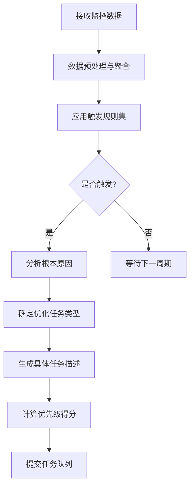
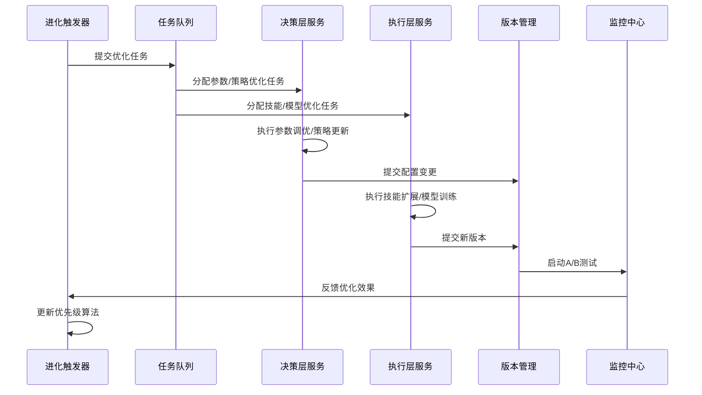

# 智能体工作平台 进化触发器模块设计文档

## 1. 概述

### 1.1 模块定位
进化触发器模块是平台自主进化机制的核心驱动组件，负责智能分析性能监控数据，自动识别优化机会，生成具体的优化任务。该模块连接性能监控层与决策层/执行层，形成完整的"监控→分析→优化→评估"闭环。

### 1.2 设计目标
- **智能化**：基于监控数据自动识别性能瓶颈和优化机会
- **精准化**：制定量化触发规则，避免误触发和漏触发
- **可配置**：支持管理员自定义触发规则和阈值
- **可扩展**：支持新增优化任务类型和触发条件
- **可追溯**：完整记录触发原因、任务内容和执行结果

### 1.3 架构位置
根据系统架构图，进化触发器模块位于进化引擎层，与以下模块交互：
- **性能监控层**：获取实时和历史监控数据作为输入
- **决策层**：提交优化策略调整建议（参数调优、策略更新）
- **执行层**：提交技能扩展、模型重训练等执行任务
- **版本管理**：协调灰度发布和版本回滚任务
- **扩展点**：支持自定义触发规则和任务类型

## 2. 优化任务类型定义

### 2.1 核心任务分类体系

#### 2.1.1 参数调优类任务
| 任务类型代码 | 任务名称 | 目标 | 适用范围 | 典型执行耗时 |
|-------------|---------|------|---------|------------|
| `OPT_PARAM_GLOBAL` | 全局参数调优 | 优化影响整体性能的全局参数（如超时设置、并发限制） | 所有智能体，整体性能下降时 | 1-2小时 |
| `OPT_PARAM_TASK_TYPE` | 任务类型参数调优 | 针对特定任务类型优化专用参数 | 特定任务类型成功率/响应时间异常 | 2-4小时 |
| `OPT_PARAM_AGENT` | 智能体参数调优 | 优化单个智能体的个性化参数 | 单个智能体性能明显低于同类 | 1-3小时 |

**参数调优范围**：
- 超时设置（工具调用超时、任务执行超时）
- 重试策略（重试次数、退避间隔）
- 并发限制（最大并发任务数）
- 缓存策略（缓存TTL、缓存大小）
- 资源配额（CPU/内存限制）

#### 2.1.2 技能扩展类任务
| 任务类型代码 | 任务名称 | 目标 | 适用范围 | 典型执行耗时 |
|-------------|---------|------|---------|------------|
| `OPT_SKILL_ADD` | 新增技能 | 为智能体添加缺失的关键技能 | 任务失败原因分析显示技能缺失 | 4-8小时 |
| `OPT_SKILL_UPGRADE` | 技能升级 | 升级现有技能到更高版本 | 技能版本过旧导致性能问题 | 2-6小时 |
| `OPT_SKILL_REPLACE` | 技能替换 | 用性能更好的同类技能替换现有技能 | 现有技能成功率低、响应慢 | 3-7小时 |

**技能扩展触发场景**：
- 高频失败任务关联特定技能缺失
- 同类智能体使用新技能后表现显著提升
- 技能市场出现更高评分的替代技能

#### 2.1.3 策略更新类任务
| 任务类型代码 | 任务名称 | 目标 | 适用范围 | 典型执行耗时 |
|-------------|---------|------|---------|------------|
| `OPT_POLICY_RL` | 强化学习策略更新 | 基于最新交互数据更新RL策略模型 | RL智能体的决策质量下降 | 6-12小时 |
| `OPT_POLICY_RULE` | 规则引擎策略更新 | 更新规则引擎的决策规则 | 规则匹配准确率下降 | 2-5小时 |
| `OPT_POLICY_FALLBACK` | 降级策略更新 | 优化异常情况下的降级处理策略 | 降级场景处理效果不佳 | 3-6小时 |

**策略更新依据**：
- A/B测试显示新策略显著优于当前策略
- 策略决策置信度持续下降
- 规则匹配错误率上升

#### 2.1.4 模型重训练类任务
| 任务类型代码 | 任务名称 | 目标 | 适用范围 | 典型执行耗时 |
|-------------|---------|------|---------|------------|
| `OPT_MODEL_FULL` | 全量模型重训练 | 使用全部历史数据重新训练模型 | 模型性能持续下降、数据分布变化 | 12-24小时 |
| `OPT_MODEL_INCREMENTAL` | 增量模型更新 | 基于新增数据增量更新模型 | 数据漂移、新增场景适应 | 4-10小时 |
| `OPT_MODEL_FINE_TUNE` | 模型微调 | 针对特定场景优化预训练模型 | 特定场景性能不足 | 6-15小时 |

### 2.2 任务元数据规范
每个优化任务包含以下元数据：
```json
{
  "task_id": "opt_20260223163000_001",
  "task_type": "OPT_PARAM_TASK_TYPE",
  "created_at": "2026-02-23T16:30:00.000Z",
  "trigger_reason": {
    "metric": "task_success_rate",
    "condition": "连续3次低于80%",
    "target": "task_type=complex_analysis"
  },
  "expected_benefit": {
    "success_rate_improvement": 0.15,
    "response_time_reduction": 1200
  },
  "priority_score": 85.6,
  "status": "pending",
  "assigned_to": null,
  "execution_result": null
}
```

## 3. 触发规则设计

### 3.1 基于任务成功率的触发规则

#### 3.1.1 整体成功率触发
| 触发条件 | 阈值 | 检测窗口 | 触发任务 | 严重等级 |
|---------|------|---------|---------|---------|
| 整体成功率持续下降 | <85% 连续3次检测 | 每15分钟检测 | `OPT_PARAM_GLOBAL` | 严重 |
| 整体成功率断崖式下降 | 环比下降>20% | 1小时内 | `OPT_PARAM_GLOBAL` + 告警 | 紧急 |
| 成功率分布不均 | 标准差>0.15 | 24小时数据 | `OPT_PARAM_AGENT`（针对低分位） | 中等 |

**检测算法**：
```python
def check_overall_success_rate(metrics_window):
    """检查整体成功率触发条件"""
    recent_rates = metrics_window['success_rate_1h']
    
    # 条件1：连续3次低于85%
    if len(recent_rates) >= 3:
        below_threshold = all(rate < 0.85 for rate in recent_rates[-3:])
        if below_threshold:
            return TriggerResult(
                type="OPT_PARAM_GLOBAL",
                reason=f"整体成功率连续3次低于85%: {recent_rates[-3:]}",
                severity="critical"
            )
    
    # 条件2：环比下降>20%
    if len(recent_rates) >= 2:
        prev_rate = recent_rates[-2]
        curr_rate = recent_rates[-1]
        if prev_rate > 0 and (prev_rate - curr_rate) / prev_rate > 0.2:
            return TriggerResult(
                type="OPT_PARAM_GLOBAL",
                reason=f"整体成功率环比下降{(prev_rate - curr_rate)/prev_rate*100:.1f}%",
                severity="emergency"
            )
    
    return None
```

#### 3.1.2 复杂任务成功率触发
| 触发条件 | 阈值 | 检测窗口 | 触发任务 | 严重等级 |
|---------|------|---------|---------|---------|
| 复杂任务成功率低于目标 | <85% 连续2次检测 | 每30分钟检测 | `OPT_PARAM_TASK_TYPE` | 严重 |
| 复杂任务成功率趋势下降 | 7日移动平均下降>5% | 7日数据 | `OPT_SKILL_ADD` 或 `OPT_SKILL_UPGRADE` | 中等 |
| 复杂任务与简单任务差距大 | 差值>20% | 24小时数据 | `OPT_POLICY_RL`（优先处理复杂任务） | 中等 |

### 3.2 基于响应时间的触发规则

#### 3.2.1 平均响应时间触发
| 触发条件 | 阈值 | 检测窗口 | 触发任务 | 严重等级 |
|---------|------|---------|---------|---------|
| 平均响应时间超限 | >5秒 连续2次检测 | 每30分钟检测 | `OPT_PARAM_GLOBAL` | 严重 |
| P95响应时间超限 | >8秒 连续检测 | 每1小时检测 | `OPT_PARAM_TASK_TYPE` | 中等 |
| 响应时间波动异常 | 变异系数>0.4 | 3小时数据 | `OPT_PARAM_GLOBAL`（稳定性优化） | 低 |

#### 3.2.2 响应时间分位数触发
| 触发条件 | 阈值 | 检测窗口 | 触发任务 | 说明 |
|---------|------|---------|---------|------|
| P99响应时间异常 | >15秒 | 1小时数据 | `OPT_MODEL_FINE_TUNE` | 针对长尾任务优化 |
| 响应时间分布右偏 | 偏度>1.5 | 6小时数据 | `OPT_SKILL_REPLACE` | 替换性能瓶颈技能 |

### 3.3 基于错误类型的触发规则

#### 3.3.1 错误频率触发
| 错误类别 | 触发条件 | 阈值 | 检测窗口 | 触发任务 |
|---------|---------|------|---------|---------|
| 系统错误 | 高频发生 | >10次/小时 | 1小时 | `OPT_PARAM_GLOBAL`（资源调整） |
| 工具调用错误 | 认证失败集中 | TOOL_003 >5次/小时 | 1小时 | `OPT_PARAM_GLOBAL`（凭证更新） |
| 智能体逻辑错误 | 特定逻辑错误频发 | AGENT_005 >3次/小时 | 2小时 | `OPT_POLICY_RULE`（规则修正） |
| 数据错误 | 输入格式错误集中 | DATA_002 >20次/小时 | 1小时 | `OPT_SKILL_ADD`（数据清洗技能） |

#### 3.3.2 错误关联性触发
| 触发条件 | 分析逻辑 | 触发任务 | 说明 |
|---------|---------|---------|------|
| 错误与任务类型强相关 | 计算错误与任务类型的卡方统计量 | `OPT_PARAM_TASK_TYPE` | 针对特定任务类型优化 |
| 错误与时间周期相关 | 分析错误的时间序列模式 | `OPT_MODEL_INCREMENTAL` | 适应周期性变化 |
| 错误与资源使用相关 | 分析错误发生时的资源指标 | `OPT_PARAM_GLOBAL` | 资源配额调整 |

### 3.4 基于资源使用率的触发规则

| 资源类型 | 触发条件 | 阈值 | 检测窗口 | 触发任务 |
|---------|---------|------|---------|---------|
| CPU | 持续高使用率 | >80% 持续10分钟 | 实时 | `OPT_PARAM_GLOBAL`（并发限制调整） |
| 内存 | 内存泄漏迹象 | 使用率持续上升斜率>5%/小时 | 2小时 | `OPT_MODEL_FINE_TUNE`（内存优化） |
| 网络 | 带宽瓶颈 | 使用率>90% 且延迟>200ms | 5分钟 | `OPT_PARAM_GLOBAL`（调用频次限制） |
| 存储 | IOPS瓶颈 | IOPS>限值80% 且响应时间>100ms | 15分钟 | `OPT_PARAM_GLOBAL`（批量处理优化） |

### 3.5 基于A/B测试结果的触发规则

| 触发条件 | 阈值 | 最小样本量 | 触发任务 | 执行动作 |
|---------|------|-----------|---------|---------|
| 新策略显著优于当前 | 胜率>60% 且 p-value<0.05 | 100任务/组 | `OPT_POLICY_RL` 或 `OPT_POLICY_RULE` | 提交灰度发布任务 |
| 新策略显著劣于当前 | 胜率<40% 且 p-value<0.05 | 50任务/组 | 无 | 终止测试，记录原因 |
| 策略效果相当 | 胜率45%-55% | 200任务/组 | 无 | 延长测试或调整策略 |

## 4. 任务生成逻辑

### 4.1 触发条件分析流程



### 4.2 根本原因分析算法

#### 4.2.1 多维关联分析
```python
def analyze_root_cause(trigger_event, historical_metrics):
    """分析性能问题的根本原因"""
    
    causes = []
    
    # 1. 时间维度关联分析
    time_pattern = analyze_time_pattern(trigger_event, historical_metrics)
    if time_pattern['has_pattern']:
        causes.append({
            'type': 'time_pattern',
            'description': time_pattern['description'],
            'confidence': time_pattern['confidence']
        })
    
    # 2. 任务类型维度关联分析
    task_type_correlation = analyze_task_type_correlation(
        trigger_event, 
        historical_metrics
    )
    if task_type_correlation['is_significant']:
        causes.append({
            'type': 'task_type_specific',
            'description': f"与任务类型强相关: {task_type_correlation['top_types']}",
            'confidence': task_type_correlation['confidence']
        })
    
    # 3. 资源使用维度关联分析
    resource_correlation = analyze_resource_correlation(
        trigger_event,
        historical_metrics
    )
    if resource_correlation['is_bottleneck']:
        causes.append({
            'type': 'resource_bottleneck',
            'description': resource_correlation['bottleneck_description'],
            'confidence': resource_correlation['confidence']
        })
    
    # 4. 错误链分析
    error_chain = analyze_error_chain(trigger_event, historical_metrics)
    if error_chain['has_chain']:
        causes.append({
            'type': 'error_chain',
            'description': error_chain['chain_description'],
            'confidence': error_chain['confidence']
        })
    
    # 按置信度排序并返回
    causes.sort(key=lambda x: x['confidence'], reverse=True)
    return causes[:3]  # 返回top3原因
```

#### 4.2.2 决策树分类模型
对于复杂触发场景，使用预训练的决策树模型分类根本原因：
```
触发事件特征 → [任务类型, 错误模式, 资源状态, 时间特征] 
               ↓
           决策树模型
               ↓
[输出概率分布] → 参数问题: 0.45, 技能问题: 0.30, 策略问题: 0.15, 模型问题: 0.10
```

### 4.3 任务描述生成模板

#### 4.3.1 参数调优任务模板
```json
{
  "task_description": {
    "objective": "优化{target}的{parameter_type}参数，提升{metric}指标",
    "scope": {
      "target_type": "{agent_id|task_type|global}",
      "target_value": "{具体标识}",
      "parameters_to_optimize": ["{param1}", "{param2}"],
      "constraints": {
        "success_rate_min": 0.85,
        "response_time_max": 5000,
        "resource_usage_limit": {"cpu": 0.8, "memory": 0.85}
      }
    },
    "optimization_method": "贝叶斯优化",
    "search_space": {
      "{param1}": {"type": "float", "min": 0.1, "max": 10.0},
      "{param2}": {"type": "integer", "min": 1, "max": 10}
    },
    "evaluation_metric": "{成功率加权得分}",
    "expected_outcome": {
      "success_rate_improvement": "{min_improvement}",
      "response_time_reduction": "{min_reduction_ms}"
    }
  }
}
```

#### 4.3.2 技能扩展任务模板
```json
{
  "task_description": {
    "objective": "为{agent_id}添加{skill_name}技能以解决{error_pattern}问题",
    "skill_requirement": {
      "category": "{技能类别}",
      "compatibility": {
        "agent_type": "{required_type}",
        "min_version": "{required_version}"
      },
      "functional_spec": {
        "input_format": "{expected_input}",
        "output_format": "{expected_output}",
        "error_handling": "{error_codes_to_handle}"
      }
    },
    "source_options": [
      {
        "type": "marketplace",
        "skill_id": "{candidate_skill_id}",
        "rating": "{skill_rating}",
        "compatibility_score": "{compatibility_score}"
      },
      {
        "type": "custom_development",
        "estimated_effort": "{estimated_hours}",
        "priority": "{development_priority}"
      }
    ],
    "integration_plan": {
      "testing_scenarios": ["{scenario1}", "{scenario2}"],
      "rollback_plan": "{rollback_procedure}",
      "performance_targets": {
        "success_rate": 0.90,
        "response_time": 3000
      }
    }
  }
}
```

#### 4.3.3 模型重训练任务模板
```python
{
  "task_description": {
    "model_type": "{model_identifier}",
    "training_data": {
      "time_range": "{start_time} to {end_time}",
      "sample_count": "{estimated_samples}",
      "class_distribution": "{current_distribution}",
      "data_quality_metrics": {
        "missing_rate": 0.02,
        "outlier_rate": 0.05,
        "drift_detected": True
      }
    },
    "training_config": {
      "algorithm": "{training_algorithm}",
      "hyperparameters": "{initial_hyperparameters}",
      "validation_split": 0.2,
      "cross_validation_folds": 5,
      "early_stopping_patience": 10
    },
    "performance_targets": {
      "success_rate": 0.88,
      "response_time": 4500,
      "model_size_limit": "{max_size_mb}",
      "inference_latency": "{max_latency_ms}"
    }
  }
}
```

### 4.4 任务生成工作流

1. **触发事件解析**：解析触发事件类型、目标对象、指标数据
2. **历史数据查询**：获取相关历史数据用于根本原因分析
3. **多维度分析**：应用时间、任务类型、资源、错误等多维度分析算法
4. **根本原因推断**：基于分析结果推断最可能的根本原因（置信度>0.7）
5. **任务类型匹配**：根据根本原因匹配对应的优化任务类型
6. **参数化任务描述**：使用对应模板生成具体任务描述
7. **预期收益估算**：基于历史相似优化估算预期收益
8. **优先级计算**：应用优先级算法计算任务优先级得分
9. **任务提交**：将完整任务提交到优化任务队列

## 5. 优先级机制设计

### 5.1 优先级计算模型

#### 5.1.1 多维度评分体系
```
优先级总分 = 基础影响分 × 紧急程度系数 × 执行成本系数
```

**基础影响分（0-100）计算**：
```python
基础影响分 = 
  成功率影响权重 × 归一化(成功率下降幅度) × 100 +
  响应时间影响权重 × 归一化(响应时间增加幅度) × 100 +
  错误频率影响权重 × 归一化(错误频率) × 100 +
  用户影响权重 × 归一化(受影响用户比例) × 100 +
  业务价值权重 × 归一化(任务业务价值) × 100
```

**权重配置参考**：
| 维度 | 权重 | 说明 |
|------|------|------|
| 成功率影响 | 0.35 | 成功率低于85%时权重最高 |
| 响应时间影响 | 0.25 | 响应时间超过5秒时权重高 |
| 错误频率 | 0.20 | 高频错误严重影响体验 |
| 用户影响 | 0.15 | 影响用户范围越广优先级越高 |
| 业务价值 | 0.05 | 核心业务任务权重更高 |

#### 5.1.2 紧急程度系数（0.5-2.0）
| 紧急程度 | 系数 | 判断条件 |
|---------|------|---------|
| 紧急 | 2.0 | 成功率断崖式下降(>30%)、系统级错误频发 |
| 高 | 1.5 | 核心指标持续恶化、影响大量用户 |
| 中 | 1.0 | 指标低于阈值但稳定、影响部分用户 |
| 低 | 0.5 | 指标轻微波动、影响范围小 |

#### 5.1.3 执行成本系数（0.8-1.2）
| 执行成本 | 系数 | 判断条件 |
|---------|------|---------|
| 低 | 1.2 | 参数微调、规则小改、预计<2小时 |
| 中 | 1.0 | 技能添加、模型增量更新、2-8小时 |
| 高 | 0.8 | 全量模型训练、架构调整、>8小时 |

### 5.2 动态优先级调整

#### 5.2.1 时间衰减函数
任务优先级随时间推移自然衰减：
```
调整后优先级 = 原始优先级 × e^(-λ × t)
```
其中：
- λ：衰减速率（默认0.1/小时）
- t：任务创建后经过的时间（小时）

#### 5.2.2 相关性聚合
当多个触发事件指向同一根本原因时，聚合生成一个高优先级任务：
```
聚合优先级 = max(各任务优先级) × log(1 + 相关事件数量)
```

#### 5.2.3 反馈学习机制
基于历史优化任务效果反馈调整优先级算法：
```python
def update_priority_weights(successful_optimizations):
    """根据成功优化记录更新权重"""
    for opt in successful_optimizations:
        actual_impact = calculate_actual_impact(opt)
        predicted_impact = opt['expected_benefit']
        
        # 调整权重：实际影响大的维度权重增加
        for dimension in opt['trigger_reason']['dimensions']:
            weight_adjustment = actual_impact[dimension] / predicted_impact[dimension]
            weights[dimension] *= (0.9 + 0.1 * weight_adjustment)
    
    # 归一化权重
    total = sum(weights.values())
    weights = {k: v/total for k, v in weights.items()}
```

### 5.3 优先级决策树

```
触发事件分析
    ├── 是否紧急事件? (成功率断崖下降>30% 或 系统级错误)
    │   ├── 是 → 优先级 = 100 (最高)
    │   └── 否 → 继续分析
    │
    ├── 是否影响核心业务?
    │   ├── 是 → 基础分 +30
    │   └── 否 → 基础分 +0
    │
    ├── 受影响用户比例 >30%?
    │   ├── 是 → 基础分 +25
    │   └── 否 → 受影响用户比例 × 100
    │
    ├── 成功率 <85%?
    │   ├── 是 → 基础分 + (85% - 实际成功率) × 200
    │   └── 否 → 基础分 +0
    │
    ├── 响应时间 >5秒?
    │   ├── 是 → 基础分 + (实际时间 - 5秒) × 40
    │   └── 否 → 基础分 +0
    │
    └── 错误频率 >10次/小时?
        ├── 是 → 基础分 + min(错误频率 × 5, 30)
        └── 否 → 基础分 +0
```

### 5.4 优先级队列管理

#### 5.4.1 多级队列设计
```
紧急队列 (优先级 90-100): 立即处理，抢占资源
高优先级队列 (优先级 70-89): 2小时内开始处理
中优先级队列 (优先级 40-69): 24小时内开始处理
低优先级队列 (优先级 0-39): 排队等待资源
```

#### 5.4.2 队列调度策略
1. **资源感知调度**：根据当前系统资源空闲情况动态调整处理速率
2. **依赖关系处理**：处理有依赖关系的任务序列
3. **并行度控制**：控制同时执行的优化任务数量
4. **超时处理**：长时间未处理的任务自动升级优先级

## 6. 任务执行编排

### 6.1 任务执行流程



### 6.2 任务分发机制

#### 6.2.1 任务类型路由表
| 任务类型 | 目标服务 | 执行模式 | 超时设置 |
|---------|---------|---------|---------|
| `OPT_PARAM_*` | 决策层/参数优化服务 | 同步+异步混合 | 4小时 |
| `OPT_SKILL_*` | 执行层/技能管理器 | 异步执行 | 8小时 |
| `OPT_POLICY_*` | 决策层/策略引擎 | 同步优化 | 6小时 |
| `OPT_MODEL_*` | 执行层/模型训练服务 | 异步批处理 | 24小时 |

#### 6.2.2 服务发现与负载均衡
```yaml
task_routing:
  decision_layer:
    service_name: "agent-decision-service"
    load_balancer: "round_robin"
    health_check: "/health"
    timeout: "30s"
    
  execution_layer:
    service_name: "agent-execution-service" 
    load_balancer: "least_connections"
    health_check: "/health"
    timeout: "60s"
```

### 6.3 执行状态跟踪

#### 6.3.1 状态机设计
```
pending → assigned → executing → completed
                   ↘ failed
                   ↘ cancelled
                   ↘ timeout
```

**状态转换规则**：
- `pending` → `assigned`: 任务被服务实例认领
- `assigned` → `executing`: 开始执行优化逻辑
- `executing` → `completed`: 优化成功完成
- `executing` → `failed`: 优化过程中出现错误
- 任何状态 → `cancelled`: 管理员手动取消
- `executing` → `timeout`: 执行超时（根据任务类型）

#### 6.3.2 进度报告规范
```json
{
  "task_id": "opt_20260223163000_001",
  "status": "executing",
  "progress": {
    "percentage": 65,
    "current_step": "参数搜索迭代",
    "step_details": {
      "iteration": 15,
      "best_score": 0.87,
      "remaining_iterations": 8
    }
  },
  "estimated_completion": "2026-02-23T19:30:00Z",
  "resource_usage": {
    "cpu_percent": 45.2,
    "memory_mb": 1204,
    "gpu_utilization": 78.5
  },
  "checkpoint": {
    "available": true,
    "last_checkpoint_time": "2026-02-23T17:45:00Z"
  }
}
```

### 6.4 结果反馈与学习

#### 6.4.1 优化效果评估
```python
def evaluate_optimization_result(task, before_metrics, after_metrics):
    """评估优化任务的实际效果"""
    
    evaluation = {
        "task_id": task["task_id"],
        "evaluation_period": "7d",  # 评估周期
        "metrics_comparison": {}
    }
    
    # 对比关键指标
    for metric in ["success_rate", "avg_response_time", "error_rate"]:
        before = before_metrics[metric]
        after = after_metrics[metric]
        improvement = calculate_improvement(before, after, metric)
        
        evaluation["metrics_comparison"][metric] = {
            "before": before,
            "after": after,
            "improvement": improvement,
            "meets_expectation": check_expectation(improvement, task["expected_benefit"])
        }
    
    # 计算综合得分
    evaluation["overall_score"] = calculate_overall_score(
        evaluation["metrics_comparison"]
    )
    
    # 记录到历史库用于学习
    save_optimization_history(evaluation)
    
    return evaluation
```

#### 6.4.2 触发规则调优
基于优化效果反馈自动调整触发规则：
```
如果优化效果显著（综合得分>80%）：
    - 保持当前触发规则
    - 降低类似事件的触发阈值（更敏感）
    
如果优化效果一般（综合得分40%-80%）：
    - 调整触发条件中的权重分配
    - 优化根本原因分析算法
    
如果优化效果差（综合得分<40%）：
    - 调高触发阈值（减少误报）
    - 增加触发条件复杂度
    - 记录为负样本用于模型训练
```

### 6.5 容错与恢复机制

#### 6.5.1 任务失败处理
1. **自动重试**：可配置的重试策略（最多3次，指数退避）
2. **失败转移**：将任务转移到其他可用服务实例
3. **降级处理**：尝试更简单、更保守的优化方案
4. **人工介入**：连续失败后通知管理员

#### 6.5.2 系统异常处理
- **服务不可用**：自动切换到备用服务或排队等待
- **数据不一致**：触发数据修复任务或使用历史备份
- **资源不足**：动态调整任务优先级，暂停低优先级任务

### 6.6 执行编排API设计

#### 6.6.1 任务提交接口
```http
POST /v1/optimization/tasks
Content-Type: application/json

{
  "task_type": "OPT_PARAM_TASK_TYPE",
  "target": {
    "type": "task_type",
    "value": "complex_analysis"
  },
  "trigger_reason": {
    "metric": "task_success_rate",
    "condition": "连续3次低于80%",
    "data": {
      "recent_rates": [0.78, 0.76, 0.75]
    }
  },
  "priority_hint": 85
}
```

响应：
```json
{
  "task_id": "opt_20260223163000_001",
  "queue_position": 3,
  "estimated_start_time": "2026-02-23T16:45:00Z",
  "tracking_url": "/v1/optimization/tasks/opt_20260223163000_001"
}
```

#### 6.6.2 任务状态查询接口
```http
GET /v1/optimization/tasks/{task_id}
```

响应：
```json
{
  "task_id": "opt_20260223163000_001",
  "status": "executing",
  "progress": {
    "percentage": 65,
    "current_step": "参数搜索迭代"
  },
  "created_at": "2026-02-23T16:30:00Z",
  "assigned_to": "decision-service-02",
  "estimated_completion": "2026-02-23T19:30:00Z"
}
```

#### 6.6.3 任务结果反馈接口
```http
PUT /v1/optimization/tasks/{task_id}/result
Content-Type: application/json

{
  "status": "completed",
  "result": {
    "optimized_parameters": {
      "timeout_ms": 8000,
      "max_retries": 3
    },
    "performance_metrics": {
      "estimated_success_rate_improvement": 0.12,
      "estimated_response_time_reduction": 1500
    }
  },
  "execution_log": "优化完成，共进行23轮贝叶斯优化迭代"
}
```

## 7. 实施与集成方案

### 7.1 模块组件清单

| 组件名称 | 技术栈 | 部署方式 | 依赖项 |
|---------|--------|---------|-------|
| 触发规则引擎 | Python 3.9+ | 容器化 | 性能监控数据库 |
| 根本原因分析服务 | Python + scikit-learn | 容器化 | 监控数据API |
| 任务生成器 | Python | 容器化 | 规则引擎、分析服务 |
| 优先级计算器 | Python | 容器化 | 配置中心 |
| 任务分发器 | Python + Redis | 容器化 | 服务发现 |
| 执行跟踪器 | Python + PostgreSQL | 容器化 | 消息队列 |
| 反馈学习器 | Python + MLflow | 容器化 | 优化历史库 |

### 7.2 集成接口定义

#### 7.2.1 与性能监控层集成
```python
# 订阅监控事件
class MonitoringSubscriber:
    def on_metric_threshold(self, event):
        """接收阈值触发事件"""
        # 解析事件，生成触发分析请求
        trigger_request = self.parse_monitoring_event(event)
        self.trigger_engine.analyze(trigger_request)
    
    def on_error_pattern(self, event):
        """接收错误模式事件"""
        # 处理错误关联分析
        self.error_analyzer.process(event)
```

#### 7.2.2 与决策层集成
```python
# 决策层任务客户端
class DecisionLayerClient:
    def submit_parameter_optimization(self, task):
        """提交参数优化任务到决策层"""
        response = self.post_to_service(
            "decision-service/optimize/parameters",
            task.to_dict()
        )
        return response["execution_id"]
    
    def submit_policy_update(self, task):
        """提交策略更新任务"""
        # 类似实现
```

#### 7.2.3 与执行层集成
```python
# 执行层任务客户端  
class ExecutionLayerClient:
    def submit_skill_extension(self, task):
        """提交技能扩展任务"""
        response = self.post_to_service(
            "execution-service/skills/extend",
            task.to_dict()
        )
        return response["training_id"]
    
    def submit_model_retraining(self, task):
        """提交模型重训练任务"""
        # 类似实现
```

### 7.3 配置管理方案

#### 7.3.1 触发规则配置
```yaml
trigger_rules:
  success_rate:
    - name: "complex_task_success_rate_below_85"
      metric: "task_success_rate"
      conditions:
        task_type: "complex_analysis"
        aggregation: "1h_avg"
        operator: "<"
        threshold: 0.85
        consecutive_count: 3
      actions:
        - task_type: "OPT_PARAM_TASK_TYPE"
          priority_calculation: "standard"
          
  response_time:
    - name: "avg_response_time_above_5s"
      metric: "avg_response_time"
      conditions:
        aggregation: "30m_avg"
        operator: ">"
        threshold: 5000
        consecutive_count: 2
      actions:
        - task_type: "OPT_PARAM_GLOBAL"
          priority_calculation: "high"
```

#### 7.3.2 优先级权重配置
```yaml
priority_weights:
  dimensions:
    success_rate_impact: 0.35
    response_time_impact: 0.25
    error_frequency: 0.20
    user_affected: 0.15
    business_value: 0.05
  
  coefficients:
    emergency_levels:
      emergency: 2.0
      high: 1.5
      medium: 1.0
      low: 0.5
    
    execution_costs:
      low: 1.2
      medium: 1.0
      high: 0.8
```

### 7.4 监控与告警

#### 7.4.1 模块自身监控指标
| 指标名称 | 采集点 | 告警阈值 | 说明 |
|---------|--------|---------|------|
| 触发规则处理延迟 | 规则引擎入口/出口 | >5秒 | 处理单个事件耗时 |
| 任务生成成功率 | 任务生成器 | <95% | 触发后成功生成任务比例 |
| 任务执行成功率 | 执行跟踪器 | <90% | 提交任务执行成功比例 |
| 优先级计算延迟 | 优先级计算器 | >1秒 | 计算单个任务优先级耗时 |
| 根本原因分析准确率 | 反馈学习器 | <70% | 分析结果与实际符合程度 |

#### 7.4.2 集成健康检查
```python
def check_integration_health():
    """检查所有依赖服务的健康状态"""
    services = [
        ("monitoring_db", check_monitoring_db),
        ("decision_layer", check_decision_service),
        ("execution_layer", check_execution_service),
        ("version_manager", check_version_service)
    ]
    
    health_status = {}
    for name, checker in services:
        try:
            health_status[name] = checker()
        except Exception as e:
            health_status[name] = {"status": "unhealthy", "error": str(e)}
    
    return health_status
```

## 8. 扩展性与演进规划

### 8.1 短期扩展能力（3-6个月）

1. **自定义触发规则**：支持用户通过UI界面定义业务特定触发规则
2. **外部数据源集成**：支持从外部系统（CRM、ERP）导入数据参与分析
3. **多智能体协作优化**：支持多个智能体联合优化任务
4. **预测性触发**：基于时间序列预测提前触发优化任务

### 8.2 中期演进方向（6-12个月）

1. **强化学习优化调度**：使用RL模型动态调整触发规则和优先级算法
2. **联邦学习支持**：支持分布式智能体的联邦优化
3. **自动化根因定位**：集成APM工具实现端到端根因定位
4. **智能任务分解**：复杂优化任务自动分解为可并行子任务

### 8.3 长期愿景（1-2年）

1. **全自主进化平台**：平台完全自主决策优化策略，无需人工干预
2. **跨平台迁移学习**：优化经验在不同平台间迁移共享
3. **认知优化能力**：优化决策层认知模型，提升长期优化效果
4. **生态协同进化**：多智能体形成协同进化生态系统

---

## 文档信息

- **文档版本**：1.0
- **创建时间**：2026-02-23
- **最后更新**：2026-02-23
- **相关文档**：
  - `outputs/文档/需求分析.md`：平台整体需求定义
  - `outputs/架构/平台架构.drawio.xml`：系统架构图
  - `outputs/文档/技术方案.md`：平台整体技术方案
  - `outputs/文档/性能监控模块设计.md`：监控模块详细设计

## 修订记录

| 版本 | 日期 | 修改内容 | 修改人 |
|------|------|---------|--------|
| 1.0 | 2026-02-23 | 初始版本，完成进化触发器模块完整设计 | 扣子 |

