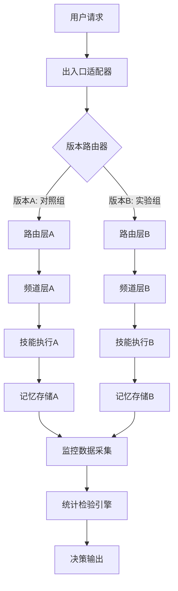
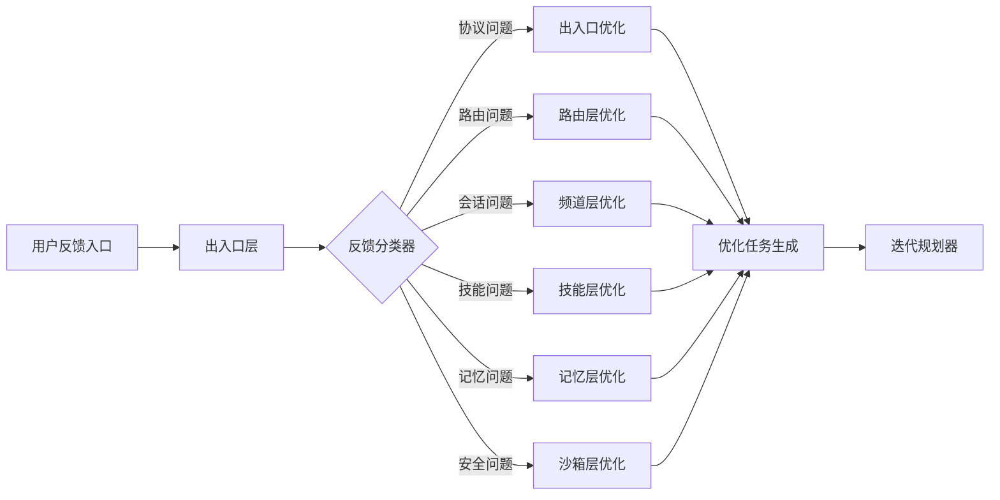

# 基于六元组架构的自主进化智能体工作平台 - 迭代优化与进化评估体系 v2.0

## 1. 概述

### 1.1 模块定位与目标
迭代优化与进化评估体系是平台自主进化机制的顶层设计与效果验证框架，负责将进化触发器生成的优化任务转化为可执行的迭代计划，并通过科学的A/B测试与量化评估验证进化效果。体系形成"监控→分析→优化→评估→反馈"的完整闭环，确保平台进化过程的可控性、可度量性与可持续性。

**核心设计目标：**
- **迭代可控性**：建立基于优先级排序的迭代规划机制，确保优化资源高效配置
- **效果可度量**：设计科学的A/B测试框架与量化评估指标，客观验证进化效果
- **决策数据驱动**：基于监控数据的趋势分析与根因定位，生成精准优化建议
- **反馈闭环化**：建立用户反馈收集与问题溯源机制，持续改进平台体验
- **与六元组深度集成**：确保进化评估体系与出入口、路由、频道、技能、记忆、沙箱各层协同工作

### 1.2 与六元组架构的集成关系
进化评估体系深度集成六元组各层，形成完整的进化闭环：

| 六元组元组 | 进化评估集成点 | 关键交互机制 |
|-----------|---------------|------------|
| **出入口层** | 用户反馈收集入口 | 多渠道（WhatsApp、企业微信、Web）反馈收集，标准化反馈数据结构化 |
| **路由层** | 优化任务智能分发 | 基于7级匹配规则的优化任务优先级计算和路由策略 |
| **频道层** | 会话级性能监控 | Session Key机制下的上下文隔离性能指标采集与分析 |
| **技能层** | 技能进化效果评估 | 新技能A/B测试，技能性能退化检测与优化建议生成 |
| **记忆层** | Token成本优化验证 | Compaction算法效果评估，Memory Sidecar性能影响分析 |
| **沙箱层** | 安全隔离进化监控 | 沙箱权限策略进化验证，安全漏洞检测与修复跟踪 |

### 1.3 核心进化指标量化目标
平台上线后必须持续追踪的核心进化指标：

| 指标类别 | 具体指标 | 目标值 | 测量频率 | 负责元组 |
|---------|---------|-------|---------|---------|
| **任务成功率** | 复杂任务成功率 | >85% | 实时+日/周/月报告 | 路由层+技能层 |
| | 简单任务成功率 | >95% | 实时+日/周/月报告 | 路由层+技能层 |
| **响应时间** | 平均响应时间 | <5秒 | 实时监控+告警 | 出入口层+路由层 |
| | P95响应时间 | <8秒 | 小时/日报告 | 出入口层+路由层 |
| | P99响应时间 | <15秒 | 小时/日报告 | 出入口层+路由层 |
| **资源效率** | Token消耗优化率 | 96% | 周/月报告 | 记忆层 |
| | 记忆压缩率 | >70% | 日报告 | 记忆层 |
| **进化效果** | A/B测试胜率 | >60% | 每次测试后 | 技能层+路由层 |
| | 优化任务执行成功率 | >90% | 周报告 | 进化触发器 |

## 2. 迭代规划机制设计

### 2.1 基于进化触发器的任务输入
继承并扩展进化触发器模块设计的11种优化任务类型，作为迭代规划的基础输入：

| 任务类型 | 触发场景 | 预期改进目标 | 执行周期 |
|---------|---------|-------------|---------|
| **OPT_PARAM_TUNING** | 参数配置未达最优 | 成功率+5%，响应时间-10% | 快速迭代(1-3天) |
| **OPT_SKILL_ENHANCE** | 技能性能持续下降 | 技能成功率恢复至基线 | 常规迭代(1-2周) |
| **OPT_SKILL_ADD** | 新场景识别需新技能 | 新增技能覆盖率 | 战略迭代(1-2月) |
| **OPT_POLICY_ADJUST** | 路由策略失效 | 路由准确率+8% | 快速迭代 |
| **OPT_MODEL_UPGRADE** | 模型版本落后 | 整体性能+15% | 战略迭代 |
| **OPT_SECURITY_PATCH** | 沙箱安全漏洞 | 安全风险评分<0.1 | 紧急迭代(2-4小时) |

每个优化任务包含完整的元数据：
- **任务ID**与类型
- **触发原因**与根本原因分析结果
- **目标智能体/技能/模型**
- **预期收益**量化指标（成功率提升、响应时间降低、Token节省）
- **执行成本**与资源需求估计（CPU、内存、存储、网络）
- **风险评估**与回滚方案

### 2.2 多维度优先级计算模型
在进化触发器优先级算法基础上，扩展迭代规划维度的权重因子，形成完整的优先级计算框架：

```python
class IterationPriorityCalculator:
    def calculate_priority_score(self, task, system_state):
        """计算迭代任务优先级得分"""
        
        # 1. 基础影响分（0-100）：继承进化触发器计算逻辑
        base_impact = self._calculate_base_impact(task)
        
        # 2. 紧急程度系数（0.5-2.0）：基于任务类型分类
        urgency_factor = self._calculate_urgency_factor(task["type"])
        
        # 3. 执行成本系数（0.8-1.2）：基于资源需求估算
        cost_factor = self._calculate_cost_factor(task["resource_estimate"])
        
        # 4. 迭代窗口系数（0.6-1.4）：考虑当前迭代周期剩余容量
        window_factor = self._calculate_window_factor(system_state["iteration_capacity"])
        
        # 5. 资源匹配系数（0.7-1.3）：考虑所需资源与可用资源的匹配度
        resource_match_factor = self._calculate_resource_match_factor(
            task["resource_estimate"],
            system_state["available_resources"]
        )
        
        # 6. 业务价值系数（0.9-1.5）：基于业务优先级和影响范围
        business_value_factor = self._calculate_business_value_factor(task["business_impact"])
        
        # 综合优先级得分
        priority_score = (
            base_impact * 
            urgency_factor * 
            cost_factor * 
            window_factor * 
            resource_match_factor * 
            business_value_factor
        )
        
        return {
            "task_id": task["task_id"],
            "priority_score": priority_score,
            "breakdown": {
                "base_impact": base_impact,
                "urgency_factor": urgency_factor,
                "cost_factor": cost_factor,
                "window_factor": window_factor,
                "resource_match_factor": resource_match_factor,
                "business_value_factor": business_value_factor
            }
        }
```

### 2.3 迭代周期规划策略
#### 2.3.1 多级迭代周期设计
基于任务紧急程度和资源需求，设计四级迭代周期：

| 迭代级别 | 周期长度 | 容量规划 | 适用任务类型 | 审批流程 |
|---------|---------|---------|------------|---------|
| **紧急迭代** | 2-4小时 | 单任务专享 | 成功率断崖下降(>30%)、系统级错误、安全漏洞 | 自动审批，事后审核 |
| **快速迭代** | 1-3天 | 2-4个任务 | 核心指标持续恶化、高优先级优化 | 快速审批(1小时内) |
| **常规迭代** | 1-2周 | 5-10个任务 | 中等优先级优化、技能扩展、性能调优 | 每周规划会议审批 |
| **战略迭代** | 1-2月 | 大型项目 | 架构演进、重大功能升级、模型更换 | 月度战略会议审批 |

#### 2.3.2 容量规划与任务选择算法
```python
class IterationCapacityPlanner:
    def plan_iteration(self, iteration_type, candidate_tasks, available_resources):
        """规划迭代周期任务安排"""
        
        # 1. 计算迭代容量（基于类型和资源）
        capacity_units = self._calculate_capacity_units(iteration_type, available_resources)
        
        # 2. 任务优先级排序
        prioritized_tasks = self._prioritize_tasks(candidate_tasks)
        
        # 3. 多约束优化选择（考虑依赖关系）
        selected_tasks = self._multi_constraint_selection(
            prioritized_tasks,
            capacity_units,
            constraints={
                "resource_limits": available_resources,
                "dependencies": self._extract_dependencies(prioritized_tasks),
                "risk_threshold": 0.3  # 最大风险容忍度
            }
        )
        
        # 4. 生成详细迭代计划
        iteration_plan = self._create_detailed_plan(
            selected_tasks,
            iteration_type,
            resources=available_resources,
            timeline=self._generate_timeline(selected_tasks)
        )
        
        return iteration_plan
    
    def _multi_constraint_selection(self, tasks, capacity, constraints):
        """多约束优化任务选择"""
        
        selected = []
        remaining_capacity = capacity
        allocated_resources = constraints["resource_limits"].copy()
        
        for task in tasks:
            # 检查依赖关系是否满足
            if not self._check_dependencies(task, selected, constraints["dependencies"]):
                continue
                
            # 检查资源约束
            if not self._check_resource_constraints(task, allocated_resources):
                continue
                
            # 检查风险约束
            if task["risk_assessment"]["score"] > constraints["risk_threshold"]:
                continue
                
            # 检查容量约束
            task_cost = self._calculate_task_cost(task)
            if task_cost > remaining_capacity:
                continue
                
            # 添加任务
            selected.append(task)
            remaining_capacity -= task_cost
            self._allocate_resources(task, allocated_resources)
            
        return selected
```

### 2.4 资源动态调度与分配
#### 2.4.1 六元组资源映射模型
基于六元组架构特点，设计资源分配策略：

| 资源类型 | 出入口层 | 路由层 | 频道层 | 技能层 | 记忆层 | 沙箱层 |
|---------|---------|-------|-------|-------|-------|-------|
| **CPU核心** | 2-4核/适配器 | 1-2核/实例 | 2核/管理器 | 1核/技能 | 2-4核/服务 | 2核/容器 |
| **内存(GB)** | 4-8GB | 2-4GB | 8-16GB | 4GB | 8-32GB | 4-8GB |
| **存储(GB)** | 20GB日志 | 10GB配置 | 50GB会话 | 20GB技能 | 200GB+向量 | 50GB隔离 |
| **网络带宽** | 高(100Mbps) | 中(50Mbps) | 中(50Mbps) | 低(20Mbps) | 中(50Mbps) | 低(20Mbps) |

#### 2.4.2 动态资源调度算法
```python
class DynamicResourceScheduler:
    def schedule_iteration(self, iteration_plan, realtime_monitoring):
        """动态调度迭代任务执行"""
        
        schedule = {
            "timeline": [],
            "resource_allocation": {},
            "concurrency_control": [],
            "fallback_plans": {}
        }
        
        # 1. 基于实时监控调整资源分配
        adjusted_resources = self._adjust_for_system_load(
            iteration_plan["resource_requirements"],
            realtime_monitoring["system_metrics"]
        )
        
        # 2. 考虑六元组层间依赖关系
        layer_dependencies = self._analyze_layer_dependencies(iteration_plan["tasks"])
        
        # 3. 生成优化调度方案
        for task in iteration_plan["tasks"]:
            # 确定最佳执行时间窗口
            time_window = self._find_optimal_window(
                task,
                adjusted_resources,
                layer_dependencies,
                realtime_monitoring["load_patterns"]
            )
            
            # 分配具体资源
            task_resources = self._allocate_task_resources(
                task,
                adjusted_resources,
                time_window
            )
            
            schedule["timeline"].append({
                "task_id": task["task_id"],
                "start_time": time_window["start"],
                "end_time": time_window["end"],
                "allocated_resources": task_resources,
                "priority": task["priority_score"],
                "dependencies": task.get("dependencies", [])
            })
            
            # 更新资源状态
            self._update_resource_usage(adjusted_resources, task_resources, time_window)
        
        # 4. 生成回滚和容错方案
        schedule["fallback_plans"] = self._create_fallback_plans(
            iteration_plan["tasks"],
            schedule["timeline"]
        )
        
        return schedule
```

## 3. A/B测试框架实现

### 3.1 与版本管理模块深度集成
基于六元组架构的版本管理机制，构建科学的多版本并行测试体系：



#### 3.1.1 六元组层间A/B测试协调机制
每个元组支持独立版本切换，确保测试隔离性：

| 测试级别 | 变更范围 | 版本隔离机制 | 回滚复杂度 |
|---------|---------|------------|-----------|
| **全栈测试** | 所有六元组层 | 独立命名空间+Docker网络 | 高（需协调六层） |
| **单层测试** | 单个元组（如技能层） | 服务层版本路由 | 低（仅单层） |
| **混合测试** | 特定元组组合 | 标签选择器+服务网格 | 中（需层间协调） |

### 3.2 科学样本量与流量分配

#### 3.2.1 基于统计功效的样本量计算
```python
class SampleSizeCalculator:
    def calculate_minimum_samples(self, test_config, historical_data):
        """计算A/B测试所需最小样本量"""
        
        # 提取基线性能指标
        baseline_metric = historical_data[test_config["primary_metric"]]
        baseline_mean = np.mean(baseline_metric)
        baseline_std = np.std(baseline_metric)
        
        # 基于预期提升计算效应量
        expected_improvement = test_config["expected_improvement"]
        effect_size = self._calculate_cohens_d(
            baseline_mean,
            baseline_mean + expected_improvement,
            baseline_std
        )
        
        # 参数设置
        alpha = test_config.get("alpha", 0.05)  # 显著性水平
        power = test_config.get("power", 0.80)  # 统计功效
        allocation_ratio = test_config.get("allocation_ratio", 1.0)  # 分配比例
        
        # 计算最小样本量（双样本t检验公式）
        z_alpha = norm.ppf(1 - alpha/2)  # 双尾检验
        z_beta = norm.ppf(power)
        
        n_per_group = ((z_alpha + z_beta) ** 2) * (2 * baseline_std ** 2) / (effect_size ** 2)
        
        return {
            "control_group": math.ceil(n_per_group),
            "treatment_group": math.ceil(n_per_group * allocation_ratio),
            "total_samples": math.ceil(n_per_group * (1 + allocation_ratio)),
            "estimated_duration": self._estimate_test_duration(
                n_per_group,
                test_config["expected_traffic_rate"]
            ),
            "statistical_power": power,
            "minimum_detectable_effect": effect_size
        }
```

#### 3.2.2 动态流量分配与风险控制
```python
class IntelligentTrafficAllocator:
    def allocate_traffic(self, test_config, realtime_metrics):
        """智能动态流量分配"""
        
        allocation = {
            "control": test_config["initial_allocation"]["control"],
            "treatment": test_config["initial_allocation"]["treatment"],
            "adjustment_log": []
        }
        
        # 1. 基于当前系统负载调整
        load_factor = self._calculate_load_factor(realtime_metrics["system_load"])
        if load_factor < 0.7:  # 低负载时增加实验流量
            allocation["treatment"] = min(
                allocation["treatment"] * 1.2,
                test_config["max_treatment_allocation"]
            )
        elif load_factor > 0.9:  # 高负载时减少实验流量
            allocation["treatment"] = max(
                allocation["treatment"] * 0.8,
                test_config["min_treatment_allocation"]
            )
        
        # 2. 基于早期结果调整（多臂赌博机算法）
        if realtime_metrics["collected_samples"] > test_config["early_stopping_threshold"]:
            treatment_performance = realtime_metrics["treatment_performance"]
            control_performance = realtime_metrics["control_performance"]
            
            # 计算优势概率
            advantage_prob = self._calculate_advantage_probability(
                treatment_performance,
                control_performance
            )
            
            # 调整分配比例
            if advantage_prob > 0.7:  # 实验组明显更优
                allocation["treatment"] = min(
                    allocation["treatment"] * 1.3,
                    0.5  # 最大不超过50%
                )
            elif advantage_prob < 0.3:  # 实验组明显更差
                allocation["treatment"] = max(
                    allocation["treatment"] * 0.5,
                    0.01  # 最小保留1%用于监控
                )
        
        # 3. 确保满足最小样本量要求
        min_samples = test_config["min_samples_per_group"]
        current_samples = self._estimate_current_samples(allocation, realtime_metrics["traffic_rate"])
        
        if current_samples < min_samples:
            # 增加分配以满足样本量
            required_increase = min_samples / current_samples
            max_increase = test_config["max_allocation_increase"]
            actual_increase = min(required_increase, max_increase)
            
            allocation["treatment"] = min(
                allocation["treatment"] * actual_increase,
                0.5
            )
        
        # 归一化确保总和为1
        total = allocation["control"] + allocation["treatment"]
        allocation["control"] /= total
        allocation["treatment"] /= total
        
        return allocation
```

### 3.3 多层统计显著性检验体系

#### 3.3.1 六元组层间指标联合检验
```python
class MultiLayerStatisticalTester:
    def perform_comprehensive_analysis(self, control_data, treatment_data, layer_configs):
        """执行多层统计检验分析"""
        
        analysis_results = {}
        
        # 1. 元组层独立检验
        for layer_name, layer_config in layer_configs.items():
            layer_control = control_data[layer_name]
            layer_treatment = treatment_data[layer_name]
            
            layer_result = self._analyze_single_layer(
                layer_control,
                layer_treatment,
                layer_config
            )
            
            analysis_results[layer_name] = layer_result
        
        # 2. 端到端全栈检验
        end_to_end_control = self._aggregate_end_to_end_metrics(control_data)
        end_to_end_treatment = self._aggregate_end_to_end_metrics(treatment_data)
        
        analysis_results["end_to_end"] = self._analyze_end_to_end_performance(
            end_to_end_control,
            end_to_end_treatment
        )
        
        # 3. 交互效应分析（层间协同影响）
        interaction_effects = self._analyze_layer_interactions(
            control_data,
            treatment_data,
            layer_configs
        )
        analysis_results["interaction_effects"] = interaction_effects
        
        # 4. 多重检验校正
        corrected_results = self._apply_multiple_testing_correction(
            analysis_results,
            method="benjamini_hochberg"
        )
        
        # 5. 综合决策建议
        decision_recommendation = self._generate_decision_recommendation(
            corrected_results,
            layer_configs
        )
        
        return {
            "layer_analysis": corrected_results,
            "end_to_end_analysis": analysis_results["end_to_end"],
            "interaction_analysis": interaction_effects,
            "decision_recommendation": decision_recommendation,
            "confidence_assessment": self._assess_overall_confidence(corrected_results)
        }
```

#### 3.3.2 统计检验方法选择矩阵
根据数据类型和分布特点选择合适的统计检验：

| 指标类型 | 数据分布 | 样本关系 | 推荐检验方法 | 效应量指标 |
|---------|---------|---------|------------|-----------|
| **成功率** | 二项分布 | 独立样本 | 比例z检验 | Cohen's h |
| **响应时间** | 偏态分布 | 配对样本 | Wilcoxon符号秩检验 | Rank-biserial |
| **Token消耗** | 正态分布 | 独立样本 | 独立样本t检验 | Cohen's d |
| **并发数** | 泊松分布 | 时间序列 | 方差分析 | η² |
| **错误率** | 二项分布 | 独立样本 | Fisher精确检验 | Odds Ratio |

### 3.4 A/B测试决策框架
#### 3.4.1 多准则决策模型
```python
class ABTestDecisionMaker:
    def make_release_decision(self, analysis_results, business_context):
        """基于多准则的A/B测试决策"""
        
        decision_criteria = {
            "statistical_significance": {
                "weight": 0.4,
                "threshold": 0.05,
                "value": analysis_results["primary_metric"]["p_value"]
            },
            "effect_size": {
                "weight": 0.3,
                "threshold": business_context["minimum_effect"],
                "value": analysis_results["primary_metric"]["effect_size"]
            },
            "secondary_metrics": {
                "weight": 0.2,
                "threshold": 0.5,  # 至少50%的次要指标改善
                "value": self._calculate_secondary_improvement(analysis_results)
            },
            "risk_assessment": {
                "weight": 0.1,
                "threshold": 0.2,  # 最大风险容忍度20%
                "value": analysis_results.get("risk_score", 0)
            }
        }
        
        # 计算综合得分
        total_score = 0
        for criterion, config in decision_criteria.items():
            criterion_score = self._evaluate_criterion(config)
            total_score += criterion_score * config["weight"]
        
        # 生成决策
        if total_score >= 0.7:
            decision = "RELEASE"  # 发布新版本
        elif total_score >= 0.4:
            decision = "ITERATE"  # 继续迭代优化
        else:
            decision = "REJECT"   # 拒绝变更
        
        return {
            "decision": decision,
            "total_score": total_score,
            "criteria_breakdown": decision_criteria,
            "recommended_actions": self._generate_release_actions(decision, analysis_results),
            "rollback_plan": self._create_rollback_plan(analysis_results)
        }
```

## 4. 进化评估指标体系

### 4.1 六元组层间性能指标映射

#### 4.1.1 分层核心指标定义
| 元组层 | 核心指标 | 测量方法 | 目标值 | 监控频率 |
|-------|---------|---------|-------|---------|
| **出入口层** | 消息处理延迟 | 入口到路由时间戳差 | <100ms | 实时 |
| | 协议转换成功率 | 成功转换消息数/总数 | >99.9% | 分钟级 |
| **路由层** | 路由准确率 | 正确路由数/总数 | >95% | 实时 |
| | 匹配规则执行时间 | 规则引擎处理时间 | <50ms | 分钟级 |
| **频道层** | 会话创建成功率 | 成功创建会话数/尝试数 | >99% | 实时 |
| | 上下文隔离有效性 | 跨会话数据泄漏率 | 0% | 小时级 |
| **技能层** | 技能执行成功率 | 成功执行技能数/调用数 | >90% | 实时 |
| | 技能加载时间 | 从注册到可用时间 | <200ms | 分钟级 |
| **记忆层** | Token压缩率 | (原始Token-压缩后)/原始Token | >70% | 小时级 |
| | 向量检索准确率 | 相关记忆召回率 | >85% | 日级 |
| **沙箱层** | 容器逃逸检测率 | 成功检测逃逸尝试数/总数 | 100% | 实时 |
| | 权限违规阻止率 | 阻止违规调用数/尝试数 | 100% | 实时 |

#### 4.1.2 端到端综合指标
| 指标类别 | 计算公式 | 目标值 | 评估周期 |
|---------|---------|-------|---------|
| **复杂任务成功率** | 成功复杂任务数/总复杂任务数 | >85% | 实时+日报告 |
| **平均响应时间** | Σ(任务结束时间-开始时间)/任务数 | <5秒 | 实时监控 |
| **用户满意度指数** | (正面反馈数-负面反馈数)/总反馈数 | >80分 | 周报告 |
| **系统可用性** | 正常服务时间/总监控时间 | >99.95% | 周报告 |
| **成本效益比** | 业务价值产出/平台运营成本 | >3.0 | 月报告 |

### 4.2 动态基准线建立机制

#### 4.2.1 基于六元组特征的基准线模型
```python
class SixTupleBaselineManager:
    def establish_layer_baselines(self, historical_data, layer_characteristics):
        """建立六元组各层基准线"""
        
        baselines = {}
        
        for layer_name, layer_data in historical_data.items():
            layer_config = layer_characteristics[layer_name]
            
            # 根据层特性选择基准线算法
            if layer_config["data_type"] == "continuous":
                baseline = self._create_statistical_baseline(layer_data)
            elif layer_config["data_type"] == "binary":
                baseline = self._create_proportional_baseline(layer_data)
            elif layer_config["data_type"] == "count":
                baseline = self._create_poisson_baseline(layer_data)
            
            # 添加层特定调整因子
            adjusted_baseline = self._apply_layer_adjustments(
                baseline,
                layer_config["operational_patterns"]
            )
            
            baselines[layer_name] = adjusted_baseline
        
        # 建立端到端综合基准线
        end_to_end_baseline = self._establish_end_to_end_baseline(
            historical_data["end_to_end"],
            baselines
        )
        baselines["end_to_end"] = end_to_end_baseline
        
        return baselines
    
    def _create_statistical_baseline(self, data):
        """创建统计基准线（正态/偏态分布）"""
        
        mean = np.mean(data)
        std = np.std(data)
        
        # 检测数据分布
        if self._is_normal_distribution(data):
            # 正态分布：均值±2标准差
            lower = mean - 2 * std
            upper = mean + 2 * std
        else:
            # 偏态分布：使用四分位数
            q1 = np.percentile(data, 25)
            q3 = np.percentile(data, 75)
            iqr = q3 - q1
            lower = q1 - 1.5 * iqr
            upper = q3 + 1.5 * iqr
        
        return {
            "central_tendency": mean,
            "variation_measure": std,
            "normal_range": (lower, upper),
            "distribution_type": self._identify_distribution(data)
        }
```

#### 4.2.2 基准线自适应更新策略
```yaml
baseline_update_policies:
  - layer: "出入口层"
    update_trigger: "协议版本更新"
    update_method: "滑动窗口（7天）"
    sensitivity: "高"
    validation_period: "24小时"
  
  - layer: "路由层"
    update_trigger: "规则库变更>10%"
    update_method: "增量学习"
    sensitivity: "中"
    validation_period: "12小时"
  
  - layer: "技能层"
    update_trigger: "新技能上线"
    update_method: "A/B测试对比"
    sensitivity: "高"
    validation_period: "48小时"
  
  - layer: "记忆层"
    update_trigger: "Compaction算法参数调整"
    update_method: "前后对比分析"
    sensitivity: "中"
    validation_period: "24小时"
  
  - layer: "沙箱层"
    update_trigger: "安全策略更新"
    update_method: "安全事件分析"
    sensitivity: "高"
    validation_period: "立即生效"
```

### 4.3 改进目标追踪与可视化

#### 4.3.1 SMART进化目标管理
```python
class EvolutionGoalTracker:
    def track_six_tuple_goals(self, goals, current_performance):
        """追踪六元组进化目标进展"""
        
        progress_reports = {}
        
        for goal in goals:
            layer = goal["target_layer"]
            metric = goal["target_metric"]
            
            # 获取当前性能数据
            current_value = current_performance[layer][metric]
            
            # 计算进展
            baseline = goal["baseline_value"]
            target = goal["target_value"]
            time_elapsed = goal["elapsed_time_percentage"]
            
            progress = self._calculate_goal_progress(
                current_value,
                baseline,
                target,
                time_elapsed
            )
            
            # 生成层特定洞察
            layer_insights = self._generate_layer_insights(
                layer,
                metric,
                progress,
                current_performance
            )
            
            progress_reports[goal["goal_id"]] = {
                "goal_description": goal["description"],
                "current_progress": progress,
                "layer_insights": layer_insights,
                "recommended_actions": self._suggest_layer_actions(layer, progress),
                "risk_assessment": self._assess_goal_risks(goal, progress)
            }
        
        # 综合平台级进展报告
        platform_progress = self._aggregate_platform_progress(progress_reports)
        
        return {
            "layer_progress": progress_reports,
            "platform_progress": platform_progress,
            "critical_path_analysis": self._identify_critical_paths(progress_reports),
            "resource_reallocation_recommendations": self._suggest_resource_reallocation(progress_reports)
        }
```

#### 4.3.2 进化仪表板设计
**战略视图（高管层）：**
- 平台整体成功率趋势图
- 进化投资回报率（ROI）仪表
- 用户满意度指数热力图
- 战略目标完成度雷达图

**运营视图（运营团队）：**
- 六元组各层实时性能监控
- A/B测试结果对比面板
- 用户反馈情绪分析
- 问题解决时效追踪

**技术视图（研发团队）：**
- 代码质量与测试覆盖率
- 部署成功与回滚统计
- 性能瓶颈检测报告
- 技术债管理看板

## 5. 反馈闭环设计

### 5.1 六元组集成反馈收集体系

#### 5.1.1 层间反馈传递机制


#### 5.1.2 反馈数据结构标准化
```python
class FeedbackNormalizer:
    def normalize_feedback(self, raw_feedback, source_layer):
        """标准化反馈数据"""
        
        normalized = {
            "feedback_id": f"fb_{uuid.uuid4().hex[:8]}",
            "received_at": datetime.now(),
            "source_layer": source_layer,
            "user_context": self._extract_user_context(raw_feedback),
            "issue_category": self._classify_issue(raw_feedback, source_layer),
            "severity_score": self._assess_severity(raw_feedback),
            "affected_components": self._identify_affected_components(raw_feedback, source_layer)
        }
        
        # 添加层特定元数据
        layer_metadata = self._extract_layer_metadata(raw_feedback, source_layer)
        normalized.update(layer_metadata)
        
        return normalized
    
    def _identify_affected_components(self, feedback, source_layer):
        """识别受影响组件（跨层分析）"""
        
        components = []
        
        # 基于源层推断影响范围
        if source_layer == "entry_points":
            components.append("entry_adapter")
            # 可能影响路由层
            if "路由" in feedback or "匹配" in feedback:
                components.append("router")
        
        elif source_layer == "router":
            components.append("router_engine")
            # 可能影响技能和频道
            if "技能" in feedback:
                components.append("skill_dispatcher")
            if "会话" in feedback:
                components.append("channel_manager")
        
        # ... 其他层分析
        
        return components
```

### 5.2 智能问题溯源与根因分析

#### 5.2.1 六元组因果图分析
```python
class SixTupleRootCauseAnalyzer:
    def analyze_cross_layer_causality(self, anomaly_event, system_state):
        """分析跨层因果关系"""
        
        # 1. 构建六元组因果图
        causality_graph = self._build_causality_graph(system_state)
        
        # 2. 定位异常源头层
        source_layer = self._locate_anomaly_source(anomaly_event, causality_graph)
        
        # 3. 追踪传播路径
        propagation_path = self._trace_propagation_path(
            source_layer,
            anomaly_event["affected_layers"],
            causality_graph
        )
        
        # 4. 计算各层贡献度
        contribution_scores = self._calculate_layer_contributions(
            propagation_path,
            anomaly_event["impact_metrics"]
        )
        
        # 5. 生成优化建议
        optimization_suggestions = self._generate_layer_specific_suggestions(
            source_layer,
            propagation_path,
            contribution_scores
        )
        
        return {
            "root_cause_layer": source_layer,
            "propagation_path": propagation_path,
            "contribution_analysis": contribution_scores,
            "optimization_priority": self._prioritize_optimizations(optimization_suggestions),
            "prevention_measures": self._suggest_prevention_measures(propagation_path)
        }
```

#### 5.2.2 根因分类与优先级矩阵
| 根因类型 | 典型表现 | 影响范围 | 解决优先级 | 负责团队 |
|---------|---------|---------|----------|---------|
| **出入口协议缺陷** | 消息解析失败，编码错误 | 单渠道用户 | 高 | 适配器团队 |
| **路由规则冲突** | 错误路由，优先级混乱 | 多智能体 | 高 | 路由引擎团队 |
| **频道会话泄漏** | 上下文混淆，数据串扰 | 会话隔离 | 紧急 | 频道管理团队 |
| **技能性能退化** | 执行超时，准确率下降 | 特定场景 | 中 | 技能开发团队 |
| **记忆压缩过度** | 信息丢失，检索不准 | 所有对话 | 高 | 记忆优化团队 |
| **沙箱权限漏洞** | 工具滥用，资源逃逸 | 系统安全 | 紧急 | 安全团队 |

### 5.3 持续优化建议生成

#### 5.3.1 基于六元组状态的建议引擎
```python
class SixTupleOptimizationAdvisor:
    def generate_comprehensive_advice(self, system_state, performance_trends):
        """生成六元组综合优化建议"""
        
        advice_by_layer = {}
        
        # 分析各层状态
        for layer_name in ["entry_points", "router", "channels", "skills", "memory", "sandbox"]:
            layer_state = system_state[layer_name]
            layer_trends = performance_trends[layer_name]
            
            # 检测层特定问题
            layer_issues = self._detect_layer_issues(layer_state, layer_trends)
            
            # 生成层优化建议
            if layer_issues:
                advice_by_layer[layer_name] = self._generate_layer_advice(
                    layer_name,
                    layer_issues,
                    layer_state,
                    layer_trends
                )
        
        # 跨层协同优化建议
        cross_layer_advice = self._analyze_cross_layer_interactions(
            advice_by_layer,
            system_state
        )
        
        # 优先级排序与资源分配
        prioritized_advice = self._prioritize_and_allocate_resources(
            advice_by_layer,
            cross_layer_advice,
            system_state["available_resources"]
        )
        
        return {
            "layer_specific_advice": advice_by_layer,
            "cross_layer_optimizations": cross_layer_advice,
            "prioritized_implementation_plan": prioritized_advice,
            "expected_benefits": self._estimate_improvement_impact(prioritized_advice),
            "risk_assessment": self._assess_implementation_risks(prioritized_advice)
        }
```

#### 5.3.2 优化建议实施路线图
**阶段1：基础稳固（第1-2周）**
- 出入口层：协议异常处理增强
- 路由层：规则冲突检测机制
- 监控体系：实时告警阈值优化

**阶段2：性能提升（第3-6周）**
- 技能层：高频技能性能优化
- 记忆层：Compaction算法调优
- 沙箱层：工具权限精细化控制

**阶段3：智能进化（第7-12周）**
- A/B测试框架自动化
- 预测性维护机制
- 自适应参数调优系统

## 6. 实施路线图

### 6.1 阶段划分与里程碑

#### 6.1.1 四阶段实施计划
| 阶段 | 时间范围 | 核心目标 | 关键交付物 | 成功标准 |
|------|---------|---------|-----------|---------|
| **准备阶段** | 第1-2周 | 体系设计完善，工具链搭建 | 1. 详细实施方案<br>2. 监控仪表板原型<br>3. 自动化测试框架 | 设计评审通过率>90% |
| **试点阶段** | 第3-6周 | 单层试点，验证机制有效性 | 1. 技能层A/B测试报告<br>2. 迭代规划验证结果<br>3. 用户反馈闭环案例 | 试点成功率>85% |
| **推广阶段** | 第7-12周 | 六元组全面集成，自动化运行 | 1. 全栈监控体系<br>2. 自动优化决策系统<br>3. 进化评估季度报告 | 自动化覆盖率>80% |
| **成熟阶段** | 第13周+ | 持续优化，预测性进化 | 1. 预测性维护模型<br>2. 智能资源调度系统<br>3. 年度进化白皮书 | 预测准确率>75% |

### 6.2 资源需求与分配

#### 6.2.1 跨职能团队配置
| 角色 | 数量 | 核心职责 | 技能要求 |
|------|------|---------|---------|
| **进化架构师** | 1 | 体系设计，技术决策，跨层协调 | 六元组架构，统计学，机器学习 |
| **数据科学家** | 2 | A/B测试设计，统计建模，效果评估 | 统计学，Python，实验设计 |
| **全栈工程师** | 3 | 迭代实施，监控开发，自动化部署 | Node.js，TypeScript，Docker |
| **运维工程师** | 2 | 环境部署，性能调优，故障处理 | Kubernetes，监控系统，网络 |
| **产品经理** | 1 | 需求管理，优先级排序，价值评估 | 产品分析，用户研究，业务洞察 |

#### 6.2.2 技术资源需求
| 资源类型 | 开发环境 | 测试环境 | 生产环境 |
|---------|---------|---------|---------|
| **K8s集群** | 1节点 | 3节点 | 多可用区，自动扩缩 |
| **CPU资源** | 16核心 | 32核心 | 弹性，按需分配 |
| **内存** | 32GB | 64GB | 128GB+，监控调整 |
| **存储** | 200GB | 500GB | 2TB+，备份冗余 |
| **网络带宽** | 100Mbps | 1Gbps | 多线路，负载均衡 |

### 6.3 风险管控策略

#### 6.3.1 主要风险识别与应对
| 风险类别 | 风险描述 | 发生概率 | 影响程度 | 应对策略 |
|---------|---------|---------|---------|---------|
| **技术风险** | A/B测试统计结论错误 | 中 | 高 | 多重检验校正，专家复核机制 |
| **流程风险** | 迭代规划资源冲突 | 高 | 中 | 动态资源调度，优先级协商机制 |
| **数据风险** | 监控数据质量异常 | 中 | 高 | 数据验证管道，异常检测算法 |
| **安全风险** | 进化机制被恶意利用 | 低 | 极高 | 沙箱隔离，权限最小化，审计追溯 |
| **组织风险** | 跨团队协作效率低 | 高 | 中 | 定期同步会议，明确责任矩阵 |

#### 6.3.2 应急预案
**A级应急预案（立即响应）：**
- 检测到安全漏洞或系统级故障
- 启动紧急迭代流程（2-4小时响应）
- 执行预设回滚方案
- 安全团队立即介入

**B级应急预案（24小时响应）：**
- 关键性能指标持续恶化
- 启动快速迭代流程（1-3天）
- 资源重分配，优先级调整
- 技术专家团队会诊

**C级应急预案（周级响应）：**
- 次要指标不达预期
- 纳入常规迭代规划
- 优化方案重新设计
- 业务影响评估

## 7. 与六元组架构集成实施方案

### 7.1 各层集成接口设计

#### 7.1.1 出入口层集成点
```typescript
interface EntryPointEvolutionInterface {
  // 反馈收集接口
  collectUserFeedback(message: InboundMessage, feedback: UserFeedback): Promise<void>;
  
  // 性能数据上报
  reportProcessingMetrics(metrics: EntryPointMetrics): Promise<void>;
  
  // A/B测试流量分配
  routeToVersion(message: InboundMessage, versionConfig: ABTestConfig): Promise<RouterVersion>;
}

// 实现示例：企业微信适配器进化集成
class WeChatAdapterEvolution implements EntryPointEvolutionInterface {
  async collectUserFeedback(message: InboundMessage, feedback: UserFeedback) {
    // 标准化反馈数据结构
    const normalizedFeedback = await this.normalizeFeedback(feedback);
    
    // 发送到反馈处理管道
    await this.feedbackPipeline.process(normalizedFeedback);
    
    // 触发潜在优化任务
    if (this.shouldTriggerOptimization(normalizedFeedback)) {
      await this.evolutionTrigger.generateTask({
        type: "OPT_PARAM_TUNING",
        layer: "entry_points",
        target: "wechat_adapter",
        priority: this.calculatePriority(normalizedFeedback)
      });
    }
  }
}
```

#### 7.1.2 路由层集成点
```typescript
interface RouterEvolutionInterface {
  // 路由准确率监控
  monitorRoutingAccuracy(decisions: RoutingDecision[]): Promise<AccuracyReport>;
  
  // 规则冲突检测
  detectRuleConflicts(rules: RoutingRule[]): Promise<ConflictReport>;
  
  // 动态参数调优
  tuneRoutingParameters(performanceData: RouterMetrics): Promise<TuningResult>;
}

// 实现示例：7级匹配规则进化
class SevenLevelRouterEvolution implements RouterEvolutionInterface {
  async monitorRoutingAccuracy(decisions: RoutingDecision[]) {
    const accuracy = await this.calculateAccuracy(decisions);
    
    // 触发优化条件：准确率持续3天<92%
    if (await this.isAccuracyDegrading(accuracy, 3, 0.92)) {
      await this.evolutionTrigger.generateTask({
        type: "OPT_POLICY_ADJUST",
        layer: "router",
        target: "seven_level_matcher",
        expectedImprovement: { accuracy: +0.08 },
        urgency: "high"
      });
    }
  }
}
```

### 7.2 跨层协同进化机制

#### 7.2.1 层间性能关联分析
```python
class CrossLayerCorrelationAnalyzer:
    def analyze_performance_linkages(self, system_metrics):
        """分析六元组层间性能关联性"""
        
        correlations = {}
        
        # 分析各层指标对端到端性能的影响
        for layer_name, layer_metrics in system_metrics.items():
            if layer_name != "end_to_end":
                # 计算与端到端指标的相关系数
                correlation_matrix = self._calculate_correlation(
                    layer_metrics,
                    system_metrics["end_to_end"]
                )
                
                # 识别关键影响因子
                key_factors = self._identify_key_factors(
                    correlation_matrix,
                    threshold=0.7
                )
                
                correlations[layer_name] = {
                    "correlation_with_end_to_end": correlation_matrix,
                    "key_performance_drivers": key_factors,
                    "optimization_leverage": self._calculate_leverage(key_factors)
                }
        
        return correlations
```

#### 7.2.2 协同优化优先级计算
```python
class CollaborativeOptimizationPrioritizer:
    def prioritize_cross_layer_optimizations(self, layer_issues, system_state):
        """计算跨层协同优化优先级"""
        
        optimization_graph = self._build_optimization_graph(layer_issues)
        
        # 计算综合影响得分
        impact_scores = {}
        for node in optimization_graph.nodes():
            # 考虑直接效益和间接效益
            direct_impact = self._calculate_direct_impact(node, layer_issues)
            indirect_impact = self._calculate_indirect_impact(node, optimization_graph)
            
            impact_scores[node] = {
                "direct": direct_impact,
                "indirect": indirect_impact,
                "total": direct_impact * 0.7 + indirect_impact * 0.3
            }
        
        # 考虑实施成本和风险
        prioritized = []
        for node, impact in impact_scores.items():
            cost = self._estimate_implementation_cost(node, system_state)
            risk = self._assess_implementation_risk(node, system_state)
            
            priority_score = self._calculate_priority_score(
                impact["total"],
                cost,
                risk
            )
            
            prioritized.append({
                "optimization": node,
                "priority_score": priority_score,
                "impact_analysis": impact,
                "cost_estimate": cost,
                "risk_assessment": risk,
                "affected_layers": self._identify_affected_layers(node, optimization_graph)
            })
        
        # 按优先级排序
        prioritized.sort(key=lambda x: x["priority_score"], reverse=True)
        
        return prioritized
```

### 7.3 进化评估仪表板集成

#### 7.3.1 实时监控视图
```typescript
// 六元组层间性能监控组件
const SixTuplePerformanceDashboard: React.FC = () => {
  const [metrics, setMetrics] = useState<SixTupleMetrics>({});
  
  // 实时数据订阅
  useEffect(() => {
    const subscription = evolutionMonitor.subscribeToMetrics((newMetrics) => {
      setMetrics(newMetrics);
    });
    
    return () => subscription.unsubscribe();
  }, []);
  
  return (
    <div className="six-tuple-dashboard">
      {/* 出入口层监控 */}
      <LayerPanel 
        layer="entry_points"
        metrics={metrics.entry_points}
        thresholds={entryPointThresholds}
        onAlert={(alert) => handleEvolutionAlert(alert)}
      />
      
      {/* 路由层监控 */}
      <LayerPanel 
        layer="router"
        metrics={metrics.router}
        thresholds={routerThresholds}
        onAlert={(alert) => handleEvolutionAlert(alert)}
      />
      
      {/* 其他层监控... */}
      
      {/* 端到端综合指标 */}
      <EndToEndMetricsPanel 
        metrics={metrics.end_to_end}
        targetValues={endToEndTargets}
        trendAnalysis={analyzeTrends(metrics)}
      />
    </div>
  );
};
```

#### 7.3.2 进化决策支持界面
```typescript
// A/B测试决策支持界面
const ABTestDecisionSupport: React.FC<ABTestConfig> = (config) => {
  const [analysisResults, setAnalysisResults] = useState<ABTestAnalysis>();
  const [decisionRecommendation, setDecisionRecommendation] = useState<Decision>();
  
  // 加载分析结果
  useEffect(() => {
    const loadAnalysis = async () => {
      const results = await evolutionAnalyzer.analyzeABTest(config);
      setAnalysisResults(results);
      
      const recommendation = await decisionMaker.generateRecommendation(results);
      setDecisionRecommendation(recommendation);
    };
    
    loadAnalysis();
  }, [config]);
  
  return (
    <div className="ab-test-decision">
      <StatisticalSignificancePanel 
        results={analysisResults?.statistical_tests}
        confidenceLevel={config.confidence_level}
      />
      
      <BusinessImpactAnalysis 
        metrics={analysisResults?.business_metrics}
        expectedROI={config.expected_roi}
      />
      
      <RiskAssessmentPanel 
        risks={analysisResults?.risk_assessment}
        mitigationStrategies={config.mitigation_strategies}
      />
      
      <DecisionRecommendationCard 
        recommendation={decisionRecommendation}
        supportingEvidence={analysisResults}
        onApprove={() => handleDecisionApproval(config, decisionRecommendation)}
        onReject={() => handleDecisionRejection(config)}
      />
    </div>
  );
};
```

## 8. 验收标准

### 8.1 文档完整性验收
| 验收项 | 验收标准 | 验证方法 | 负责人 |
|-------|---------|---------|-------|
| **文档结构完整** | 包含8个核心章节：概述、迭代规划、A/B测试、评估指标、反馈闭环、实施路线图、六元组集成、验收标准 | 文档审阅，章节检查清单 | 技术总监 |
| **内容深度达标** | 每个章节有具体实施细节，包含代码示例、算法描述、配置模板 | 专家评审，技术深度评估 | 首席架构师 |
| **可落地性验证** | 所有设计方案均可基于HexaCore框架实现，无理论障碍 | 技术可行性分析，原型验证 | 工程经理 |

### 8.2 迭代机制验收
| 验收项 | 验收标准 | 目标值 | 验证方法 |
|-------|---------|-------|---------|
| **优先级计算准确** | 优化任务优先级排序符合业务价值和紧急程度 | 人工复核准确率>90% | 测试用例验证 |
| **资源分配合理** | 迭代资源分配考虑六元组各层特性 | 资源利用率>85% | 模拟调度分析 |
| **风险控制有效** | 高风险任务有明确回滚方案和监控 | 风险任务成功率>95% | 故障注入测试 |

### 8.3 A/B测试框架验收
| 验收项 | 验收标准 | 目标值 | 验证方法 |
|-------|---------|-------|---------|
| **统计检验科学** | 检验方法选择正确，多重检验校正应用合理 | p值错误率<5% | 统计验证测试 |
| **样本量计算准确** | 最小样本量满足统计功效要求 | 实际功效>80% | 功效分析验证 |
| **决策框架可靠** | 决策模型综合考虑统计显著性和业务影响 | 决策准确率>85% | 历史数据回测 |

### 8.4 进化评估指标验收
| 验收项 | 验收标准 | 目标值 | 验证方法 |
|-------|---------|-------|---------|
| **指标覆盖全面** | 六元组各层均有核心监控指标 | 层指标覆盖率100% | 指标映射检查 |
| **基准线建立准确** | 各指标基准线反映正常运营状态 | 基线准确率>95% | 历史数据分析 |
| **改进目标可追踪** | 进化目标有明确测量方法和追踪机制 | 目标追踪完整率>90% | 目标管理系统验证 |

### 8.5 六元组集成验收
| 验收项 | 验收标准 | 验证方法 | 集成测试用例 |
|-------|---------|---------|-------------|
| **出入口层集成** | 反馈收集和性能监控接口正常工作 | 接口测试，数据流验证 | 企业微信反馈处理流程 |
| **路由层集成** | 规则优化和参数调优机制有效 | A/B测试路由验证 | 7级匹配规则优化测试 |
| **技能层集成** | 技能性能监控和优化建议生成准确 | 技能退化检测测试 | 客服技能A/B测试 |
| **记忆层集成** | Token优化效果评估机制可靠 | 压缩率验证测试 | Compaction算法效果评估 |
| **沙箱层集成** | 安全进化监控和漏洞检测有效 | 安全测试，渗透测试 | 权限策略进化验证 |

### 8.6 整体验收流程
1. **文档评审阶段**（第1周）：技术委员会审阅文档完整性和技术深度
2. **原型验证阶段**（第2-3周）：构建关键组件原型，验证核心算法
3. **试点运行阶段**（第4-6周）：在技能层试点，收集运行数据
4. **全面集成阶段**（第7-10周）：六元组全面集成，自动化运行
5. **效果评估阶段**（第11-12周）：评估进化效果，生成验收报告

**最终验收标准：**
- 文档评审通过率>90%
- 原型验证通过率>85%
- 试点成功率>85%
- 自动化覆盖率>80%
- 用户满意度指数>80

---

## 附录A：关键算法实现参考

### A.1 优先级计算算法
```python
# 参见第2.2节 IterationPriorityCalculator 类实现
```

### A.2 样本量计算算法
```python
# 参见第3.2.1节 SampleSizeCalculator 类实现
```

### A.3 统计检验算法
```python
# 参见第3.3.1节 MultiLayerStatisticalTester 类实现
```

## 附录B：配置模板

### B.1 迭代计划配置模板
```yaml
# iteration_plan_template.yaml
version: "2.0"
iteration_type: "regular"  # emergency/fast/regular/strategic
duration_days: 7
capacity_units: 10
resource_constraints:
  cpu_cores: 32
  memory_gb: 64
  storage_gb: 200
tasks:
  - task_id: "OPT_SKILL_ENHANCE_001"
    layer: "skills"
    priority_score: 92.5
    estimated_duration_hours: 16
    resource_requirements:
      cpu_cores: 4
      memory_gb: 8
    dependencies: []
    risk_score: 0.15
    rollback_plan: "restore_previous_skill_version"
```

### B.2 A/B测试配置模板
```yaml
# ab_test_config_template.yaml
test_id: "AB_SKILL_OPTIMIZATION_001"
primary_metric: "task_success_rate"
secondary_metrics:
  - "average_response_time"
  - "user_satisfaction_score"
hypothesis: "新技能版本将提升成功率5%"
expected_improvement: 0.05
statistical_parameters:
  alpha: 0.05
  power: 0.80
  confidence_level: 0.95
sample_size_requirements:
  minimum_per_group: 1000
  maximum_test_duration_days: 14
traffic_allocation:
  initial: { control: 0.9, treatment: 0.1 }
  adaptive_adjustment: true
  max_treatment_allocation: 0.5
```

## 附录C：监控指标定义

### C.1 出入口层指标
```yaml
entry_point_metrics:
  message_processing_latency_ms:
    description: "消息从接收到路由的时间差"
    measurement: "time_difference(timestamp_received, timestamp_routed)"
    alert_threshold: ">100ms持续5分钟"
  
  protocol_conversion_success_rate:
    description: "协议转换成功比例"
    measurement: "successful_conversions / total_messages"
    alert_threshold: "<99%持续10分钟"
```

### C.2 路由层指标
```yaml
router_metrics:
  routing_accuracy:
    description: "路由决策正确率"
    measurement: "correct_decisions / total_decisions"
    alert_threshold: "<92%持续1小时"
  
  rule_execution_time_ms:
    description: "7级匹配规则执行时间"
    measurement: "average(rule_engine_execution_time)"
    alert_threshold: ">50ms持续15分钟"
```

*文档版本：v2.0*
*最后更新：2026-02-28*
*负责人：进化架构师团队*
